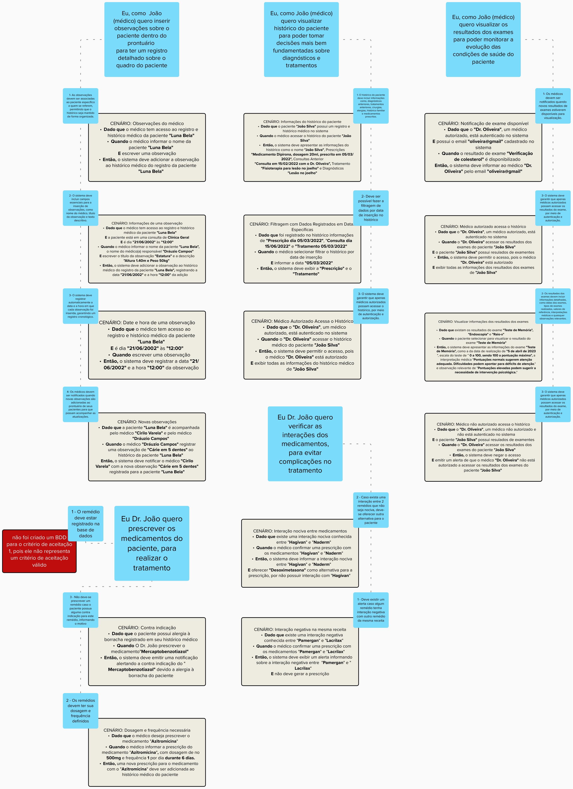

# Behavior Driven Development - HealthNet

## Introdução

&emsp;&emsp; É proposto pelo professor George Marsicano a criação do Behavior Driven Development (BDD) relacionado ao estudo de caso "HealthNet" através de uma análise do artefato criado pela facção Moonwalkers. 
 

&emsp;&emsp; Apresentam-se as Histórias de Usuário (USs), Critérios de Aceitação (CAs) e o Behaviour Driven Development (BDD) desenvolvidos por Persona: 
 

### Recepcionista

Figura 1: Conteúdo da Recepcionista 

Fonte: Gustavo França, Larissa Gomes e Oscar de Brito (2023)

### Médico

Figura 2: Conteúdo do Médico 

Fonte: Gustavo França, Larissa Gomes e Oscar de Brito (2023)

### Farmacêutica

Figura 3: Conteúdo da Farmacêutica 

Fonte: Gustavo França, Larissa Gomes e Oscar de Brito (2023)

### Coordenador de Agendamento

Figura 4: Conteúdo do Coordenador de Agendamento 

Fonte: Gustavo França, Larissa Gomes e Oscar de Brito (2023)

### Paciente

Figura 5: Conteúdo do Paciente 

Fonte: Gustavo França, Larissa Gomes e Oscar de Brito (2023)

### Diretor

Figura 6: Conteúdo do Diretor 

Fonte: Gustavo França, Larissa Gomes e Oscar de Brito (2023)

## Verificação e Validação - USs

&emsp;&emsp; É realizado uma "check-list" para verificar e validar as Histórias de Usuário produzidos pelos Moonwalkers: 

Figura 7: Check-list das USs 

Fonte: Gustavo França, Larissa Gomes e Oscar de Brito (2023)

## Verificação e Validação - CAs

&emsp;&emsp; É realizado uma "check-list" para verificar e validar os Critérios de Aceitação produzidos pelos Moonwalkers: 

Figura 7: Check-list das CAs 

Fonte: Gustavo França, Larissa Gomes e Oscar de Brito (2023)

#### Mural

Segue abaixo o Mural que possui todas as figuras apresentadas:

<iframe src='https://app.mural.co/embed/c3826321-4735-444f-8d57-cc86c239e9e5'
  width='100%'
  height='480px'
  style='min-width: 640px; min-height: 480px; background-color: #f4f4f4; border: 1px solid #efefef'
  sandbox='allow-same-origin allow-scripts allow-modals allow-popups allow-popups-to-escape-sandbox'></iframe>

## Histórico de versão

| Data  | Versão | Descrição                            | Autor                          |
| :---: | :----: | ------------------------------------ | ------------------------------ |
| 19/11 |  1.0   | Criação do artefato BDD | Gustavo França |

