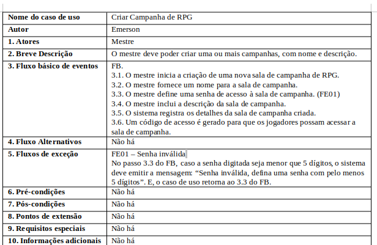
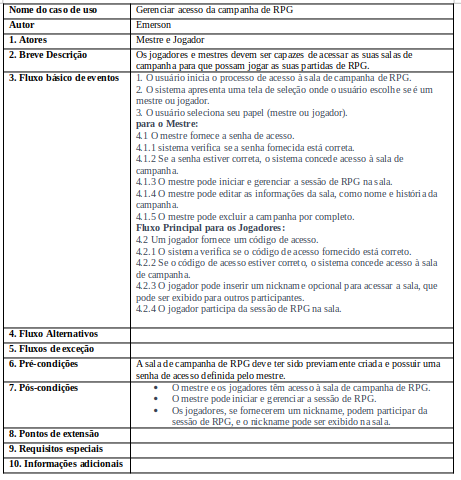
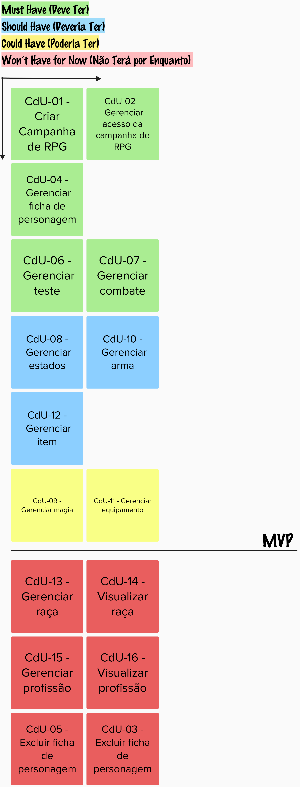

---
hide:
  - toc
---

# Backlog Casos de Uso

## Introdução

&emsp;&emsp; O Processo Unificado utiliza casos de uso como forma de declaração e especificação de requisitos. Tendo isso em vista, antes de especificar os casos de uso, foi necessário elicitar os requisitos a serem declarados. Para isso, foram realizadas previamente as atividades de Elicitação e Descoberta, Análise e Consenso, Verificação e Validação da Engenharia de Requisitos. Esse processo pode ser observado na Figura 1 e os requisitos finais elicitados e passados pela verificação e validação na Tabela 1.
 

<b>Figura 1:</b> Elicitação dos Requisitos. 

<table>
    <thead>
        <tr>
            <th>Requisitos Elicitados</th>
        </tr>
    </thead>
    <tbody>
        <tr>
            <td>Criar raça</td>
        </tr>
        <tr>
            <td>Visualizar raça</td>
        </tr>
        <tr>
            <td>Editar raça</td>
        </tr>
        <tr>
            <td>Excluir raça</td>
        </tr>
        <tr>
            <td>Criar profissão</td>
        </tr>
        <tr>
            <td>Visualizar profissão</td>
        </tr>
        <tr>
            <td>Editar profissão</td>
        </tr>
        <tr>
            <td>Excluir profissão</td>
        </tr>
        <tr>
            <td>Criar ficha de personagem</td>
        </tr>
        <tr>
            <td>Visualizar ficha de personagem</td>
        </tr>
        <tr>
            <td>Editar ficha de personagem</td>
        </tr>
        <tr>
            <td>Excluir ficha de personagem</td>
        </tr>
        <tr>
            <td>Atribuir estados</td>
        </tr>
        <tr>
            <td>Retirar estado</td>
        </tr>
        <tr>
            <td>Adicionar magia</td>
        </tr>
        <tr>
            <td>Retirar magia</td>
        </tr>
        <tr>
            <td>Adicionar arma</td>
        </tr>
        <tr>
            <td>Retirar arma</td>
        </tr>
        <tr>
            <td>Adicionar equipamento</td>
        </tr>
        <tr>
            <td>Retirar equipamento</td>
        </tr>
        <tr>
            <td>Administrar item</td>
        </tr>
        <tr>
            <td>Retirar item</td>
        </tr>
        <tr>
            <td>Realizar teste</td>
        </tr>
        <tr>
            <td>Visualizar resultado do teste</td>
        </tr>
        <tr>
            <td>Ordenar iniciativa de combate</td>
        </tr>
        <tr>
            <td>Realizar efeito do combate</td>
        </tr>
        <tr>
            <td>Visualizar efeito do combate</td>
        </tr>
        <tr>
            <td>Visualizar mapa</td>
        </tr>
        <tr>
            <td>Importar mapa</td>
        </tr>
        <tr>
            <td>Editar mapa</td>
        </tr>
        <tr>
            <td>Criar campanha de RPG</td>
        </tr>
        <tr>
            <td>Visualizar campanha de RPG</td>
        </tr>
        <tr>
            <td>Editar campanha de RPG</td>
        </tr>
        <tr>
            <td>Excluir campanha de RPG</td>
        </tr>
        <tr>
            <td>Acessar campanha de RPG (mestre)</td>
        </tr>
        <tr>
            <td>Acessar campanha de RPG (jogador)</td>
        </tr>
    </tbody>
</table>

<b>Tabela 1:</b> Requisitos Elicitados. 

## Casos de Uso

### Atores

&emsp;&emsp; Foram identificados 2 atores dos fluxos de eventos do nosso sistema, são eles: 

- <b>Mestre:</b> refere-se ao jogador de uma campanha de RPG que deseja mestrar uma campanha no ChaosManager.
- <b>Jogador:</b> refere-se ao jogador de uma campanha de RPG que deseja participar de um campanha mestrada pela persona mestre

### Casos de Uso Identificados

&emsp;&emsp; Com base nos requisitos elicitados, foram identificados 15 casos de uso, como apresentado na Tabela 2. 

| ID  | Nome do Caso de Uso |
| :---: | :----: |
| CdU-01  | Criar Campanha de RPG |
| CdU-02  | Gerenciar acesso da campanha de RPG |
| CdU-03  | Gerenciar ficha de personagem |
| CdU-04  | Excluir ficha de personagem |
| CdU-05  | Gerenciar teste |
| CdU-06  | Gerenciar combate |
| CdU-07  | Gerenciar estados |
| CdU-08  | Gerenciar magia |
| CdU-09  | Gerenciar arma |
| CdU-10  | Gerenciar equipamento |
| CdU-11  | Gerenciar item  |
| CdU-12  | Gerenciar raça |
| CdU-13  | Visualizar raça |
| CdU-14  | Gerenciar profissão |
| CdU-15  | Visualizar profissão |

<b>Tabela 2:</b> Casos de Uso. 

### Especificação dos Casos de Uso

#### CdU-01

<b>Figura 2:</b> Especificação Caso de Uso 01. 

#### CdU-02

<b>Figura 3:</b> Especificação Caso de Uso 02. 

#### CdU-03

<b>Figura 4:</b> Especificação Caso de Uso 03. 

#### CdU-04

<b>Figura 5:</b> Especificação Caso de Uso 04. 

#### CdU-05

<b>Figura 6:</b> Especificação Caso de Uso 05. 

#### CdU-06

<b>Figura 7:</b> Especificação Caso de Uso 06. 

#### CdU-07

<b>Figura 8:</b> Especificação Caso de Uso 07. 

#### CdU-08

<b>Figura 9:</b> Especificação Caso de Uso 08. 

#### CdU-09

<b>Figura 10:</b> Especificação Caso de Uso 09. 

#### CdU-10

<b>Figura 11:</b> Especificação Caso de Uso 10. 

#### CdU-11

<b>Figura 12:</b> Especificação Caso de Uso 11. 

#### CdU-12

<b>Figura 13:</b> Especificação Caso de Uso 12. 

#### CdU-13

<b>Figura 14:</b> Especificação Caso de Uso 13. 

#### CdU-14

<b>Figura 15:</b> Especificação Caso de Uso 14. 

#### CdU-15

<b>Figura 16:</b> Especificação Caso de Uso 15. 

### Backlog priorizado

&emsp;&emsp; Para Organizar e Atualizar o Backlog, realizamos a priorização dos Casos de Uso utilizando a técnica MoSCoW para determinar a prioridade dos requisitos. A execução da técnica pode ser vista na Figura 17.

<b>Figura 17:</b> Priorização MoSCoW. 

### MVP

&emsp;&emsp; Com base nos objetivos a serem atingidos no projeto, os Casos de Uso a fazerem parte do MVP foram selecionados com isso em vista. A Tabela 3 apresenta a relação dos Casos de Uso e qual objetivo secundário estariam contribuindo para ser atingido. Cumprindo todos os objetivos secundários, o objetivo principal de <b>“Unificar ferramentas de Combate, fichas de personagem, ação/teste de habilidade e interpretação de um rpg de mesa por meio da implementação do sistema de regras Order&Caos.
”</b> será alcançado.

| Objetivos secundários  | Casos de Uso do MVP |
| :---: | :----: |
| Permitir que jogadores se reunam em um único ambiente | CdU-01 - Criar Campanha de RPG   CdU-02 - Gerenciar acesso da campanha de RPG |
| Os usuários devem conseguir ter acesso a todas as suas informações por meio da ficha de personagem | CdU-03 - Gerenciar ficha de personagem   CdU-07 - Gerenciar estados   CdU-08 - Gerenciar magia   CdU-09 - Gerenciar arma   CdU-10 - Gerenciar equipamento   CdU-11 - Gerenciar item |
| Os usuários devem poder usufruir das dinâmicas disponíveis (Testes e combate) | CdU-05 - Gerenciar teste   CdU-06 - Gerenciar combate |

## Histórico de versão

| Data  | Versão | Descrição                            | Autor                          |
| :---: | :----: | ------------------------------------ | ------------------------------ |
| 25/10 |  1.0   | Criação da priorização de requisitos | Oscar de Brito e Larissa Gomes |
