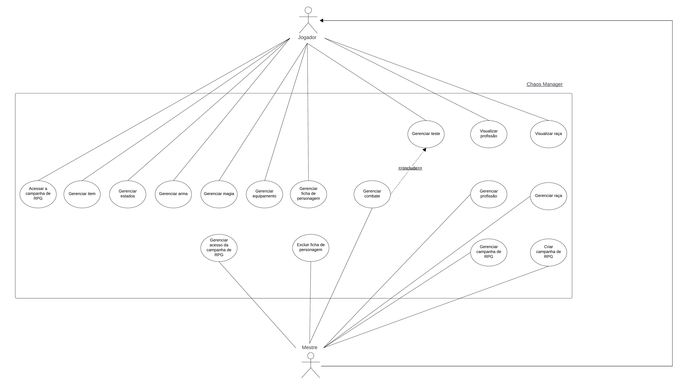
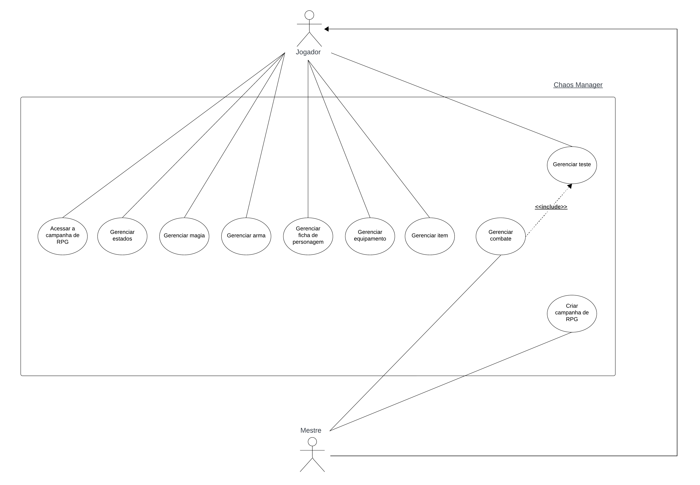

# Backlog Casos de Uso

## Introdução

&emsp;&emsp; O Processo Unificado utiliza casos de uso como forma de declaração e especificação de requisitos. Tendo isso em vista, antes de especificar os casos de uso, foi necessário elicitar os requisitos a serem declarados. Para isso, foram realizadas previamente as atividades de Elicitação e Descoberta, Análise e Consenso, Verificação e Validação da Engenharia de Requisitos. Esse processo pode ser observado na Figura 1 e os requisitos finais elicitados e passados pela verificação e validação na Tabela 1. 
 

<b>Figura 1:</b> Elicitação dos Requisitos. 

<table>
    <thead>
        <tr>
            <th>Requisitos Elicitados</th>
        </tr>
    </thead>
    <tbody>
        <tr>
            <td>Criar raça</td>
        </tr>
        <tr>
            <td>Visualizar raça</td>
        </tr>
        <tr>
            <td>Editar raça</td>
        </tr>
        <tr>
            <td>Excluir raça</td>
        </tr>
        <tr>
            <td>Criar profissão</td>
        </tr>
        <tr>
            <td>Visualizar profissão</td>
        </tr>
        <tr>
            <td>Editar profissão</td>
        </tr>
        <tr>
            <td>Excluir profissão</td>
        </tr>
        <tr>
            <td>Criar ficha de personagem</td>
        </tr>
        <tr>
            <td>Visualizar ficha de personagem</td>
        </tr>
        <tr>
            <td>Editar ficha de personagem</td>
        </tr>
        <tr>
            <td>Excluir ficha de personagem</td>
        </tr>
        <tr>
            <td>Atribuir estados</td>
        </tr>
        <tr>
            <td>Retirar estado</td>
        </tr>
        <tr>
            <td>Adicionar magia</td>
        </tr>
        <tr>
            <td>Retirar magia</td>
        </tr>
        <tr>
            <td>Adicionar arma</td>
        </tr>
        <tr>
            <td>Retirar arma</td>
        </tr>
        <tr>
            <td>Adicionar equipamento</td>
        </tr>
        <tr>
            <td>Retirar equipamento</td>
        </tr>
        <tr>
            <td>Administrar item</td>
        </tr>
        <tr>
            <td>Retirar item</td>
        </tr>
        <tr>
            <td>Realizar teste</td>
        </tr>
        <tr>
            <td>Visualizar resultado do teste</td>
        </tr>
        <tr>
            <td>Ordenar iniciativa de combate</td>
        </tr>
        <tr>
            <td>Realizar efeito do combate</td>
        </tr>
        <tr>
            <td>Visualizar efeito do combate</td>
        </tr>
        <tr>
            <td>Visualizar mapa</td>
        </tr>
        <tr>
            <td>Importar mapa</td>
        </tr>
        <tr>
            <td>Editar mapa</td>
        </tr>
        <tr>
            <td>Criar campanha de RPG</td>
        </tr>
        <tr>
            <td>Visualizar campanha de RPG</td>
        </tr>
        <tr>
            <td>Editar campanha de RPG</td>
        </tr>
        <tr>
            <td>Excluir campanha de RPG</td>
        </tr>
        <tr>
            <td>Acessar campanha de RPG</td>
        </tr>
    </tbody>
</table>

<b>Tabela 1:</b> Requisitos Elicitados. 

&emsp;&emsp; Para um melhor entendimento do que seriam alguns dos requisitos citados, a Figura 2 representa a <b>Ficha do Personagem</b> onde é o item que mantém todas as informações de um personagem durante a campanha.
 

<b>Figura 2:</b> Ficha do personagem. 

## Casos de Uso

### Atores

&emsp;&emsp; Foram identificados 2 atores dos fluxos de eventos do nosso sistema, são eles: 

- <b>Mestre:</b> refere-se ao jogador de uma campanha de RPG que deseja mestrar uma campanha no ChaosManager.
- <b>Jogador:</b> refere-se ao jogador de uma campanha de RPG que deseja participar de um campanha mestrada pela persona mestre

### Casos de Uso Identificados

&emsp;&emsp; Com base nos requisitos elicitados, foram identificados 15 casos de uso, como apresentado na Tabela 2. 

| ID | Nome do Caso de Uso | Descrição | Requisitos Envolvidos |
| :--- | :----: | :--- | :----: |
| CdU-01  | Criar Campanha de RPG | Este caso de uso permite o mestre criar uma sala de campanha onde possa administrar todas as suas sessões. Ele deve poder informar o nome, história e senha para a campanha ser criada. | Criar campanha de RPG Visualizar campanha de RPG   Editar campanha de RPG   Excluir campanha de RPG |
| CdU-02  | Gerenciar acesso da campanha de RPG | Este caso de uso permite os mestre e os jogadores acessarem uma sala de campanha onde possam ter acesso às ferramentas que os auxiliarão nas sessões. Eles devem poder acessar informando o nome da sala e sua senha de acesso. | Acessar campanha de RPG |
| CdU-03  | Gerenciar campanha de RPG |Esse caso de uso permite o mestre gerenciar sua sala de campanha como necessário, editando as informações que deseja ou até mesmo excluindo a campanha. | Visualizar campanha de RPG   Editar campanha de RPG   Excluir campanha de RPG |
| CdU-04  | Gerenciar ficha de personagem | Este caso de uso permite o mestre e os jogadores gerenciarem a ficha de personagem para que consigam administrar todas as informações do seu personagem durante a campanha, bem como criar a ficha e posteriormente editá-la. As fichas do mestre apenas ele poderá acessar, enquanto todos podem ver as dos outros jogadores.  | Criar ficha de personagem   Visualizar ficha de personagem   Editar ficha de personagem  |
| CdU-05  | Excluir ficha de personagem | Este caso de uso é utilizado pelo mestre para excluir uma ficha de personagem quando não mais necessária. | Excluir ficha de personagem |
| CdU-06  | Gerenciar teste | Este caso de uso protagoniza momentos em que os Jogadores e os personagens do Mestre precisam realizar ações que demandem alguma dificuldade, onde é possível realizar 10 testes diferentes. | Realizar teste   Visualizar resultado do teste |
| CdU-07  | Gerenciar combate | Este caso de uso será utilizado pelo mestre para gerenciar o combate e pelo jogador para reagir as ações do mestre no combate. Para tanto, o mestre pode indicar quem participa do combate e em que ordem, indicar quem participa do turno atacando e sendo atacado e por fim executando o efeito desse combate. | Ordenar iniciativa de combate   Realizar efeito do combate   Visualizar efeito do combate |
| CdU-08  | Gerenciar estados | Este caso de uso é utilizado pelos jogadores e mestre para gerenciar os estados que utilizarão durante a campanha de RPG, bem como adicioná-las e retirá-las de suas fichas de personagem. | Atribuir estados   Retirar estado |
| CdU-09  | Gerenciar magia | Este caso de uso é utilizado pelos jogadores e mestre para gerenciar as magias que utilizarão durante a campanha de RPG, bem como adicioná-las e retirá-las do sistema. | Adicionar magia   Retirar magia |
| CdU-10  | Gerenciar arma | Este caso de uso é utilizado pelos jogadores e mestre para gerenciar as armas que utilizarão durante a campanha de RPG, bem como adicioná-las e retirá-las de suas fichas de personagem. | Adicionar arma   Retirar arma |
| CdU-11  | Gerenciar equipamento | Este caso de uso é utilizado pelos jogadores e mestre para gerenciar os equipamentos que utilizarão durante a campanha de RPG, bem como adicioná-las e retirá-las de suas fichas de personagem. | Adicionar equipamento   Retirar equipamento |
| CdU-12  | Gerenciar item  | Este caso de uso é utilizado pelos jogadores e mestre para gerenciar os itens que utilizarão durante a campanha de RPG, bem como adicioná-las, alterar suas quantidades para acrescentá-las ou deduzí-las e retirá-los de suas fichas de personagem. | Administrar item   Retirar item |
| CdU-13  | Gerenciar raça | Este caso de uso é utilizado pelos jogadores e mestre para gerenciar as raças que utilizarão durante a campanha de RPG, bem como adicioná-las, editá-las e removê-las do sistema.  | Criar raça   Editar raça   Excluir raça |
| CdU-14  | Visualizar raça | Este caso de uso é utilizado pelos jogadores e mestre para visualizar as raças que existem durante a campanha de RPG, assim como as informações de cada uma delas. | Visualizar raça |
| CdU-15  | Gerenciar profissão | Este caso de uso é utilizado pelos jogadores e mestre para gerenciar as profissões que utilizarão durante a campanha de RPG, bem como adicioná-las, editá-las e removê-las do sistema.  | Criar profissão   Editar profissão   Excluir profissão |
| CdU-16  | Visualizar profissão | Este caso de uso é utilizado pelos jogadores e mestre para visualizar as profissões que existem durante a campanha de RPG, assim como as informações de cada uma delas. | Visualizar profissão |

<b>Tabela 2:</b> Casos de Uso. 

&emsp;&emsp; Com os atores e casos de usos identificados, foi criado o diagrama de casos de uso para visualizar como e por quem as ações são realizadas dentro do sistema, assim como a ligação entre casos quando existiam. O diagrama está disponível na Figura 3. 

<b>Figura 3:</b> Diagrama de caso de uso. 

### Especificação dos Casos de Uso

#### CdU-01 - Criar Campanha de RPG

<table>
    <tr>
        <th>Nome do caso de uso</th>
        <td>Criar Campanha de RPG</td>
    </tr>
    <tr>
        <th>Autor</th>
        <td>Emerson Teles,Larissa Gomes, Oscar de Brito e Gustavo França</td>
    </tr>
    <tr>
        <th>1. Atores</th>
        <td>Mestre</td>
    </tr>
    <tr>
        <th>2. Breve Descrição</th>
        <td>Este caso de uso permite o mestre criar uma sala de campanha onde possa administrar todas as suas sessões. Ele deve poder informar o nome, história e senha para a campanha ser criada.</td>
    </tr>
    <tr>
        <th>3. Fluxo básico de eventos</th>
        <td>
            
FB.

            
3.1. O mestre seleciona a opção “Criar nova sala de campanha de RPG”.

            
3.2. O mestre fornece um nome e história para a sala de campanha.

            
3.3. O mestre define uma senha de acesso à sala de campanha.

            
3.4. O mestre seleciona a opção de “Criar”.

            
3.5. O sistema faz a validação das informações. (FE01) (FE02) (RN01)

            
3.6. O sistema cria a sala de campanha.

            
3.7. O sistema gera um código de acesso para que os jogadores possam acessar a sala de campanha. (RN02)

            
3.8. O sistema informa ao mestre as instruções de acesso e o código de acesso dos jogadores.(RN03)

        </td>
    </tr>
    <tr>
        <th>4. Fluxo Alternativos</th>
        <td>Não há</td>
    </tr>
    <tr>
        <th>5. Fluxos de exceção</th>
        <td>
            
FE01 – Senha inválida 

            
No passo 3.5 do FB, caso a senha digitada seja menor que 5 dígitos, o sistema deve emitir a mensagem: “Senha inválida, defina uma senha com pelo menos 5 dígitos!”. E, o caso de uso retorna ao 3.3 do FB.

            
FE02 –Campanha já existe

            
No passo 3.5 do FB, caso o nome da campanha informado já exista, o sistema deve emitir a mensagem: “Nome de campanha já existe, informe um novo!”. E, o caso de uso retorna ao 3.2 do FB.

        </td>
    </tr>
    <tr>
        <th>6. Pré-condições</th>
        <td>Não há</td>
    </tr>
    <tr>
        <th>7. Pós-condições</th>
        <td>7.1. Sala de campanha criada.</td>
    </tr>
    <tr>
        <th>8. Pontos de extensão</th>
        <td>Não há</td>
    </tr>
    <tr>
        <th>9. Requisitos especiais</th>
        <td>Não há</td>
    </tr>
    <tr>
        <th>10. Regras de negócio</th>
        <td>
            (RN01) - Validação de informações
            <table>
                <tr>
                    <th>Atributo</th>
                    <th>Tipo</th>
                    <th>Obrigatoriedade</th>
                    <th>Observação</th>
                </tr>
                <tr>
                    <td>Nome</td>
                    <td>String</td>
                    <td>True</td>
                </tr>
                <tr>
                    <td>História</td>
                    <td>String</td>
                    <td>False</td>
                </tr>
                <tr>
                    <td>Senha</td>
                    <td>String</td>
                    <td>True</td>
                    <td>A senha do mestre deve ter no mínimo 5 dígitos</td>
                </tr>
            </table>
             
            

            (RN02) - O código de acesso dos jogadores deve ter 6 dígitos, sendo gerado entre 100.000 e 999.999
            

             

            (RN03) - As instruções de acesso devem conter o nome da campanha,  a senha de acesso do mestre e o código de acesso dos jogadores
            

            

        </td>
        </td>
    </tr>
</table>

<b>Tabela 3:</b> Especificação Caso de Uso 01. 

#### CdU-02 - Gerenciar acesso da campanha de RPG

<table>
    <tr>
        <th>Nome do caso de uso</th>
        <td>Gerenciar acesso da campanha de RPG</td>
    </tr>
    <tr>
        <th>Autor</th>
        <td>Emerson Teles,Larissa Gomes,Oscar de Brito e Gustavo França</td>
    </tr>
    <tr>
        <th>1. Atores</th>
        <td>Mestre e jogador possuem essa mesma funcionalidade, nos fluxos serão referidos como usuário.</td>
    </tr>
    <tr>
        <th>2. Breve Descrição</th>
        <td>Este caso de uso permite o mestre e os jogadores acessarem uma sala de campanha onde possam ter acesso às ferramentas que os auxiliarão nas sessões. Eles devem poder acessar informando o nome da sala e sua senha de acesso.</td>
    </tr>
    <tr>
        <th>3. Fluxo básico de eventos</th>
        <td>
            
FB.

            
3.1. O usuário seleciona a opção “Acessar sala de campanha de RPG”.

            
3.2. O usuário fornece o nome e a senha de acesso.

            
3.3. O usuário seleciona a opção “Acessar”.

            
3.4. O sistema valida as informações. (FE01) (FE02) (RN01)

            
3.5. O sistema informa que a autenticação foi realizada com sucesso.

        </td>
    </tr>
    <tr>
        <th>4. Fluxo Alternativos</th>
        <td>Não há</td>
    </tr>
    <tr>
        <th>5. Fluxos de exceção</th>
        <td>
            
FE01 – Campanha inexistente 

            
No passo 3.4 do FB, caso o nome de campanha digitado não corresponda a nenhuma campanha existente, o sistema deve emitir a mensagem: “Campanha não existe ou nome de campanha incorreto!”. E, o caso de uso retorna ao 3.2 do FB.

            
FE02 – Senha inválida 

            
No passo 3.4 do FB, caso a senha digitada não corresponda a nenhuma senha de usuário (Jogador e Mestre) da campanha, o sistema deve emitir a mensagem: “Senha inválida, digite novamente!”. E, o caso de uso retorna ao 3.2 do FB.

        </td>
    </tr>
    <tr>
        <th>6. Pré-condições</th>
        <td>6.1. Sala de campanha criada.</td>
    </tr>
    <tr>
        <th>7. Pós-condições</th>
        <td>7.1. Usuários acessam a sala de campanha de RPG</td>
    </tr>
    <tr>
        <th>8. Pontos de extensão</th>
        <td>Não há</td>
    </tr>
    <tr>
        <th>9. Requisitos especiais</th>
        <td>Não há</td>
    </tr>
    <tr>
        <th>10. Regras de negócio</th>
        <td>
            (RN01) - Validação de informações
            <table>
                <tr>
                    <th>Atributo</th>
                    <th>Tipo</th>
                    <th>Obrigatoriedade</th>
                    <th>Observação</th>
                </tr>
                <tr>
                    <td>Nome</td>
                    <td>String</td>
                    <td>True</td>
                </tr>
                <tr>
                    <td>Senha</td>
                    <td>String</td>
                    <td>True</td>
                    <td>A senha do usuário deve ter no mínimo 5 dígitos</td>
                </tr>
            </table>
        </td>
    </tr>
</table>

<b>Tabela 4:</b> Especificação Caso de Uso 02. 

#### CdU-03 - Gerenciar campanha de RPG

<table>
<tr>
    <th>Nome do caso de uso</th>
    <th>Gerenciar campanha de RPG</th>
</tr>
<tr>
    <td>Autor</td>
    <td>Larissa Gomes,Oscar de Brito e Gustavo França</td>
</tr>
<tr>
    <td>1. Atores</td>
    <td>Mestre</td>
</tr>
<tr>
    <td>2. Breve Descrição</td>
    <td>Esse caso de uso permite o mestre gerenciar sua sala de campanha como necessário, editando as informações que deseja ou até mesmo excluindo a campanha.</td>
</tr>
<tr>
    <td>3. Fluxo básico de eventos</td>
    <td>
        
FB.

        
3.1. O mestre seleciona a opção “Configurações”.

        
3.2. O sistema apresenta as informações da campanha:

        <ul>
          <li>Nome</li>
          <li>História</li>
          <li>Senhas de acesso</li>
        </ul>
        
3.3. O sistema apresenta as seguintes opções:

        <ul>
          <li>Editar</li>
          <li>Excluir campanha (FA01)</li>
        </ul>
        
3.4. O mestre seleciona a opção “Editar”.

        
3.5. O mestre altera as informações que deseja das apresentadas:

        <ul>
          <li>Nome</li>
          <li>História</li>
          <li>Senhas de acesso</li>
        </ul>
        
3.6. O mestre seleciona a opção de “Confirmar”.

        
3.7. O sistema faz a validação das informações. (FE01) (FE02) (RN01)

        
3.8. O sistema atualiza as informações da campanha.

      </td>
    </tr>
    <tr>
      <td>4. Fluxo Alternativos</td>
      <td>
        
4.1. FA01 – Excluir Campanha

        
&emsp; 4.1.1. O mestre seleciona a opção “Excluir campanha”.

        
&emsp; 4.1.2. O sistema confirma se o mestre deseja realizar essa ação.

        
&emsp; 4.1.3. O mestre seleciona a opção de “Confirmar”.

        
&emsp; 4.1.4. O sistema exclui a campanha.

      </td>
    </tr>
    <tr>
      <td>5. Fluxos de exceção</td>
      <td>
        
FE01 – Senha inválida 

        
No passo 3.7 do FB, caso a senha digitada seja menor que 5 dígitos, o sistema deve emitir a mensagem: “Senha inválida, defina uma senha com pelo menos 5 dígitos”. E, o caso de uso retorna ao 3.5 do FB.

        
FE02 –Campanha já existe

        
No passo 3.7 do FB, caso o nome da campanha informado já exista, o sistema deve emitir a mensagem: “Nome de campanha já existe, informe um novo”. E, o caso de uso retorna ao 3.5 do FB.

      </td>
    </tr>
    <tr>
      <td>6. Pré-condições</td>
      <td>
        
6.1. Sala de campanha criada.

      </td>
    </tr>
    <tr>
      <td>7. Pós-condições</td>
      <td>
        
7.1. Informações atualizadas da campanha

        
7.2. Campanha excluída (fluxo alternativo)

      </td>
    </tr>
    <tr>
      <td>8. Pontos de extensão</td>
      <td>Não há</td>
    </tr>
    <tr>
      <td>9. Requisitos especiais</td>
      <td>Não há</td>
    </tr>
    <tr>
      <td>10. Regras de negócio</td>
      <td>(RN01) - Validação de informações
            <table>
                <tr>
                    <th>Atributo</th>
                    <th>Tipo</th>
                    <th>Obrigatoriedade</th>
                    <th>Observação</th>
                </tr>
                <tr>
                    <td>Nome</td>
                    <td>String</td>
                    <td>True</td>
                </tr>
                <tr>
                    <td>Senha</td>
                    <td>String</td>
                    <td>True</td>
                    <td>A senha do usuário deve ter no mínimo 5 dígitos</td>
                </tr>
            </table>
      </td>
    </tr>
  </table>

</body>
</html>

<b>Tabela 5:</b> Especificação Caso de Uso 03. 

#### 
 CdU-04 - Gerenciar ficha de personagem 

<table>
    <tr>
        <th>Nome do caso de uso</th>
        <td>Gerenciar ficha de personagem</td>
    </tr>
    <tr>
        <th>Autores</th>
        <td>Gustavo França, Larissa Gomes, Pedro Eduardo e Oscar de Brito</td>
    </tr>
    <tr>
        <th>1. Atores</th>
        <td>Mestre e jogador possuem essa mesma funcionalidade, nos fluxos serão referidos como usuário</td>
    </tr>
    <tr>
        <th>2. Breve Descrição</th>
        <td>Este caso de uso permite o mestre e os jogadores gerenciarem a ficha de personagem para que consigam administrar todas as informações do seu personagem durante a campanha, bem como criar a ficha e posteriormente editá-la. As fichas do mestre apenas ele poderá acessar, enquanto todos podem ver as dos outros jogadores.</td>
    </tr>
    <tr>
        <th>3. Fluxo básico de eventos</th>
        <td>
            
FB

            
3.1. O usuário seleciona a opção “Ficha de personagem”.

            
3.2. O sistema apresenta as seguintes opções:

            <ul>
            <li>Criar ficha</li>
            <li>Lista de Fichas de Personagens (FA01)</li>
            </ul>
            
3.3. O usuário seleciona a opção “Criar ficha”

            
3.4. O usuário fornece informações sobre o personagem:

            <ul>
            <li>NPC</li>
            <li>Nome do usuário e do personagem</li>
            <li>Raça e profissão (RN017)</li>
            <li>Idade e gênero</li>
            <li>Dinheiro</li>
            <li>Traços (RN01) (RN02) (RN03)</li>
            <li>História, notas e descrição física</li>
            </ul>
            
3.5. O usuário seleciona os traços do personagem.

            
3.6. O usuário atribui os valores dos atributos do personagem.

            
3.7. O usuário seleciona a opção “Criar ficha”.

            
3.8. O sistema valida as informações. (RN016) (RN017)
            
3.9. O sistema cria uma ficha de personagem com os dados informados. (RN04) (RN04) (RN05) (RN06) (RN07) (RN08) (RN09) (RN010) (RN011) (RN012) (RN013) (RN014) (RN015)

            
3.10. O sistema adiciona a ficha criada a lista de fichas de personagens.

        </td>
    </tr>
    <tr>
        <th>4. Fluxo Alternativos</th>
        <td>
            
4.1. FA01 – Editar ficha

            
&emsp; 4.1.1. O usuário seleciona a opção “Lista de Fichas de Personagens”

            
&emsp; 4.1.2. O sistema apresenta todas as Fichas de Personagens

            
&emsp; 4.1.3. O usuário seleciona uma Ficha de Personagem 

            
&emsp; 4.1.4. O sistema apresenta as seguintes opções:

            <ul>
            <li>Editar</li>
            <li>Excluir (IA01)</li>
            </ul>
            
&emsp; 4.1.5. O usuário seleciona a opção “Editar”

            
&emsp; 4.1.6. O sistema exibe as informações que podem ser editadas:

            <ul>
            <li>NPC</li>
            <li>Nome do usuário e do personagem</li>
            <li>Raça e profissão (RN017)</li>
            <li>Idade e gênero</li>
            <li>Dinheiro</li>
            <li>Traços (RN01) (RN02) (RN03)</li>
            <li>História, notas e descrição física</li>
            </ul>
            
&emsp; 4.1.7. O usuário seleciona o campo da informação que deseja alterar.

            
&emsp; 4.1.8. O usuário fornece os novos dados nos campos exibidos.

            
&emsp; 4.1.9. O usuário seleciona a opção de “Confirmar”.

            
&emsp; 4.1.10. O sistema valida as informações. (FE017) (RN018)

            
&emsp; 4.1.11. O sistema atualiza os dados da ficha. (RN04) (RN05) (RN06) (RN07) (RN08) (RN09) (RN010) (RN011) (RN012) (RN013) (RN014) (RN015) (RN016). 

            
O caso de uso retorna ao 3.2 do FB.

        </td>
    </tr>
    <tr>
        <th>5. Fluxos de exceção</th>
        <td>
            
FE01 – Personagem Morto

            
No passo 4.1.10 do FA01, caso os pontos de vida informados sejam ≤0, o sistema deve emitir a mensagem: “Personagem morto, deseja excluir a ficha?”. Em caso positivo, o sistema exclui a ficha da “Lista de Fichas de Personagens". Em caso positivo ou negativo, o caso de uso retorna ao 4.1.11 do FA01.

        </td>
    </tr>
    <tr>
        <th>6. Pré-condições</th>
        <td>
            
6.1. Sala de campanha criada.

            
6.2. Estar acessado na sala de campanha de RPG

        </td>
    </tr>
    <tr>
        <th>7. Pós-condições</th>
        <td>
            
7.1. Ficha de personagem criada

            
7.2. Informações atualizadas da ficha de personagem (fluxo alternativo)

        </td>
    </tr>
    <tr>
        <th>8. Pontos de extensão</th>
        <td>Não há.</td>
    </tr>
    <tr>
        <th>9. Requisitos especiais</th>
        <td>
            
9.1. O sistema deve automatizar os valores dos testes do personagem

            
9.2. O sistema deve automatizar o peso carregado pelo personagem

            
9.3. O sistema deve automatizar a capacidade do personagem

            
9.4. O sistema deve automatizar a capacidade em combate do personagem

        </td>
    </tr>
    <tr>
        <th>10. Regras de negócio</th>
        <td>
            
RN:

            
(RN01) Se um jogador escolher um traço positivo, deverá escolher também um traço negativo 

            
(RN02) Se um jogador escolher um traço, não poderá escolher outro com o mesmo id, pois é um traço antagônico.

            (RN03) - Validação de informações
            <table>
                <tr>
                    <th>ID</th>
                    <th>Traço Positivo</th>
                    <th>Traço Negativo</th>
                </tr>
                <tr>
                    <td>1</td>
                    <td>Sentidos aguçados</td>
                    <td>Limitação física/sensorial</td>
                </tr>
                <tr>
                    <td>2</td>
                    <td>Saúde de ferro</td>
                    <td>Doença degenerativa</td>
                </tr>
                 <tr>
                    <td>3</td>
                    <td>Empatia pura</td>
                    <td>Psicopatia</td>
                </tr>
                <tr>
                    <td>4</td>
                    <td>Serenidade</td>
                    <td>Autodestruição</td>
                </tr>
                <tr>
                    <td>5</td>
                    <td>Regeneração rápida</td>
                    <td>Doença crônica/mental</td>
                </tr>
                <tr>
                    <td>6</td>
                    <td>Res. à temperatura/química</td>
                    <td>Vulnerável à temperatura/química</td>
                </tr>
                  <tr>
                    <td>7</td>
                    <td>Valentia desmedida à</td>
                    <td>Fobia incontrolável à</td>
                </tr>
                 <tr>
                    <td>8</td>
                    <td>Imunidade à</td>
                    <td>Alergia à</td>
                </tr>
                  <tr>
                    <td>9</td>
                    <td>Perfeccionismo</td>
                    <td>Negligência</td>
                </tr>
                  <tr>
                    <td>10</td>
                    <td>Concentração</td>
                    <td>Distração</td>
                </tr>
                <tr>
                    <td>11</td>
                    <td>Sensatez</td>
                    <td>Insensatez</td>
                </tr>
                 <tr>
                    <td>12</td>
                    <td>Moderação</td>
                    <td>Compulsão</td>
                </tr>
                <tr>
                    <td>13</td>
                    <td>Diligência</td>
                    <td>Preguiça</td>
                </tr>
                <tr>
                    <td>14</td>
                    <td>Otimismo</td>
                    <td>Pessimismo</td>
                </tr>
                <tr>
                    <td>15</td>
                    <td>Coragem</td>
                    <td>Covardia</td>
                </tr>
                <tr>
                    <td>16</td>
                    <td>Honradez</td>
                    <td>Desonra</td>
                </tr>
                <tr>
                    <td>17</td>
                    <td>Hipertrofia</td>
                    <td>Desnutrição</td>
                </tr>
                <tr>
                    <td>18</td>
                    <td>Robustez</td>
                    <td>Baixa estatura</td>
                </tr>
                <tr>
                    <td>19</td>
                    <td>Atraente</td>
                    <td>Repulsividade</td>
                </tr>
                <tr>
                    <td>20</td>
                    <td>Conhecido como justo</td>
                    <td>Conhecido como injusto</td>
                </tr>
                <tr>
                    <td>21</td>
                    <td>Paciência</td>
                    <td>Pavio curto</td>
                </tr>
                <tr>
                    <td>22</td>
                    <td>Bom humor</td>
                    <td>Depressão</td>
                </tr>
                <tr>
                    <td>23</td>
                    <td>Ceticismo</td>
                    <td>Fanatismo</td>
                </tr>
                <tr>
                    <td>24</td>
                    <td>Flexibilidade</td>
                    <td>Teimosia</td>
                </tr>
                <tr>
                    <td>25</td>
                    <td>Extroversão</td>
                    <td>Timidez</td>
                </tr>
                <tr>
                    <td>26</td>
                    <td>Perspicácia</td>
                    <td>Ingenuidade</td>
                </tr>
                <tr>
                    <td>27</td>
                    <td>Sagacidade</td>
                    <td>Monotonia</td>
                </tr>
                <tr>
                    <td>28</td>
                    <td>Eloquência</td>
                    <td>Dicção prejudicada</td>
                </tr>
            </table>
            
(RN04) - O valor da força é igual o atributo vigor + habilidade

            
(RN05) - O valor da resistência física é igual o atributo vigor + percepção

            
(RN06) -  O valor da resistência mental é igual o atributo vigor + inteligência

            
(RN07) - O valor da sobrevivência é igual o atributo vigor + domínio

            
(RN08) - O valor da agilidade é igual o atributo habilidade + percepção

            
(RN09) - O valor da destreza é igual o atributo habilidade e domínio

            
(RN10) - O valor da competência é igual o atributo inteligência + habilidade

            
(RN011) - O valor da criatividade é igual o atributo vigor + habilidade

            
(RN012) - O valor da manipulação é igual o atributo inteligência + domínio

            
(RN013) - O valor da sorte é igual o atributo domínio + percepção

            
(RN014) - O valor do peso é igual à soma dos pesos dos itens, armas e equipamentos

            
(RN015) - A capacidade é igual ao valor da Força do personagem

            
(RN016) - O valor da capacidade em combate é igual ao atributo Vigor do personagem

            
(RN017) - Se o jogador escolher uma profissão com objeto, esse objeto deve ser adicionado a sua ficha.

            (RN018) - Validação de informações
            <table>
                <tr>
                    <th>Atributo</th>
                    <th>Tipo</th>
                    <th>Obrigatoriedade</th>
                </tr>
                <tr>
                    <td>Nome do Usuário</td>
                    <td>String</td>
                    <td>True</td>
                </tr>
                <tr>
                    <td>Nome do Personagem</td>
                    <td>String</td>
                    <td>True</td>
                </tr>
                 <tr>
                    <td>NPC</td>
                    <td>Boolean</td>
                    <td>True</td>
                </tr>
                <tr>
                    <td>História</td>
                    <td>String</td>
                    <td>False</td>
                </tr>
                <tr>
                    <td>Notas</td>
                    <td>String</td>
                    <td>False</td>
                </tr>
                <tr>
                    <td>Descrição Física</td>
                    <td>String</td>
                    <td>False</td>
                </tr>
                  <tr>
                    <td>Idade </td>
                    <td>Int</td>
                    <td>False</td>
                </tr>
                 <tr>
                    <td>Gênero </td>
                    <td>String</td>
                    <td>False</td>
                </tr>
                  <tr>
                    <td>Raça </td>
                    <td>Raca/String</td>
                    <td>False</td>
                </tr>
                  <tr>
                    <td>Profissão</td>
                    <td>Profissao/String</td>
                    <td>False</td>
                </tr>
                <tr>
                    <td>Dinheiro</td>
                    <td>Int</td>
                    <td>False</td>
                </tr>
                 <tr>
                    <td>Traços</td>
                    <td>TracoPositivo/TracoNegativo</td>
                    <td>False</td>
                </tr>
            </table>
    </tr>
    <tr>
        <th>11. Informações Adicionais</th>
        <td>(IA01) - Serve como um caso de uso principal para base de navegabilidade dos os casos de uso:  <a href="#43">CdU-05 - Excluir ficha de personagem</a> <a href="#4"> CdU-08 - Gerenciar estados </a> <a href="#5"> CdU-09 - Gerenciar magia</a> <a href="#6"> CdU-10 - Gerenciar arma</a> <a href="#7"> CdU-11 - Gerenciar equipamento</a> <a href="#8">  CdU-12 - Gerenciar item</a></td>
    </tr>
</table>

<b>Tabela 6:</b> Especificação Caso de Uso 04. 

#### 
 CdU-05 - Excluir ficha de personagem

<table>
    <tr>
        <th>Nome do caso de uso</th>
        <td>Excluir ficha de personagem</td>
    </tr>
    <tr>
        <th>Autores</th>
        <td>Gustavo França, Larissa Gomes, Pedro Eduardo e Oscar de Brito</td>
    </tr>
    <tr>
        <th>1. Atores</th>
        <td>Mestre</td>
    </tr>
    <tr>
        <th>2. Breve Descrição</th>
        <td>Este caso de uso é utilizado pelo mestre para excluir uma ficha de personagem quando não mais necessária.</td>
    </tr>
    <tr>
        <th>3. Fluxo básico de eventos</th>
        <td>
            
FB

            
3.1. O mestre seleciona uma Ficha de Personagem

            
3.2. O sistema apresenta as seguintes opções:

            <ul>
            <li>Editar (IA01)</li>
            <li>Excluir</li>
            </ul>
            
3.3. O mestre seleciona a opção “Excluir”

            
3.4. O mestre seleciona a opção “Confirmar”

            
3.5. O sistema exclui a ficha da “Lista de Fichas de Personagens"

        </td>
    </tr>
    <tr>
        <th>4. Fluxo Alternativos</th>
        <td>Não há</td>
    </tr>
    <tr>
        <th>5. Fluxos de exceção</th>
        <td>Não há</td>
    </tr>
    <tr>
        <th>6. Pré-condições</th>
        <td>
            
6.1. Sala de campanha criada.

            
6.2. Estar acessado na sala de campanha de RPG

            
6.3. Ficha de personagem criada.

        </td>
    </tr>
    <tr>
        <th>7. Pós-condições</th>
        <td>7.1. A ficha é excluída</td>
    </tr>
    <tr>
        <th>8. Pontos de extensão</th>
        <td>Não há.</td>
    </tr>
    <tr>
        <th>9. Requisitos especiais</th>
        <td>Não há</td>
    </tr>
    <tr>
        <th>10. Regras de negócio</th>
        <td>Não há</td>
    </tr>
    <tr>
        <th>11. Informações Adicionais</th>
        <td>(IA01) - O caso de uso <a href="#43">CdU-04 - Gerenciar ficha de personagem </a> serve como um caso de uso principal para base de navegabilidade desse caso de uso</td>
    </tr>
</table>

<b>Tabela 7:</b> Especificação Caso de Uso 05. 

#### 
 CdU-06 - Gerenciar teste 

<table>
    <tr>
        <th>Nome do caso de uso</th>
        <td>Gerenciar teste</td>
    </tr>
    <tr>
        <th>Autores</th>
        <td>Gustavo França, Pedro Eduardo e Larissa Gomes</td>
    </tr>
    <tr>
        <th>1. Atores</th>
        <td>Mestre e Jogador são os atores designados para utilizar essas funcionalidades. Serão referenciados como usuário.</td>
    </tr>
    <tr>
        <th>2. Breve Descrição</th>
        <td>Este caso de uso protagoniza momentos em que os Jogadores e os personagens do Mestre precisam realizar ações que demandem alguma dificuldade, onde é possível realizar 10 testes diferentes.</td>
    </tr>
    <tr>
        <th>3. Fluxo básico de eventos</th>
        <td>
            
FB

            
3.1. O usuário seleciona uma das seguintes opções:

            <ul>
            <li>Força</li>
            <li>Resistência Física</li>
            <li>Resistência Mental</li>
            <li>Sobrevivência</li>
            <li>Agilidade</li>
            <li>Destreza</li>
            <li>Competência (FA01)</li>
            <li>Criatividade</li>
            <li>Manipulação</li>
            <li>Sorte</li>
            </ul>
            
3.2. O usuário seleciona o teste que irá realizar

            
3.3. O usuário seleciona “Rolar Dados”(RN01)

            
3.4. O usuário seleciona "Realizar Teste"

            
3.5. O sistema mostra o resultado do teste no registro de ações. (FE01) (FE02) (RN02)

        </td>
    </tr>
    <tr>
        <th>4. Fluxo Alternativos</th>
        <td>
            
4.1. FA01 – Teste de Competência

            
&emsp; 4.1.1. O usuário seleciona o teste de competência.

            
&emsp; 4.1.2. O usuário informa quanto pontos de energia deseja utilizar.

            
O caso de uso retorna ao 3.4 do FB.

        </td>
    </tr>
    <tr>
        <th>5. Fluxos de exceção</th>
        <td>
            
5.1. FE01 - Falha crítica

            
No passo 3.4 do FB, se valor do dado for 1, o sistema deve emitir a mensagem: “Falha crítica” no Registro de Ações. E, o caso de uso retorna ao 3.4 do FB.

            
5.2. FE02 - Acerto crítico

            
No passo 3.4 do FB, se o valor do dado for 20, o sistema deve emitir a mensagem: “Acerto crítico” no Registro de Ações. E, o caso de uso retorna ao 3.4 do FB.

            
5.3. FE03 - Não rolou dados

            
No passo 3.4 do FB, se o usuário selecionar para realizar teste sem ter rodado os dados, o sistema deve emitir a mensagem: “Por favor, role os dados” no Registro de Ações. E, o caso de uso retorna ao 3.3 do FB.

        </td>
    </tr>
    <tr>
        <th>6. Pré-condições</th>
        <td>
            
6.1. Sala de campanha criada.

            
6.2. Estar acessado na sala de campanha de RPG

            
6.3. Ficha de personagem criada.

        </td>
    </tr>
    <tr>
        <th>7. Pós-condições</th>
        <td>7.1. É retornado o resultado do teste</td>
    </tr>
    <tr>
        <th>8. Pontos de extensão</th>
        <td>Não há.</td>
    </tr>
    <tr>
        <th>9. Requisitos especiais</th>
        <td>Não há</td>
    </tr>
    <tr>
        <th>10. Regras de negócio</th>
        <td>
            
(RN01) - Um registro de ações deve ser apresentado somente ao Mestre e a quem realizou a ação

            
(RN02) - O resultado do teste deve obedecer ao cálculo do teste sendo um inteiro randomizado de 1 a 20 somado ao valor do teste e somado ao valor dos pontos de energia em caso de teste de competência

            
(RN03) - O resultado do valor do dado (d20) deve ser um inteiro randomizado de 1 a 20

        </td>
    </tr>
</table>

<b>Tabela 8:</b> Especificação Caso de Uso 06. 

#### CdU-07 - Gerenciar combate

|**Nome do caso de uso** |Gerenciar combate|
| - | - |
|**Autor**|Pedro Eduardo, Larissa Gomes, Oscar de Brito e Gustavo França|
|**1. Atores**|Mestre e Jogador são os atores designados para utilizar essas funcionalidades. Em caso que ambos são elegíveis para o passo, serão referenciados como usuário.|
|**2. Breve Descrição**|Este caso de uso será utilizado pelo mestre para gerenciar o combate e pelo jogador para reagir as ações do mestre no combate. Para tanto, o mestre pode indicar quem participa do combate e em que ordem, indicar quem participa do turno atacando e sendo atacado e por fim executando o efeito desse combate.|
|**3. Fluxo básico de eventos**|
FB

3\.1. O mestre abre o “Gerenciador de combate”.

3\.2. O mestre seleciona a opção “Adicionar ordem do combate”.

3\.3. O mestre adiciona as fichas dos personagens que participarão do combate na ordem que será realizado.

3\.4. O mestre seleciona as fichas de personagem de quem vai realizar e sofrer a ação.

3\.5. O mestre determina um teste para ser realizado (PI01)

3\.6. O mestre determina o valor mínimo para passar no teste 

3\.7. O usuário realizando a ação executa o teste indicado pelo mestre de acordo com a ação desejada. (PI01)

3\.8. O usuário sofrendo a ação realiza o teste indicado pelo mestre de acordo com a ação de reação desejada. (PI01) (FA01) 

3\.9. O mestre adiciona o valor da ação e o modificador de dano em caso de uso de arma (RN08) (RN09)

3\.10. O mestre adiciona o valor da reação (RN05) (RN06) (RN07) 

3\.11. O mestre adiciona pontos de energia (RN010) 

3\.12. O mestre executa o efeito do combate. (RN01) (RN02) (RN03) (RN04) (RN011) (RN012) (RN013)

|
|**4. Fluxo Alternativos**|
4\.1. FA01 – Escolheu receber o golpe

&emsp; 4.1.1. O usuário realizando a retaliação realiza o teste indicado pelo mestre de acordo com a ação desejada. (PI01)

&emsp;4.1.2. O usuário sofrendo a ação realiza o teste indicado pelo mestre de Resistência Física ou Mental (PI01)

&emsp;4.1.3. O mestre adiciona o valor da retaliação e o modificador de dano em caso de uso de arma (RN08) (RN09)

O caso de uso retorna ao 3.11 do FB.

|
|**5. Fluxos de exceção**|Não há|
|**6. Pré-condições**|
6\.1. Sala de campanha criada.

6\.2. Estar acessado na sala de campanha de RPG

6\.3. Ficha de personagem criada.

6\.4. Testes criados.
|
|**7. Pós-condições**|7\.1. As fichas que sofreram danos devem ter os pontos de vida e de armadura atualizados|
|**8. Pontos de extensão**|Não há|
|**9. Requisitos especiais**|Não há|
|**10. Regras de negócio**|
(RN01) O teste deve superar ou ser igual ao valor da dificuldade estipulada pelo mestre

(RN02) Se o teste não for maior ou igual ao valor estipulado pelo mestre e a consequência exigir um dano, então o jogador deverá realizar um teste de Resistência Física

(RN03) O dano recebido pela RN02 é igual ao dano estipulado pelo mestre – o valor do teste de Resistência Física

(RN04) Os Pontos de Armadura serão decrementados quando houver dano.

(RN05) O valor da reação de esquiva é o resultado de um teste de agilidade

(RN06) O valor da reação de defesa é o resultado de um teste de Resistência Física

(RN07) Se o jogador passar no teste da reação de esquivar, então não sofrerá dano

(RN08) O cálculo de dano sem uso de armas é igual ao valor obtido na Ação

(RN09) O cálculo de dano com o uso de armas é igual ao valor da ação + Modificador de dano

(RN010) O cálculo de dano causado por magia é igual ao valor da ação + Pontos de Energia usados

(RN011) O cálculo da absorção de dano da reação de defender OU situação sem chance de esquiva ou defesa é igual ao cálculo de dano – teste de Resistência Física

(RN012) O cálculo da absorção de dano da reação de esquivar (caso de falha) é igual ao cálculo de dano – o valor da Resistência Física do personagem

(RN013) O cálculo da absorção de dano da reação de não esquivar/defender é igual ao cálculo de dano – o valor da Resistência Física do personagem
|
|**11. Informações adicionais**|Pontos de Inclusão: (PI01) [CdU-06 - Gerenciar teste](https://mdsreq-fga-unb.github.io/2023.2-ChaosManager/casodeUso/#2)|

<b>Tabela 9:</b> Especificação Caso de Uso 07. 

#### CdU-08 - Gerenciar estados

<table>
    <tr>
        <th>Nome do caso de uso</th>
        <td>Gerenciar estados</td>
    </tr>
    <tr>
        <th>Autor</th>
        <td>Larissa Gomes, Oscar de Brito e Gustavo França</td>
    </tr>
    <tr>
        <th>1. Atores</th>
        <td>Mestre e Jogador possuem essa mesma funcionalidade, nos fluxos serão referidos como usuário.</td>
    </tr>
    <tr>
        <th>2. Breve Descrição</th>
        <td>Este caso de uso é utilizado pelos jogadores e mestre para gerenciar os estados que utilizarão durante a campanha de RPG, bem como adicioná-las e retirá-las de suas fichas de personagem.</td>
    </tr>
    <tr>
        <th>3. Fluxo básico de eventos</th>
        <td>
            
FB.

            
3.1. O usuário acessa a ficha (FA01)

            
3.2. O usuário seleciona um campo vazio na seção de estados da ficha.

            
3.3. O sistema apresenta as seguintes opções de estados:

            <ul>
            <li>Medo</li>
            <li>Desespero</li>
            <li>Estresse</li>
            <li>Descontrole</li>
            <li>Inconsciente/Coma</li>
            <li>Tontura</li>
            <li>Embriaguez</li>
            <li>Náusea</li>
            <li>Hemorragia</li>
            <li>Fratura óssea</li>
            <li>Envenenamento</li>
            <li>Fome</li>
            <li>Frio/Calor</li>
            <li>Humilhação</li>
            <li>Trauma físico</li>
            <li>Trauma psicológico</li>
            <li>Mente controlada</li>
            <li>Estado crítico de saúde</li>
            </ul>
            
3.4. O usuário seleciona o estado desejado das opções

            
3.5. O usuário seleciona a opção de “confirmar”.

            
3.6. O sistema valida as informações. (FE01) (RN01)

            
3.7. O sistema adiciona o estado na ficha.

            
3.8. O sistema aplica as penalidades do estado na ficha do personagem.

            
3.9. O sistema apresenta a ficha do personagem. 

        </td>
    </tr>
    <tr>
        <th>4. Fluxo Alternativos</th>
        <td>
            
4.1. FA01 – Retirar Estado

            
&emsp; 4.1.1. O usuário seleciona o campo do estado que deseja retirar na seção de Traços & Estados da ficha.

            
&emsp; 4.1.2. O usuário seleciona a opção “Retirar estado”.

            
&emsp; 4.1.3. O sistema retira o estado da ficha do personagem.

            
&emsp; 4.1.4. O sistema remove as penalidades do estado aplicadas na ficha do personagem.

            
   O caso de uso retorna ao 3.9 do FB.

            

        </td>
    </tr>
    <tr>
        <th>5. Fluxos de exceção</th>
        <td>
            
FE01 – Estado já aplicado

            
No passo 3.6 do FB, caso o usuário selecione um estado que já esteja aplicado, o sistema deve emitir a mensagem: “Estado já aplicado”. E, o caso de uso retorna ao 3.4 do FB.

            

        </td>
    </tr>
    <tr>
        <th>6. Pré-condições</th>
        <td>
            
6.1. Sala de campanha criada. 

            
6.2. Estar acessado na sala de campanha de RPG

            
6.3. Ficha de personagem criada.

        </td>
    </tr>
    <tr>
        <th>7. Pós-condições</th>
        <td>
            
7.1. É adicionado um estado na ficha 

            
7.2. Penalidades são aplicadas ao personagem de acordo com o estado

            
7.3. É retirado um estado da ficha removendo penalidades (fluxo alternativo)

        </td>
    </tr>
    <tr>
        <th>8. Pontos de extensão</th>
        <td>Não há</td>
    </tr>
    <tr>
        <th>9. Requisitos especiais</th>
        <td>Não há</td>
    </tr>
    <tr>
        <th>10. Regras de negócio</th>
        <td>(RN01) - Validação de informações
            <table>
                <tr>
                    <th>Atributo</th>
                    <th>Tipo</th>
                    <th>Obrigatoriedade</th>
                </tr>
                <tr>
                    <td>Estado</td>
                    <td>enum.key</td>
                    <td>True</td>
                </tr>
            </table>
        </td>
    </tr>
</table>

<b>Tabela 10:</b> Especificação Caso de Uso 08. 

#### CdU-09 - Gerenciar magia

<table>
    <tr>
        <th>Nome do caso de uso</th>
        <td>Gerenciar magia</td>
    </tr>
    <tr>
        <th>Autor</th>
        <td>Oscar de Brito, Larissa Gomes, Gustavo França</td>
    </tr>
    <tr>
        <th>1. Atores</th>
        <td>Mestre e Jogador são os atores designados para utilizar essas funcionalidades. Serão referenciados como usuário.</td>
    </tr>
    <tr>
        <th>2. Breve Descrição</th>
        <td>Este caso de uso é utilizado pelos jogadores e mestre para gerenciar as magias que utilizarão durante a campanha de RPG, bem como adicioná-las e retirá-las do sistema.</td>
    </tr>
    <tr>
        <th>3. Fluxo básico de eventos</th>
        <td>
            
FB.

            
3.1. O usuário acessa a ficha. (FA01)

            
3.2. O usuário seleciona um campo vazio na seção de magia da ficha.

            
3.3. O usuário seleciona uma classe de magia:

            <ul>
            <li>Habilidade especial</li>
            <li>Encantamentos & Maldições</li>
            <li>Abjuração</li>
            <li>Alquimia</li>
            <li>Transmutação</li>
            <li>Translocação</li>
            <li>Conjuração</li>
            <li>Mentalização</li>
            </ul>
            
3.4. O usuário preenche o campo de nome. 

            
3.5. O usuário seleciona a opção de “Confirmar”.

            
3.6.  O sistema valida as informações. (FE01) (RN01). 

             
3.7. O sistema adiciona a magia na ficha. 

            
 3.8. O sistema apresenta a ficha do personagem.

        </td>
    </tr>
    <tr>
        <th>4. Fluxo Alternativos</th>
        <td>
            
4.1. FA01 – Retirar magia

            
&emsp; 4.1.1. O usuário seleciona o campo da magia que deseja retirar na seção de magia da ficha.

            
&emsp; 4.1.2. O usuário seleciona a opção “Retirar magia”.

            
&emsp; 4.1.3. O sistema retira a magia da ficha do personagem.

            
O caso de uso retorna ao 3.8 do FB.

            

        </td>
    </tr>
    <tr>
        <th>5.Fluxos de exceção</th>
        <td>
        
FE01 – Magia já existe
  
         No passo 3.6 do FB, caso o nome da magia informado já exista, o sistema deve emitir a mensagem: “Nome da magia já existe, informe um novo!”. E, o caso de uso retorna ao 3.2 do FB.</td>
    </tr>
    <tr>
        <th>6. Pré-condições</th>
        <td>
            
6.1. Sala de campanha criada.

            
6.2. Estar acessado na sala de campanha de RPG

            
6.3. Ficha de personagem criada.

        </td>
    </tr>
    <tr>
        <th>7. Pós-condições</th>
        <td>
            
7.1. É adicionado uma magia na ficha

            
7.2. É retirado uma magia na ficha (fluxo alternativo)

        </td>
    </tr>
    <tr>
        <th>8. Pontos de extensão</th>
        <td>Não há.</td>
    </tr>
    <tr>
        <th>9. Requisitos especiais</th>
        <td>Não há.</td>
    </tr>
    <tr>
        <th>10. Regras de negócio</th>
        <td>
        (RN01) - Validação de informações
            <table>
                <tr>
                    <th>Atributo</th>
                    <th>Tipo</th>
                    <th>Obrigatoriedade</th>
                </tr>
                <tr>
                    <td>Magia</td>
                    <td>enum.key</td>
                    <td>True</td>
                </tr>
            </table>
        </td>
    </tr>
</table>

  
<b>Tabela 11:</b> Especificação Caso de Uso 09.

#### CdU-10 - Gerenciar arma

<table>
  <thead>
    <tr>
      <th>Nome do caso de uso</th>
      <th>Gerenciar arma</th>
    </tr>
  </thead>
  <tbody>
    <tr>
      <td>Autor</td>
      <td>Larissa Gomes, Oscar de Brito e Gustavo França</td>
    </tr>
    <tr>
      <td>1. Atores</td>
      <td>Mestre e Jogador possuem essa mesma funcionalidade, nos fluxos serão referidos como usuário.</td>
    </tr>
    <tr>
      <td>2. Breve Descrição</td>
      <td>Este caso de uso é utilizado pelos jogadores e mestre para gerenciar as armas que utilizarão durante a campanha de RPG, bem como adicioná-las e retirá-las de suas fichas de personagem.</td>
    </tr>
    <tr>
      <td>3. Fluxo básico de eventos</td>
      <td>
        
FB.

        
3.1. O usuário acessa a ficha. (FA02)

        
3.2. O usuário seleciona um campo vazio na seção de arma da ficha.

        
3.3. O sistema verifica se o usuário seleciona opção “arma existente” (FA01)

        
3.4. O usuário preenche os campos de nome, teste usado e peso.(RN02)

        
3.5. O usuário seleciona o modificador de dano da arma.

        
3.6. O usuário seleciona a opção de “confirmar”.

        
3.7. O sistema faz a validação da arma. (FE01) (RN01)

        
3.8. O sistema adiciona a arma na ficha.

        
3.9. O sistema adiciona a arma à lista de armas existentes.

        
3.10. O sistema adiciona o peso da arma ao peso carregado do personagem.

        
3.11. O sistema apresenta a ficha do personagem.

      </td>
    </tr>
    <tr>
      <td>4. Fluxo Alternativos</td>
      <td>
        
4.1. FA01 – Seleciona Arma Existente

        
&emsp; 4.1.1. O usuário seleciona opção “arma existente”.

        
&emsp; 4.1.2. O usuário seleciona uma arma da lista.(RN03)

        
O caso de uso retorna ao 3.11 do FB.

        

        
4.2. FA02 – Retirar Arma

        
&emsp; 4.2.1. O usuário seleciona o campo da arma que deseja retirar na seção de arma da ficha.

        
&emsp; 4.2.2. O usuário seleciona a opção “retirar arma”.

        
&emsp; 4.2.3. O sistema remove o peso da arma do peso carregado do personagem.

        
&emsp; 4.2.4. O sistema retira a arma da ficha do personagem.
 
        
O caso de uso retorna ao 3.11 do FB.

      </td>
    </tr>
    <tr>
      <td>5. Fluxos de exceção</td>
      <td>
        
FE01 – Arma já existe

        
No passo 3.7 do fluxo básico, caso o usuário informe o nome de uma arma existente, porém com dados diferentes da já cadastrada, o sistema deve emitir a mensagem: “Arma já cadastrada no sistema”. E, o caso de uso retorna ao 3.3 do FB.

        

      </td>
    </tr>
    <tr>
      <td>6. Pré-condições</td>
      <td>
        
6.1. Sala de campanha criada.

        
6.2. Estar acessado na sala de campanha de RPG

        
6.3. Ficha de personagem criada.

      </td>
    </tr>
    <tr>
      <td>7. Pós-condições</td>
      <td>
        
7.1. É adicionado uma arma na ficha

        
7.2. É retirado uma arma na ficha (FA02)

      </td>
    </tr>
    <tr>
      <td>8. Pontos de extensão</td>
      <td>Não há</td>
    </tr>
    <tr>
      <td>9. Requisitos especiais</td>
      <td>Não há</td>
    </tr>
    <tr>
      <td>10. Regras de negócio</td>
      <td> (RN01) - Validação de informações
      <table>
                <tr>
                    <th>Atributo</th>
                    <th>Tipo</th>
                    <th>Obrigatoriedade</th>
                    <th>Observação</th>
                </tr>
                <tr>
                    <td>Nome</td>
                    <td>String</td>
                    <td>True</td>
                </tr>
                <tr>
                    <td>Peso</td>
                    <td>Int</td>
                    <td>True</td>
                </tr>
                <tr>
                    <td>Modificador</td>
                    <td>String</td>
                    <td>True</td>
                </tr>
            </table>
        
(RN02) - O "Teste Usado" deve conter os seguintes testes:

            <table>
                <tr>
                    <th>Testes usados</th>
                </tr>
                <tr>
                    <td>Força</td>
                </tr>
                <tr>
                    <td>Resistência Física</td>
                 </tr>
                <tr>
                    <td>Resistência Mental</td>
                </tr>
                <tr>
                    <td>Sobrevivência</td>
                </tr>
                <tr>
                    <td>Agilidade</td>
                </tr>
                <tr>
                    <td>Destreza</td>
                </tr>
                <tr>
                    <td>Competência (FA01)</td>
                </tr>
                <tr>
                    <td>Criatividade</td>
                </tr>
                <tr>
                    <td>Manipulação</td>
                </tr>
                <tr>
                    <td>Sorte</td>
                </tr>
            </table>
            (RN03) - Armas disponíveis:
            <table>
                 <tr>
                    <th>Armas</th>
                </tr>
                <tr>
        <td>Faca/adaga</td>
    </tr>
    <tr>
        <td>Foice</td>
    </tr>
    <tr>
        <td>Espada</td>
    </tr>
    <tr>
        <td>Espada longa (2-mãos)</td>
    </tr>
    <tr>
        <td>Katana (2-mãos)</td>
    </tr>
    <tr>
        <td>Machadinho</td>
    </tr>
    <tr>
        <td>Alabarda (2-mãos)</td>
    </tr>
    <tr>
        <td>Marreta (2-mãos)</td>
    </tr>
    <tr>
        <td>Porrete</td>
    </tr>
    <tr>
        <td>Maça dentada</td>
    </tr>
    <tr>
        <td>Chicote</td>
    </tr>
    <tr>
        <td>Tridente (2-mãos)</td>
    </tr>
    <tr>
        <td>Bastão (2-mãos)</td>
    </tr>
    <tr>
        <td>Arco curto (2-mãos)</td>
    </tr>
    <tr>
        <td>Arco longo (2-mãos)</td>
    </tr>
    <tr>
        <td>Shuriken</td>
    </tr>
    <tr>
        <td>Rifle de precisão</td>
    </tr>
    <tr>
        <td>Besta</td>
    </tr>
    <tr>
        <td>Revolver</td>
    </tr>
    <tr>
        <td>Pistola semi-auto</td>
    </tr>
    <tr>
        <td>Espingarda (2-mãos)</td>
    </tr>
    <tr>
        <td>Submetralhadora</td>
    </tr>
    <tr>
        <td>Rifle de assalto</td>
    </tr>
</table>
            </table>
  </tbody>
</table>

#### CdU-11 - Gerenciar equipamento

<table>
    <tr>
        <th>Nome do caso de uso</th>
        <td>Gerenciar equipamento</td>
    </tr>
    <tr>
        <th>Autor</th>
        <td>Larissa Gomes, Oscar de Brito e Gustavo França</td>
    </tr>
    <tr>
        <th>1. Atores</th>
        <td>Mestre e Jogador possuem essa mesma funcionalidade, nos fluxos serão referidos como usuário.</td>
    </tr>
    <tr>
        <th>2. Breve Descrição</th>
        <td>Este caso de uso é utilizado pelos jogadores e mestre para gerenciar os equipamentos que utilizarão durante a campanha de RPG, bem como adicioná-las e retirá-las de suas fichas de personagem.</td>
    </tr>
    <tr>
        <th>3. Fluxo básico de eventos</th>
        <td>
            
FB.

            
3.1. O usuário acessa a ficha. (FA02)

            
3.2. O usuário seleciona um campo vazio na seção de equipamentos da ficha.

            
3.3. O sistema verifica se o usuário seleciona opção “equipamento existente”. (FA01)

            
3.4. O usuário preenche os campos de nome, pontos de armadura (PdA) e peso.

            
3.5. O usuário seleciona a opção de “confirmar”.

            
3.6. O sistema faz a validação do equipamento. (FE01)  (RN01)

            
3.7. O sistema adiciona o equipamento na ficha.

            
3.8. O sistema adiciona a arma a lista de equipamentos existentes.

            
3.9. O sistema adiciona o peso do equipamento ao peso carregado do personagem.

            
3.10. O sistema apresenta a ficha do personagem.

        </td>
    </tr>
    <tr>
        <th>4. Fluxo Alternativos</th>
        <td>
            
4.1. FA01 – Seleciona Equipamento Existente

            
&emsp; 4.1.1. O usuário seleciona opção “equipamento existente”.

            
&emsp; 4.1.2. O usuário seleciona um equipamento da lista.(RN02)

            
O caso de uso retorna ao 3.10 do FB.

            

            
4.2. FA02 – Retirar Equipamento

            
&emsp; 4.2.1. O usuário seleciona o campo do equipamento que deseja retirar na seção de equipamento da ficha.

            
&emsp; 4.2.2. O usuário seleciona a opção “retirar equipamento”.

            
&emsp; 4.2.3. O sistema remove o peso do equipamento do peso carregado do personagem. 

            
&emsp; 4.2.4. O sistema retira o equipamento da ficha do personagem.

            
 O caso de uso retorna ao passo 3.10 do FB
        </td>
    </tr>
    <tr>
        <th>5. Fluxos de exceção</th>
        <td>
            
FE01 – Equipamento já existe

            
No passo 3.6 do FB, caso o usuário informe o nome de um equipamento existente, porém com dados diferentes do já cadastrado, o sistema deve emitir a mensagem: “Equipamento já cadastrado no sistema”. E, o caso de uso retorna ao 3.3 do FB.

            

        </td>
    </tr>
    <tr>
        <th>6. Pré-condições</th>
        <td>
            
6.1. Sala de campanha criada.

            
6.2. Estar acessado na sala de campanha de RPG

            
6.3. Ficha de personagem criada.

        </td>
    </tr>
    <tr>
        <th>7. Pós-condições</th>
        <td>
            
7.1. É adicionado um equipamento na ficha

            
7.2. É retirado um equipamento na ficha (fluxo alternativo)

        </td>
    </tr>
    <tr>
        <th>8. Pontos de extensão</th>
        <td>Não há.</td>
    </tr>
    <tr>
        <th>9. Requisitos especiais</th>
        <td>Não há.</td>
    </tr>
    <tr>
        <th>10. Regras de negócio</th>
        <td>
        (RN01) - Validação de informações
      <table>
                <tr>
                    <th>Atributo</th>
                    <th>Tipo</th>
                    <th>Obrigatoriedade</th>
                </tr>
                <tr>
                    <td>Nome</td>
                    <td>String</td>
                    <td>True</td>
                </tr>
                <tr>
                    <td>Peso</td>
                    <td>Int</td>
                    <td>True</td>
                </tr>
                <tr>
                    <td>Pontos de Armadura</td>
                    <td>Int</td>
                    <td>True</td>
                </tr>
            </table>
            (RN02) - Equipamentos disponíveis
            <table>
                <tr>
                        <th>Equipamentos</th>
                    </tr>
                <tr>
        <td>Traje de peles</td>
    </tr>
    <tr>
        <td>Traje de couro</td>
    </tr>
    <tr>
        <td>Cota de malha</td>
    </tr>
    <tr>
        <td>Armadura de couro de crocodilo</td>
    </tr>
    <tr>
        <td>Peitoral de ferro</td>
    </tr>
    <tr>
        <td>Colete à prova de balas (leve)</td>
    </tr>
    <tr>
        <td>Colete à prova de balas (médio)</td>
    </tr>
    <tr>
        <td>Ō-yoroi/armadura samurai</td>
    </tr>
    <tr>
        <td>Armadura de centurião</td>
    </tr>
    <tr>
        <td>Couraça de aço</td>
    </tr>
    <tr>
        <td>Colete à prova de balas (pesado)</td>
    </tr>
    <tr>
        <td>Armadura de cavaleiro</td>
    </tr>
    <tr>
        <td>Escudo de madeira</td>
    </tr>
    <tr>
        <td>Scutum (escudo romano)</td>
    </tr>
    <tr>
        <td>Broquel (escudo pequeno)</td>
    </tr>
    <tr>
        <td>Escudo de ferro</td>
    </tr>
    <tr>
        <td>Escudo de aço</td>
    </tr>
    <tr>
        <td>Escudo eletrônico</td>
    </tr>
    <tr>
        <td>Capacete de couro</td>
    </tr>
    <tr>
        <td>Capacete de obras</td>
    </tr>
    <tr>
        <td>Capacete militar moderno</td>
    </tr>
    <tr>
        <td>Elmo viking</td>
    </tr>
    <tr>
        <td>Elmo de cavaleiro</td>
    </tr>
        </tr>
                </table>
</table>

<b>Tabela 13:</b> Especificação Caso de Uso 11. 

#### CdU-12 - Gerenciar item

<table>
  <thead>
    <tr>
      <th>Nome do caso de uso</th>
      <th>Gerenciar item</th>
    </tr>
  </thead>
  <tbody>
    <tr>
      <td>Autor</td>
      <td>Larissa Gomes, Oscar de Brito e Gustavo França</td>
    </tr>
    <tr>
      <td>1. Atores</td>
      <td>Mestre e Jogador possuem essa mesma funcionalidade, nos fluxos serão referidos como usuário.</td>
    </tr>
    <tr>
      <td>2. Breve Descrição</td>
      <td>Este caso de uso é utilizado pelos jogadores e mestre para gerenciar os itens que utilizarão durante a campanha de RPG, bem como adicioná-los, alterar suas quantidades para acrescentá-los ou deduzi-los e retirá-los de suas fichas de personagem.</td>
    </tr>
    <tr>
      <td>3. Fluxo básico de eventos</td>
      <td>
        
FB.

        
3.1. O usuário acessa a ficha. (FA01) (FA02)

        
3.2. O usuário seleciona um campo vazio na seção de item da ficha.

        
3.3. O usuário preenche os campos de nome e peso.

        
3.4. O usuário seleciona a opção de “confirmar”.

        
3.5. O sistema valida as informações (RN02).

        
3.6. O sistema adiciona uma unidade do item na ficha.

        
3.7. O sistema adiciona o peso do item ao peso carregado do personagem.

        
3.8. O sistema apresenta a ficha do personagem.

      </td>
    </tr>
    <tr>
      <td>4. Fluxo Alternativos</td>
      <td>
        
4.1. FA01 – Alterar quantidade do item

        
&emsp; 4.1.1. O usuário seleciona o item que deseja alterar a quantidade.

        
&emsp; 4.1.2. O usuário seleciona o campo de quantidade.

        
&emsp; 4.1.3. O usuário altera a quantidade de itens para o desejado.

        
&emsp; 4.1.4. O usuário seleciona a opção de “confirmar”.

        
&emsp; 4.1.5. O sistema valida a nova quantidade. (FE01) (FE02)

        
&emsp; 4.1.6. O sistema atualiza o peso carregado do personagem. (RN01)

        
&emsp; 4.1.7. O sistema atualiza a nova quantidade do item na ficha.
 
        
O caso de uso retorna ao passo 3.8 do FB.

        

        
4.2. FA02 – Retirar Item

        
&emsp; 4.2.1. O usuário seleciona o campo do item que deseja retirar na seção de item da ficha.

        
&emsp; 4.2.2. O usuário seleciona a opção “retirar item”.

        
&emsp; 4.2.3. O sistema remove o peso do item do peso carregado do personagem.

        
&emsp; 4.2.4. O sistema retira o item da ficha do personagem.
 
        
O caso de uso retorna ao passo 3.8 do FB.

      </td>
    </tr>
    <tr>
      <td>5. Fluxos de exceção</td>
      <td>
        
FE01 – Nova quantidade negativa

        
No passo 4.1.5 do FA01, caso o usuário informe a quantidade do item como 0, o sistema deve emitir a mensagem: “Quantidade inválida”. E, o caso de uso retorna ao 4.1.3 do FA01.

        
FE01 – Nova quantidade 0

        
No passo 4.1.5 do FA01, caso o usuário a quantidade do item como 0, o sistema deve emitir a mensagem: “Quantidade inválida, deseja retirar o item?”. Em caso negativo, o caso de uso retorna ao 4.1.3 do FA01, em caso positivo o caso de uso passa para o passo 4.2.3 do FA02.

        

      </td>
    </tr>
    <tr>
      <td>6. Pré-condições</td>
      <td>
        
6.1. Sala de campanha criada.

        
6.2. Estar acessado na sala de campanha de RPG

        
6.3. Ficha de personagem criada.

      </td>
    </tr>
    <tr>
      <td>7. Pós-condições</td>
      <td>
        
7.1. É adicionado um item na ficha

        
7.2. É alterado a quantidade de um item da ficha (fluxo alternativo)

        
7.3. É retirado um item na ficha (fluxo alternativo)

      </td>
    </tr>
    <tr>
      <td>8. Pontos de extensão</td>
      <td>Não há</td>
    </tr>
    <tr>
      <td>9. Requisitos especiais</td>
      <td>Não há</td>
    </tr>
    <tr>
      <td>10. Regras de negócio</td>
      <td>
        
(RN01) - Peso do item a ser acrescentado ao peso carregado = (peso do item) x (Nova quantidade - quantidade Anterior)

        (RN02) - Validação de informações
            <table>
                <tr>
                    <th>Atributo</th>
                    <th>Tipo</th>
                    <th>Obrigatoriedade</th>
                </tr>
                <tr>
                    <td>Nome</td>
                    <td>String</td>
                    <td>True</td>
                </tr>
                <tr>
                    <td>Peso</td>
                    <td>Int</td>
                    <td>True</td>
                </tr>
            </table>
      </td>
    </tr>
  </tbody>
</table>

  
<b>Tabela 14:</b> Especificação Caso de Uso 12.

#### CdU-13 - Gerenciar raça

<table>
    <tr>
        <th>Nome do caso de uso</th>
        <td>Gerenciar raça</td>
    </tr>
    <tr>
        <th>Autor</th>
        <td>Oscar de Brito e Gustavo França</td>
    </tr>
    <tr>
        <th>1. Atores</th>
        <td>Mestre</td>
    </tr>
    <tr>
        <th>2. Breve Descrição</th>
        <td>Este caso de uso é utilizado pelos jogadores e mestre para gerenciar as raças que utilizarão durante a campanha de RPG, bem como adicioná-las e retirá-las do sistema e da ficha de personagem.</td>
    </tr>
    <tr>
        <th>3. Fluxo básico de eventos</th>
        <td>
            
FB.

            
3.1. O mestre seleciona a opção “Gerenciar Raça”.

            
3.2. O sistema apresenta as seguintes opções:

            <ul>
            <li>Criar Raça</li>
            <li>Editar Raça (FA01)</li>
            <li>Excluir Raças (FA02)</li>
            </ul>
            
3.3. O mestre seleciona a opção de “Criar raça”

            
3.4. O mestre preenche os campos de: (RN02)

            <ul>
            <li>Nome</li>
            <li>Descrição</li>
            <li>Atributos</li>
            <li>Tabela de idades com seus testes afetados</li>
            </ul>
            
3.5. O mestre seleciona a opção de “confirmar”.

            
3.6. O sistema faz a validação da raça. (FE01) (RN01)

            
3.7. O sistema adiciona a raça na lista de raças existentes.

            
 

        </td>
    </tr>
    <tr>
        <th>4. Fluxo Alternativos</th>
        <td>
            
4.1. FA01 – Editar Raça

            
&emsp; 4.1.1. O mestre seleciona a opção de editar raça.

            
&emsp; 4.1.2. O mestre seleciona a raça desejada da lista de raças existentes.

            
&emsp; 4.1.3. O mestre edita as informações desejadas da raça:

            <ul>
            <li>Nome</li>
            <li>Descrição</li>
            <li>Atributos</li>
            <li>Tabela de idades com seus testes afetados</li>
            </ul>
            
&emsp; 4.1.4. O mestre seleciona a opção de “confirmar”.

            
&emsp; 4.1.5. O sistema faz a validação da raça. (FE01)

            
&emsp; 4.1.6. O sistema atualiza as informações da raça.

            
&emsp; 4.1.7. O sistema atualiza as informações nas fichas que tem a raça. 

            
 O caso de uso retorna para o item 3.2 do FB

            
4.2. FA02 – Remover Raça

            
&emsp; 4.2.1. O mestre seleciona a opção de “remover raça”.

            
&emsp; 4.2.2. O mestre seleciona a raça desejada da lista de raças existentes.

            
&emsp; 4.2.3. O sistema remove a raça da lista de raça existentes.

            
&emsp; 4.2.4. O sistema remove as raças das fichas dos personagens

            
&emsp; 4.2.5. O sistema remove os atributos alterados pela raça.

            
&emsp; 4.2.6. O sistema remove os testes afetados pela idade alterados pela raça. 

            O caso de uso retorna para o item 3.2 do FB

        </td>
    </tr>
    <tr>
        <th>5. Fluxos de exceção</th>
        <td>
            
FE01 – Raça já existe

            
No passo 3.6 do fluxo básico, caso o usuário informe o nome de uma raça existente, porém com dados diferentes da já cadastrada, o sistema deve emitir a mensagem: “Raça já cadastrada no sistema”. E, o caso de uso retorna ao 3.4 do FB.

            

        </td>
    </tr>
    <tr>
        <th>6. Pré-condições</th>
        <td>
            
6.1. Sala de campanha criada.

            
6.2. Estar acessado na sala de campanha de RPG

        </td>
    </tr>
    <tr>
        <th>7. Pós-condições</th>
        <td>
            
7.1. É adicionado uma raça na campanha

            
7.2. É atualizado a raça, alterando as informações nas fichas que a possuem (fluxo alternativo)

            
7.3. É removido a raça da campanha, retirando os atributos e os testes afetados pela idade da ficha dos personagens com essa raça (fluxo alternativo)

            

        </td>
    </tr>
    <tr>
        <th>8. Pontos de extensão</th>
        <td>Não há.</td>
    </tr>
    <tr>
        <th>9. Requisitos especiais</th>
        <td>Não há.</td>
    </tr>
    <tr>
        <th>10. Regras de negócio</th>
        <td>
        (RN01) - Validação de informações
            <table>
                <tr>
                    <th>Atributo</th>
                    <th>Tipo</th>
                    <th>Obrigatoriedade</th>
                </tr>
                <tr>
                    <td>Nome</td>
                    <td>String</td>
                    <td>True</td>
                </tr>
                <tr>
                    <td>Descrição</td>
                    <td>String</td>
                    <td>False</td>
                </tr>
            </table>
        (RN02) - Em "Atributos" o mestre deve adicionar todos os atributos que a raça escolhida afeta e em quanto são afetados.
        </td>
    </tr>
</table>

<b>Tabela 15:</b> Especificação Caso de Uso 13. 

#### CdU-14 - Visualizar raça

<table>
    <tr>
        <th>Nome do caso de uso</th>
        <td>Visualizar raça</td>
    </tr>
    <tr>
        <th>Autor</th>
        <td>Oscar de Brito, Larissa Gomes, Gustavo França</td>
    </tr>
    <tr>
        <th>1. Atores</th>
        <td>Mestre e Jogador possuem essa mesma funcionalidade, nos fluxos serão referidos como usuário.</td>
    </tr>
    <tr>
        <th>2. Breve Descrição</th>
        <td>Este caso de uso é utilizado pelos jogadores e mestre para visualizar as raças que existem durante a campanha de RPG, assim como as informações de cada uma delas.</td>
    </tr>
    <tr>
        <th>3. Fluxo básico de eventos</th>
        <td>
            
FB.

            
3.1. O usuário acessa a área da lista de raças. (RN01)

            
3.2. O usuário seleciona a raça que deseja visualizar.

            
3.3. O sistema mostra as informações de:

            <ul>
            <li>Nome</li>
            <li>Descrição</li>
            <li>Atributos</li>
            <li>Tabela de idades com seus testes afetados</li>
            </ul>
            

        </td>
    </tr>
    <tr>
        <th>4. Fluxo Alternativos</th>
        <td> Não há</td>
    </tr>
    <tr>
        <th>5. Fluxos de exceção</th>
        <td>Não há</td>
    </tr>
    <tr>
        <th>6. Pré-condições</th>
        <td>
            
6.1. Sala de campanha criada.

            
6.2. Estar acessado na sala de campanha de RPG

        </td>
    </tr>
    <tr>
        <th>7. Pós-condições</th>
        <td>7.1. É acessado as informações de uma raça</td>
    </tr>
    <tr>
        <th>8. Pontos de extensão</th>
        <td>Não há</td>
    </tr>
    <tr>
        <th>9. Requisitos especiais</th>
        <td>Não há</td>
    </tr>
    <tr>
        <th>10. Regras de negócio</th>
        <td>(RN01) - Deve ser possível acessar a lista de raças somente se existir ao menos 1 raça criada </td>
    </tr>
</table>

<b>Tabela 16:</b> Especificação Caso de Uso 14. 

#### CdU-15 - Gerenciar profissão

<table>
    <tr>
        <th>Nome do caso de uso</th>
        <td>Gerenciar profissão</td>
    </tr>
    <tr>
        <th>Autor</th>
        <td>Gustavo França, Larissa Gomes, Oscar de Brito</td>
    </tr>
    <tr>
        <th>1. Atores</th>
        <td>Mestre</td>
    </tr>
    <tr>
        <th>2. Breve Descrição</th>
        <td>Este caso de uso é utilizado pelos jogadores e mestre para gerenciar as profissões que utilizarão durante a campanha de RPG, bem como adicioná-las, editá-las e removê-las do sistema.</td>
    </tr>
    <tr>
        <th>3. Fluxo básico de eventos</th>
        <td>
            
FB.

            
3.1. O mestre seleciona a opção “Gerenciar Profissão”.

            
3.2. O sistema apresenta as seguintes opções:

            <ul>
            <li>Criar Profissão</li>
            <li>Editar Profissão (FA01)</li>
            <li>Excluir Profissão (FA02)</li>
            </ul>
            
3.3. O mestre seleciona a opção de “Criar profissão"

            
3.4. O mestre preenche os campos de:

            <ul>
            <li>Nome</li>
            <li>Descrição</li>
            <li>Bônus e/ou penalidades</li>
            <li>Um objeto associado a essa profissão</li>
            </ul>
            
3.5. O mestre seleciona a opção de “confirmar”. 

            
3.6. O sistema faz a validação da profissão. (FE01) (RN01)

            
3.7. O sistema adiciona a profissão na lista de profissões existentes.

            

        </td>
    </tr>
    <tr>
        <th>4. Fluxo Alternativos</th>
        <td>
            
4.1. FA01 – Editar Profissão  

            
&emsp; 4.1.1. O mestre seleciona a opção de editar profissão.

            
&emsp; 4.1.2. O mestre seleciona a profissão desejada da lista de profissões existentes.

            
&emsp; 4.1.3. O mestre edita as informações desejadas da profissão 

            
&emsp; 4.1.4. O mestre seleciona a opção de “confirmar”. 

            
&emsp; 4.1.5. O sistema faz a validação da profissão (FE01) 

            
&emsp; 4.1.6. O sistema atualiza as informações da profissão.

            
&emsp; 4.1.7. O sistema atualiza as informações nas fichas que têm a profissão.

            
 O caso de uso retorna para o item 3.2 do FB

            
4.2. FA02 – Remover profissão

            
&emsp; 4.2.1. O mestre seleciona a opção de “remover profissão”. 

            
&emsp; 4.2.2. O mestre seleciona a profissão desejada da lista de profissões existentes.

            
&emsp; 4.2.3. O sistema remove a profissão da lista de profissões existentes.

            
&emsp; 4.2.4. O sistema remove as profissões das fichas dos personagens.

            
&emsp; 4.2.5. O sistema remove os atributos alterados pela profissão.

            
&emsp; 4.2.6. O sistema remove o objeto associado a essa profissão se ainda estiver na ficha.

            
 O caso de uso retorna para o item 3.2 do FB

            

        </td>
    </tr>
    <tr>
        <th>5. Fluxos de exceção</th>
        <td>
            
FE01 – Profissão já existe 

            
No passo 3.6 do FB, caso o usuário informe o nome de uma profissão existente, porém com dados diferentes da já cadastrada, o sistema deve emitir a mensagem: “Profissão já cadastrada no sistema”. E, o caso de uso retorna ao 3.4 do FB.

            

        </td>
    </tr>
    <tr>
        <th>6. Pré-condições</th>
        <td>
            
6.1. Sala de campanha criada. 

            
6.2. Estar acessado na sala de campanha de RPG

        </td>
    </tr>
    <tr>
        <th>7. Pós-condições</th>
        <td>
            
7.1. É adicionado uma profissão na campanha

            
7.2. É atualizado a profissão, alterando as informações nas fichas que a possuem (fluxo alternativo)

            
7.3. É removido a profissão da campanha retirando os atributos e os objetos associados da ficha dos personagens com essa profissão (fluxo alternativo)

            

        </td>
    </tr>
    <tr>
        <th>8. Pontos de extensão</th>
        <td>Não há</td>
    </tr>
    <tr>
        <th>9. Requisitos especiais</th>
        <td>Não há</td>
    </tr>
    <tr>
        <th>10. Regras de negócio</th>
        <td>(RN01) - Validação de informações
            <table>
                <tr>
                    <th>Atributo</th>
                    <th>Tipo</th>
                    <th>Obrigatoriedade</th>
                </tr>
                <tr>
                    <td>Nome</td>
                    <td>String</td>
                    <td>True</td>
                </tr>
                <tr>
                    <td>Descrição</td>
                    <td>String</td>
                    <td>False</td>
                </tr>
                <tr>
                    <td>Objeto</td>
                    <td>String</td>
                    <td>False</td>
                </tr>
            </table>
        </td>
    </tr>
</table>

<b>Tabela 17:</b> Especificação Caso de Uso 15. 

#### CdU-16 - Visualizar profissão

<table>
    <tr>
        <th>Nome do caso de uso</th>
        <td>Visualizar profissão</td>
    </tr>
    <tr>
        <th>Autor</th>
        <td>Gustavo França, Larissa Gomes, Oscar de Brito</td>
    </tr>
    <tr>
        <th>1. Atores</th>
        <td>Mestre e Jogador possuem essa mesma funcionalidade, nos fluxos serão referidos como usuário.</td>
    </tr>
    <tr>
        <th>2. Breve Descrição</th>
        <td>Este caso de uso é utilizado pelos jogadores e mestre para visualizar as profissões que existem durante a campanha de RPG, assim como as informações de cada uma delas.</td>
    </tr>
    <tr>
        <th>3. Fluxo básico de eventos</th>
        <td>
            
FB.

            
3.1. O usuário acessa a área da lista de profissões. (RN01)

            
3.2. O usuário seleciona a profissão que deseja visualizar.

            
3.3. O sistema mostra as informações de:

            <ul>
            <li>Nome</li>
            <li>Descrição</li>
            <li>Bônus e/ou penalidades</li>
            <li>Um objeto associado a essa profissão</li>
            </ul>
            

        </td>
    </tr>
    <tr>
        <th>4. Fluxo Alternativos</th>
        <td>Não há.</td>
    </tr>
    <tr>
        <th>5. Fluxos de exceção</th>
        <td>Não há.</td>
    </tr>
    <tr>
        <th>6. Pré-condições</th>
        <td>
            
6.1. Sala de campanha criada. 

            
6.2. Estar acessado na sala de campanha de RPG

        </td>
    </tr>
    <tr>
        <th>7. Pós-condições</th>
        <td>7.1. É acessado as informações de uma profissão</td>
    </tr>
    <tr>
        <th>8. Pontos de extensão</th>
        <td>Não há</td>
    </tr>
    <tr>
        <th>9. Requisitos especiais</th>
        <td>Não há</td>
    </tr>
    <tr>
        <th>10. Regras de negócio</th>
        <td>(RN01) - Deve ser possível acessar a lista de raças somente se existir ao menos 1 profissão criada</td>
    </tr>
</table>

<b>Tabela 18:</b> Especificação Caso de Uso 16. 

### Backlog priorizado

&emsp;&emsp; Para Organizar e Atualizar o Backlog, realizamos a priorização dos Casos de Uso utilizando a técnica MoSCoW para determinar a prioridade dos requisitos, os critérios utilizados para definir o que seria Must, Should, Could ou Would foram o <b>valor de negócio</b>, a <b>complexidad</b>e e a <b>viabilidade</b>, tendo um maior peso os que possuiam valor de negócio que ajudava a cumprir os objetivos e necessidades mais urgentes do cliente. A execução da técnica pode ser vista na Figura 4.

<b>Figura 4:</b> Priorização MoSCoW. 

### MVP

&emsp;&emsp; Com base nos objetivos a serem atingidos no projeto, os Casos de Uso a fazerem parte do MVP foram selecionados com isso em vista. A Tabela 3 apresenta a relação dos Casos de Uso e qual objetivo secundário estariam contribuindo para ser atingido. Cumprindo todos os objetivos secundários, o objetivo principal de <b>“Unificar ferramentas de Combate, fichas de personagem, ação/teste de habilidade e interpretação de um rpg de mesa por meio da implementação do sistema de regras Order&Caos.</b> A Figura 5 apresenta o diagrama de casos de uso atualizado com o MVP proposto.
” será alcançado.

| Objetivos secundários  | Casos de Uso do MVP |
| :---: | :----: |
| Permitir que jogadores se reunam em um único ambiente | CdU-01 - Criar Campanha de RPG   CdU-02 - Gerenciar acesso da campanha de RPG |
| Os usuários devem conseguir ter acesso a todas as suas informações por meio da ficha de personagem | CdU-04 - Gerenciar ficha de personagem   CdU-08 - Gerenciar estados   CdU-09 - Gerenciar magia   CdU-10 - Gerenciar arma   CdU-11 - Gerenciar equipamento   CdU-12 - Gerenciar item |
| Os usuários devem poder usufruir das dinâmicas disponíveis (Testes e combate) | CdU-06 - Gerenciar teste   CdU-07 - Gerenciar combate |

<b>Figura 5:</b> Diagrama de caso de uso do MVP. 

### Definição de Preparado (DOR)

&emsp;&emsp; É o acordo entre o time e o cliente indicando quando um requisito estará preparado para ser puxado para uma iteração. 

 - O caso de uso possui fluxos de eventos com um ou mais requisitos identificados;
 - O caso de uso possui uma especificação;
 - A especificação do caso de uso possui todos os campos de **Atores, Fluxo básico de eventos, Fluxo Alternativos, Fluxos de exceção, Pré-condições, Pós-condições, Pontos de extensão, Requisitos especiais, Informações adicionais e Regras de Negócios** preenchidos;
 - Houve um consenso da equipe de desenvolvimento de que esse caso de uso deve entrar na iteração de desenvolvimento;
 - Caso existam, as dependências dos requisitos foram identificadas.

### Definição de Pronto (DOD)

&emsp;&emsp; É o acordo que demonstra a qualidade do requisito produzido,na qual “Done”comprova a satisfação de todos como trabalho realizado. Se um requisito não atende ao “Done”, ele não deve ser liberado ou mesmo apresentado para a iteração. 

- O requisito entrega um incremento do produto;
- Todos os fluxos de eventos e condições do caso de uso foram seguidos;
- O código das funcionalidades relacionadas ao caso de uso foi revisado e aprovado por outro(s) membro(s) da equipe;
- O código das funcionalidades relacionadas ao caso de uso segue os padrões de codificação da estabelecidos pela equipe.

## Histórico de versão

| Data  | Versão | Descrição                            | Autor                          |
| :---: | :----: | ------------------------------------ | ------------------------------ |
| 25/10 |  1.0   | Criação documento de casos de uso | Larissa Gomes e Oscar de Brito |
| 25/10 |  1.1   | Adição das especificações | Emerson Teles, Gustavo França, Larissa Gomes, Oscar de Brito e Pedro Eduardo|
| 01/11 |  2.0   | Atualização descrições de caso de uso e correção de especificações | Larissa Gomes |
| 01/11 |  2.1   | Adicionando DOR e DOD | Larissa Gomes, Emerson Teles e Luciano |
| 15/11 |  3.0   | Correção das especificações | Larissa Gomes |
| 20/11 |  4.0   | Correção das especificações e Regras de Negócio | Larissa Gomes, Gustavo França, Oscar Brito e Pedro Eduardo |
| 22/11 |  4.1   | Correção diagrama e adição diagrama do MVP | Larissa Gomes |
| 09/12 |  4.2   | Correção das Regras de Negócio | Gustavo França, Oscar de Brito e Larissa Gomes |
| 11/12 |  4.3   | Correção das Regras de Negócio | Gustavo França, Oscar de Brito e Larissa Gomes |
| 12/12 |  4.4   | Correção das Regras de Negócio | Gustavo França, Oscar de Brito e Larissa Gomes |
