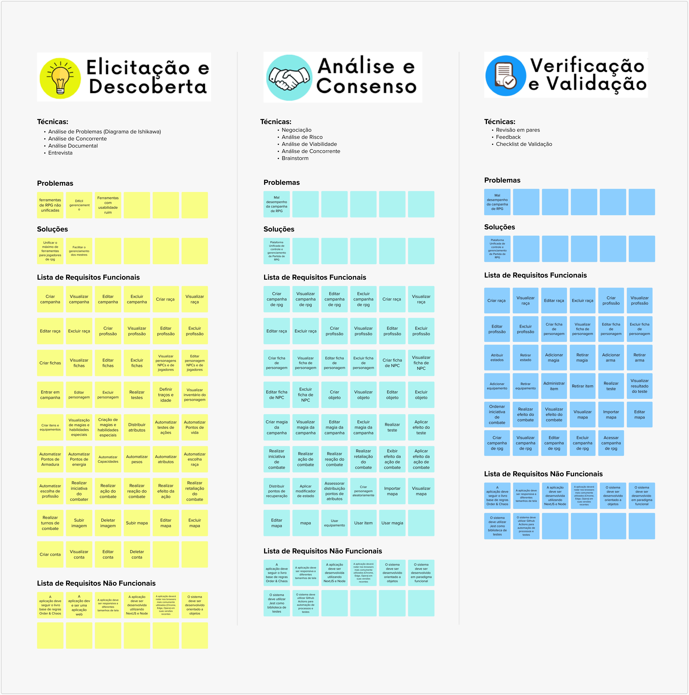
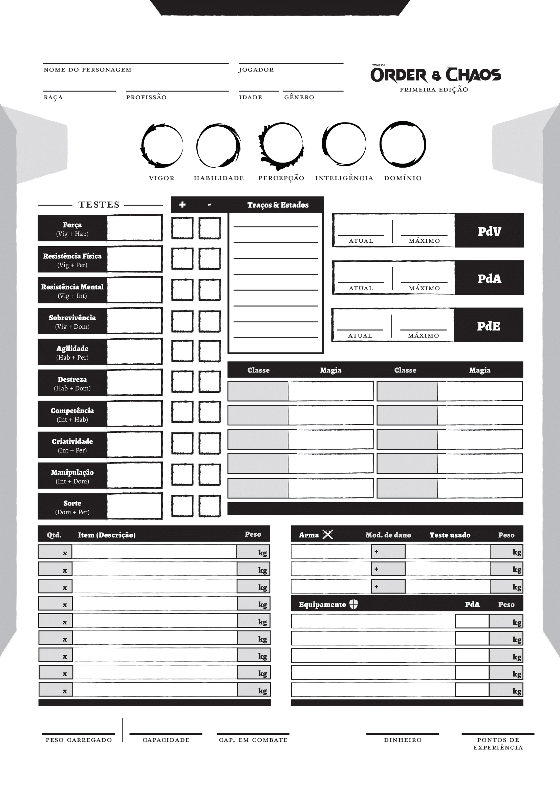
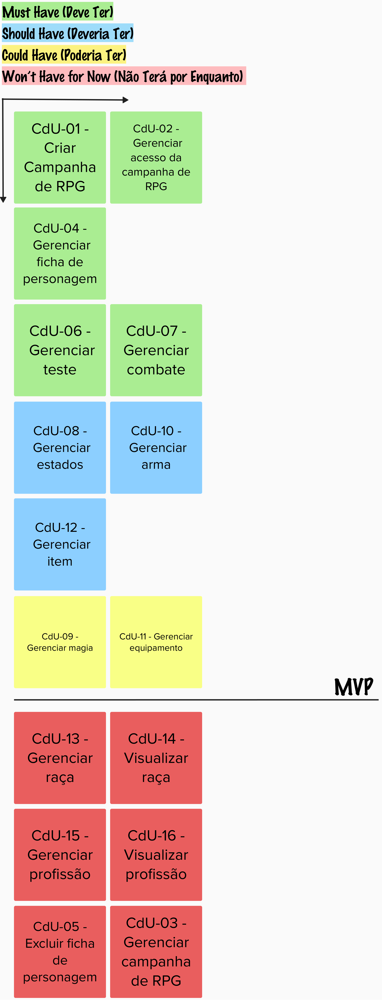

# Backlog Casos de Uso

## Introdução

&emsp;&emsp; O Processo Unificado utiliza casos de uso como forma de declaração e especificação de requisitos. Tendo isso em vista, antes de especificar os casos de uso, foi necessário elicitar os requisitos a serem declarados. Para isso, foram realizadas previamente as atividades de Elicitação e Descoberta, Análise e Consenso, Verificação e Validação da Engenharia de Requisitos. Esse processo pode ser observado na Figura 1 e os requisitos finais elicitados e passados pela verificação e validação na Tabela 1. 
 

<b>Figura 1:</b> Elicitação dos Requisitos. 

<table>
    <thead>
        <tr>
            <th>Requisitos Elicitados</th>
        </tr>
    </thead>
    <tbody>
        <tr>
            <td>Criar raça</td>
        </tr>
        <tr>
            <td>Visualizar raça</td>
        </tr>
        <tr>
            <td>Editar raça</td>
        </tr>
        <tr>
            <td>Excluir raça</td>
        </tr>
        <tr>
            <td>Criar profissão</td>
        </tr>
        <tr>
            <td>Visualizar profissão</td>
        </tr>
        <tr>
            <td>Editar profissão</td>
        </tr>
        <tr>
            <td>Excluir profissão</td>
        </tr>
        <tr>
            <td>Criar ficha de personagem</td>
        </tr>
        <tr>
            <td>Visualizar ficha de personagem</td>
        </tr>
        <tr>
            <td>Editar ficha de personagem</td>
        </tr>
        <tr>
            <td>Excluir ficha de personagem</td>
        </tr>
        <tr>
            <td>Atribuir estados</td>
        </tr>
        <tr>
            <td>Retirar estado</td>
        </tr>
        <tr>
            <td>Adicionar magia</td>
        </tr>
        <tr>
            <td>Retirar magia</td>
        </tr>
        <tr>
            <td>Adicionar arma</td>
        </tr>
        <tr>
            <td>Retirar arma</td>
        </tr>
        <tr>
            <td>Adicionar equipamento</td>
        </tr>
        <tr>
            <td>Retirar equipamento</td>
        </tr>
        <tr>
            <td>Administrar item</td>
        </tr>
        <tr>
            <td>Retirar item</td>
        </tr>
        <tr>
            <td>Realizar teste</td>
        </tr>
        <tr>
            <td>Visualizar resultado do teste</td>
        </tr>
        <tr>
            <td>Ordenar iniciativa de combate</td>
        </tr>
        <tr>
            <td>Realizar efeito do combate</td>
        </tr>
        <tr>
            <td>Visualizar efeito do combate</td>
        </tr>
        <tr>
            <td>Visualizar mapa</td>
        </tr>
        <tr>
            <td>Importar mapa</td>
        </tr>
        <tr>
            <td>Editar mapa</td>
        </tr>
        <tr>
            <td>Criar campanha de RPG</td>
        </tr>
        <tr>
            <td>Visualizar campanha de RPG</td>
        </tr>
        <tr>
            <td>Editar campanha de RPG</td>
        </tr>
        <tr>
            <td>Excluir campanha de RPG</td>
        </tr>
        <tr>
            <td>Acessar campanha de RPG</td>
        </tr>
    </tbody>
</table>

<b>Tabela 1:</b> Requisitos Elicitados. 

&emsp;&emsp; Para um melhor entendimento do que seriam alguns dos requisitos citados, a Figura 2 representa a <b>Ficha do Personagem</b> onde é o item que mantém todas as informações de um personagem durante a campanha.
 

<b>Figura 2:</b> Ficha do personagem. 

## Casos de Uso

### Atores

&emsp;&emsp; Foram identificados 2 atores dos fluxos de eventos do nosso sistema, são eles: 

- <b>Mestre:</b> refere-se ao jogador de uma campanha de RPG que deseja mestrar uma campanha no ChaosManager.
- <b>Jogador:</b> refere-se ao jogador de uma campanha de RPG que deseja participar de um campanha mestrada pela persona mestre

### Casos de Uso Identificados

&emsp;&emsp; Com base nos requisitos elicitados, foram identificados 15 casos de uso, como apresentado na Tabela 2. 

| ID | Nome do Caso de Uso | Descrição | Requisitos Envolvidos |
| :--- | :----: | :--- | :----: |
| CdU-01  | Criar Campanha de RPG | Este caso de uso permite o mestre criar uma sala de campanha onde possa administrar todas as suas sessões. Ele deve poder informar o nome, história e senha para a campanha ser criada. | Criar campanha de RPG Visualizar campanha de RPG   Editar campanha de RPG   Excluir campanha de RPG |
| CdU-02  | Gerenciar acesso da campanha de RPG | Este caso de uso permite os mestre e os jogadores acessarem uma sala de campanha onde possam ter acesso às ferramentas que os auxiliarão nas sessões. Eles devem poder acessar informando o nome da sala e sua senha de acesso. | Acessar campanha de RPG |
| CdU-03  | Gerenciar campanha de RPG |Esse caso de uso permite o mestre gerenciar sua sala de campanha como necessário, editando as informações que deseja ou até mesmo excluindo a campanha. | Visualizar campanha de RPG   Editar campanha de RPG   Excluir campanha de RPG |
| CdU-04  | Gerenciar ficha de personagem | Este caso de uso permite o mestre e os jogadores gerenciarem a ficha de personagem para que consigam administrar todas as informações do seu personagem durante a campanha, bem como criar a ficha e posteriormente editá-la. As fichas do mestre apenas ele poderá acessar, enquanto todos podem ver as dos outros jogadores.  | Criar ficha de personagem   Visualizar ficha de personagem   Editar ficha de personagem  |
| CdU-05  | Excluir ficha de personagem | Este caso de uso é utilizado pelo mestre para excluir uma ficha de personagem quando não mais necessária. | Excluir ficha de personagem |
| CdU-06  | Gerenciar teste | Este caso de uso protagoniza momentos em que os Jogadores e os personagens do Mestre precisam realizar ações que demandem alguma dificuldade, onde é possível realizar 10 testes diferentes. | Realizar teste   Visualizar resultado do teste |
| CdU-07  | Gerenciar combate | Este caso de uso será utilizado pelo mestre para gerenciar o combate e pelo jogador para reagir as ações do mestre no combate. Para tanto, o mestre pode indicar quem participa do combate e em que ordem, indicar quem participa do turno atacando e sendo atacado e por fim executando o efeito desse combate. | Ordenar iniciativa de combate   Realizar efeito do combate   Visualizar efeito do combate |
| CdU-08  | Gerenciar estados | Este caso de uso é utilizado pelos jogadores e mestre para gerenciar os estados que utilizarão durante a campanha de RPG, bem como adicioná-las e retirá-las de suas fichas de personagem. | Atribuir estados   Retirar estado |
| CdU-09  | Gerenciar magia | Este caso de uso é utilizado pelos jogadores e mestre para gerenciar as magias que utilizarão durante a campanha de RPG, bem como adicioná-las e retirá-las do sistema. | Adicionar magia   Retirar magia |
| CdU-10  | Gerenciar arma | Este caso de uso é utilizado pelos jogadores e mestre para gerenciar as armas que utilizarão durante a campanha de RPG, bem como adicioná-las e retirá-las de suas fichas de personagem. | Adicionar arma   Retirar arma |
| CdU-11  | Gerenciar equipamento | Este caso de uso é utilizado pelos jogadores e mestre para gerenciar os equipamentos que utilizarão durante a campanha de RPG, bem como adicioná-las e retirá-las de suas fichas de personagem. | Adicionar equipamento   Retirar equipamento |
| CdU-12  | Gerenciar item  | Este caso de uso é utilizado pelos jogadores e mestre para gerenciar os itens que utilizarão durante a campanha de RPG, bem como adicioná-las, alterar suas quantidades para acrescentá-las ou deduzí-las e retirá-los de suas fichas de personagem. | Administrar item   Retirar item |
| CdU-13  | Gerenciar raça | Este caso de uso é utilizado pelos jogadores e mestre para gerenciar as raças que utilizarão durante a campanha de RPG, bem como adicioná-las, editá-las e removê-las do sistema.  | Criar raça   Editar raça   Excluir raça |
| CdU-14  | Visualizar raça | Este caso de uso é utilizado pelos jogadores e mestre para visualizar as raças que existem durante a campanha de RPG, assim como as informações de cada uma delas. | Visualizar raça |
| CdU-15  | Gerenciar profissão | Este caso de uso é utilizado pelos jogadores e mestre para gerenciar as profissões que utilizarão durante a campanha de RPG, bem como adicioná-las, editá-las e removê-las do sistema.  | Criar profissão   Editar profissão   Excluir profissão |
| CdU-16  | Visualizar profissão | Este caso de uso é utilizado pelos jogadores e mestre para visualizar as profissões que existem durante a campanha de RPG, assim como as informações de cada uma delas. | Visualizar profissão |

<b>Tabela 2:</b> Casos de Uso. 

&emsp;&emsp; Com os atores e casos de usos identificados, foi criado o diagrama de casos de uso para visualizar como e por quem as ações são realizadas dentro do sistema, assim como a ligação entre casos quando existiam. O diagrama está disponível na Figura 3. 

<b>Figura 3:</b> Diagrama de caso de uso. 

### Especificação dos Casos de Uso

#### CdU-01 - Criar Campanha de RPG

|**Nome do caso de uso** |Criar Campanha de RPG|
| - | - |
|**Autor**|Emerson Teles e Larissa Gomes|
|**1. Atores**|Mestre |
|**2. Breve Descrição**|Este caso de uso permite o mestre criar uma sala de campanha onde possa administrar todas as suas sessões. Ele deve poder informar o nome, história e senha para a campanha ser criada.|
|**3. Fluxo básico de eventos**|
FB.

3\.1. O mestre seleciona a opção “Criar nova sala de campanha de RPG”.

3\.2. O mestre fornece um nome e história para a sala de campanha.

3\.3. O mestre define uma senha de acesso à sala de campanha.

3\.4. O mestre seleciona a opção de “Criar”. (FE01)

3\.5. O sistema faz a validação das informações. (FE02)

3\.6. O sistema cria a sala de campanha.

3\.7. O sistema gera um código de acesso para que os jogadores possam acessar a sala de campanha.

3\.7. O sistema informa ao mestre as instruções de acesso e o código de acesso dos jogadores.
|
|**4. Fluxo Alternativos**|Não há|
|**5. Fluxos de exceção**|
FE01 – Senha inválida 

No passo 3.4 do FB, caso a senha digitada seja menor que 5 dígitos, o sistema deve emitir a mensagem: “Senha inválida, defina uma senha com pelo menos 5 dígitos”. E, o caso de uso retorna ao 3.3 do FB.

FE02 –Campanha já existe

No passo 3.5 do FB, caso o nome da campanha informado já exista, o sistema deve emitir a mensagem: “Nome de campanha já existe, informe um novo”. E, o caso de uso retorna ao 3.2 do FB.
|
|**6. Pré-condições**|Não há|
|**7. Pós-condições**|7\.1. Sala de campanha criada.|
|**8. Pontos de extensão**|Não há|
|**9. Requisitos especiais**|Não há|
|**10. Regras de negócio**|Não há|

<b>Tabela 3:</b> Especificação Caso de Uso 01. 

#### CdU-02 - Gerenciar acesso da campanha de RPG

|**Nome do caso de uso** |Gerenciar acesso da campanha de RPG|
| - | - |
|**Autor**|Emerson Teles e Larissa Gomes|
|**1. Atores**|Mestre e jogador possuem essa mesma funcionalidade, nos fluxos serão referidos como usuário.|
|**2. Breve Descrição**|Este caso de uso permite o mestre e os jogadores acessarem uma sala de campanha onde possam ter acesso às ferramentas que os auxiliarão nas sessões. Eles devem poder acessar informando o nome da sala e sua senha de acesso.|
|**3. Fluxo básico de eventos**|
FB.

3\.1. O usuário seleciona a opção “Acessar sala de campanha de RPG”.

3\.2. O usuário fornece o nome e a senha de acesso.

3\.3. O usuário seleciona a opção “Acessar”.

3\.4. O sistema valida as informações. (FE01)

3\.5. O sistema exibe a sala de campanha.
|
|**4. Fluxo Alternativos**|Não há|
|**5. Fluxos de exceção**|Não há|
|**6. Pré-condições**|6\.1. Sala de campanha criada.|
|**7. Pós-condições**|7\.1. Usuários acessam a sala de campanha de RPG|
|**8. Pontos de extensão**|Não há|
|**9. Requisitos especiais**|Não há|
|**10. Regras de negócio**|Não há|

<b>Tabela 4:</b> Especificação Caso de Uso 02. 

#### CdU-03 - Gerenciar campanha de RPG

|**Nome do caso de uso** |Gerenciar campanha de RPG|
| - | - |
|**Autor**|Larissa Gomes|
|**1. Atores**|Mestre|
|**2. Breve Descrição**|Esse caso de uso permite o mestre gerenciar sua sala de campanha como necessário, editando as informações que deseja ou até mesmo excluindo a campanha.|
|**3. Fluxo básico de eventos**|
FB.

3\.1. O mestre seleciona a opção “Configurações”.

3\.2. O sistema apresenta as informações da campanha:

`     `- Nome

`     `- História

`     `- Senhas de acesso.

3\.3. O sistema apresenta as seguintes opções:

`     `- Editar

`     `- Excluir campanha (FA01)

3\.4. O mestre seleciona a opção “Editar”.

3\.5. O mestre altera as informações que deseja das apresentadas: `     `- Nome

`     `- História

`     `- Senhas de acesso.

3\.6. O mestre seleciona a opção de “Confirmar”.

3\.7. O sistema faz a validação das informações. (FE01) (FE02)

3\.8. O sistema atualiza as informações da campanha.
|
|**4. Fluxo Alternativos**|
4\.1. FA01 – Excluir Campanha

`   `4.1.1. O mestre seleciona a opção “Configurações”.

`   `4.1.2. O mestre seleciona a opção “Excluir campanha”

`   `4.1.3. O sistema confirma se o mestre deseja realizar essa ação.

`   `4.1.4. O mestre seleciona a opção de “Confirmar”.

`   `4.1.5. O sistema exclui a campanha.
|
|**5. Fluxos de exceção**|
FE01 – Senha inválida 

No passo 3.7 do FB, caso a senha digitada seja menor que 5 dígitos, o sistema deve emitir a mensagem: “Senha inválida, defina uma senha com pelo menos 5 dígitos”. E, o caso de uso retorna ao 3.5 do FB.

FE02 –Campanha já existe

No passo 3.7 do FB, caso o nome da campanha informado já exista, o sistema deve emitir a mensagem: “Nome de campanha já existe, informe um novo”. E, o caso de uso retorna ao 3.5 do FB.
|
|**6. Pré-condições**|
6\.1. Sala de campanha criada.

6\.2. Estar acessado a sala de campanha de RPG
|
|**7. Pós-condições**|
7\.1. Informações atualizadas da campanha

7\.2. Campanha excluída (fluxo alternativo)
|
|**8. Pontos de extensão**|Não há|
|**9. Requisitos especiais**|Não há|
|**10. Regras de negócio**|Não há|

<b>Tabela 5:</b> Especificação Caso de Uso 03. 

#### 
 CdU-04 - Gerenciar ficha de personagem 

|**Nome do caso de uso** |Gerenciar ficha de personagem|
| - | - |
|**Autores**|Gustavo França, Larissa Gomes e Pedro Eduardo|
|**1. Atores**|Mestre e jogador possuem essa mesma funcionalidade, nos fluxos serão referidos como usuário|
|**2. Breve Descrição**|Este caso de uso permite o mestre e os jogadores gerenciarem a ficha de personagem para que consigam administrar todas as informações do seu personagem durante a campanha, bem como criar a ficha e posteriormente editá-la. As fichas do mestre apenas ele poderá acessar, enquanto todos podem ver as dos outros jogadores.|
|**3. Fluxo básico de eventos**|
FB

3\.1. O usuário seleciona a opção “Ficha de personagem”.

3\.2. O sistema apresenta as seguintes opções:

`     `-  Criar ficha

`     `-  Lista de Fichas de Personagens (FA01)

3\.3. O usuário seleciona a opção “Criar ficha”

3\.4. O usuário fornece informações sobre o personagem:

`     `- Nome do usuário e do personagem

`     `- Raça e profissão (RN016)

`     `- Idade e gênero

`     `- Dinheiro

`     `- Traços (RN01) (RN02)

`     `- Pontos de vida, armadura, energia e experiência

`     `- História, notas e descrição física.

3\.5. O usuário seleciona os traços do personagem.

3\.6. O usuário atribui os valores dos atributos do personagem.

3\.7. O usuário seleciona a opção “Criar ficha”.

3\.8. O sistema cria uma ficha de personagem com os dados informados. (RN03) (RN04) (RN05) (RN06) (RN07) (RN08) (RN09) (RN010) (RN011) (RN012) (RN013) (RN014) (RN015)

3\.9. O sistema adiciona a ficha criada a lista de fichas de personagens.
|
|**4. Fluxo Alternativos**|
FA01 – Editar ficha

`   `4.1.1. O usuário seleciona a opção “Lista de Fichas de Personagens”

`   `4.1.2. O sistema apresenta todas as Fichas de Personagens

`   `4.1.3. O usuário seleciona uma Ficha de Personagem 

`   `4.1.4. O sistema apresenta as seguintes opções:

`     `- Editar

`     `- Excluir (PE01)

`   `4.1.5. O usuário seleciona a opção “Editar”

`   `4.1.6. O sistema exibe as informações que podem ser editadas:

`     `- Nome do usuário e do personagem

`     `- Raça e profissão (RN016)

`     `- Idade e gênero

`     `- Dinheiro

`     `- Traços (RN01) (RN02)

`     `- Pontos de vida, armadura, energia e experiência

`     `- História, notas e descrição física.

`   `4.1.7. O usuário seleciona o campo da informação que deseja alterar.

`   `4.1.8. O usuário fornece os novos dados nos campos exibidos.

`   `4.1.9. O usuário seleciona a opção de “Confirmar”.

`   `4.1.10. O sistema valida as informações. (FE01)

`   `4.1.11. O sistema atualiza os dados da ficha. (RN03) (RN04) (RN05) (RN06) (RN07) (RN08) (RN09) (RN010) (RN011) (RN012) (RN013) (RN014) (RN015)
|
|**5. Fluxos de exceção**|
FE01 – Personagem Morto

No passo 4.1.10 do FA01, caso os pontos de vida informados sejam ≤0, o sistema deve emitir a mensagem: “Personagem morto”. A ficha do personagem não pode mais ser editada. E, o caso de uso retorna ao 4.1.8 do FA01.
|
|**6. Pré-condições**|
6\.1. Sala de campanha criada.

6\.2. Estar acessado a sala de campanha de RPG
|
|**7. Pós-condições**|
7\.1. Ficha de personagem criada

7\.2. Informações atualizadas da ficha de personagem (fluxo alternativo)
|
|**8. Pontos de extensão**|
PE01 – Excluir

Excluir se refere ao caso de uso [CdU-05 - Excluir ficha de personagem](https://mdsreq-fga-unb.github.io/2023.2-ChaosManager/casodeUso/#3), sendo um ponto de extensão do caso de uso “Gerenciar ficha de personagem”
|
|**9. Requisitos especiais**|
9\.1. O sistema deve automatizar os valores dos testes do personagem

9\.2. O sistema deve automatizar o peso carregado pelo personagem

9\.3. O sistema deve automatizar a capacidade do personagem

9\.4. O sistema deve automatizar a capacidade em combate do personagem
|
|**10. Regras de negócio**|
RN:

(RN01) Se um jogador escolher um traço positivo, deverá escolher também um traço negativo 

(RN02) Se um jogador escolher um traço, não poderá escolher um traço antagônico

(RN03) O valor da força é igual o atributo vigor + habilidade

(RN04) O valor da resistência física é igual o atributo vigor + percepção

(RN05) O valor da resistência mental é igual o atributo vigor + inteligência

(RN06) O valor da sobrevivência é igual o atributo vigor + domínio

(RN07) O valor da agilidade é igual o atributo habilidade + percepção

(RN08) O valor da destreza é igual o atributo habilidade e domínio

(RN09) O valor da competência é igual o atributo inteligência + habilidade

(RN010) O valor da criatividade é igual o atributo vigor + habilidade

(RN011) O valor da manipulação é igual o atributo inteligência + domínio

(RN012) O valor da sorte é igual o atributo domínio + percepção

(RN013) O valor do peso é igual à soma dos pesos dos itens, armas e equipamentos

(RN014) A capacidade é igual ao valor da Força do personagem

(RN015) O valor da capacidade em combate é igual ao atributo Vigor do personagem

(RN016) Se o jogador escolher uma profissão com objeto, esse objeto deve ser adicionado a sua ficha.
|

<b>Tabela 6:</b> Especificação Caso de Uso 04. 

#### 
 CdU-05 - Excluir ficha de personagem

|**Nome do caso de uso** |Excluir ficha de personagem|
| - | - |
|**Autores**|Gustavo França, Larissa Gomes e Pedro Eduardo|
|**1. Atores**|Mestre|
|**2. Breve Descrição**|Este caso de uso é utilizado pelo mestre para excluir uma ficha de personagem quando não mais necessária.|
|**3. Fluxo básico de eventos**|
FB

3\.1. O usuário seleciona a opção “Ficha de personagem”.

3\.2. O usuário seleciona a opção “Lista de Fichas de Personagens"

3\.3. O sistema apresenta todas as Fichas de Personagens

3\.4. O usuário seleciona uma Ficha de Personagem 

3\.5. O sistema apresenta as seguintes opções:

`     `- Editar (PE01)

`     `- Excluir  3\.6. O usuário seleciona a opção “Excluir”

3\.7. O mestre seleciona a opção “Confirmar”

3\.8. O sistema exclui a ficha da “Lista de Fichas de Personagens"
|
|**4. Fluxo Alternativos**|Não há|
|**5. Fluxos de exceção**|Não há|
|**6. Pré-condições**|
6\.1. Sala de campanha criada.

6\.2. Estar acessado a sala de campanha de RPG

6\.3. Ficha de personagem criada.
|
|**7. Pós-condições**|7\.1. A ficha é excluída|
|**8. Pontos de extensão**|PE01 - Excluir ficha de personagem é um ponto de extensão do caso de uso [CdU-04 - Gerenciar ficha de personagem](https://mdsreq-fga-unb.github.io/2023.2-ChaosManager/casodeUso/#1)|
|**9. Requisitos especiais**|Não há|
|**10. Regras de negócio** |
RN:

(RN01) Quando um personagem morrer, ou seja, ter a sua vida zerada, deve aparecer para o mestre um pop-up para a exclusão da ficha.
|

<b>Tabela 7:</b> Especificação Caso de Uso 05. 

#### 
 CdU-06 - Gerenciar teste 

|**Nome do caso de uso** |Gerenciar teste|
| - | - |
|**Autores**|Gustavo França, Pedro Eduardo e Larissa Gomes|
|**1. Atores**|Mestre e Jogador são os atores designados para utilizar essas funcionalidades. Serão referenciados como usuário.|
|**2. Breve Descrição**|Este caso de uso protagoniza momentos em que os Jogadores e os personagens do Mestre precisam realizar ações que demandem alguma dificuldade, onde é possível realizar 10 testes diferentes.|
|**3. Fluxo básico de eventos**|
FB

3\.1. O usuário abre o campo de teste

3\.2. O sistema apresenta as seguintes opções:

`     `- Força

`     `- Resistência Física

`     `- Resistência Mental

`     `- Sobrevivência

`     `- Agilidade

`     `- Destreza

`     `- Competência (FA01)

`     `- Criatividade

`     `- Manipulação

`     `- Sorte

3\.2. O usuário seleciona o teste que irá realizar

3\.3. O usuário seleciona “rolar dados”

3\.4. O sistema mostra o resultado do teste no registro de ações. (FE01) (FE02) (RN01) (RN02)
|
|**4. Fluxo Alternativos**|
4\.1. FA01 – Teste de Competência

`   `4.1.1. O usuário seleciona o teste de competência.

`   `4.1.2. O usuário informa quanto pontos de energia deseja utilizar.

`   `4.1.3. O usuário seleciona “rolar dados”.

`   `4.1.4. O sistema deduz os pontos de energia utilizados da ficha do personagem.

`   `O caso de uso retorna ao 3.4 do FB.

|
|**5. Fluxos de exceção**|
5\.1. FE01 - Falha crítica

No passo 3.4 do FB e 4.1.5 do FA01, se valor do dado for 1, o sistema deve emitir a mensagem: “Falha crítica” no Registro de Ações. E, o caso de uso retorna ao 3.4 do FB.

5\.2. FE02 - Acerto crítico

No passo 3.4 do FB e 4.1.5 do FA01, se o valor do dado for 20, o sistema deve emitir a mensagem: “Acerto crítico” no Registro de Ações. E, o caso de uso retorna ao 3.4 do FB.

|
|**6. Pré-condições**|
6\.1. Sala de campanha criada.

6\.2. Estar acessado a sala de campanha de RPG

6\.3. Ficha de personagem criada.
|
|**7. Pós-condições**|7\.1. É retornado o resultado do teste|
|**8. Pontos de extensão**|Não há|
|**9. Requisitos especiais**|Não há|
|**10. Regras de negócio**|
RN:

(RN01) O resultado do teste deve obedecer ao cálculo do teste sendo um inteiro randomizado de 1 a 20 somado ao valor do teste e somado ao valor dos pontos de energia em caso de teste de competência

(RN02) Um registro de ações deve ser apresentado somente ao Mestre e a quem realizou a ação 

|

<b>Tabela 8:</b> Especificação Caso de Uso 06. 

#### CdU-07 - Gerenciar combate

|**Nome do caso de uso** |Gerenciar combate|
| - | - |
|**Autor**|Pedro Eduardo e Larissa Gomes|
|**1. Atores**|Mestre e Jogador são os atores designados para utilizar essas funcionalidades. Em caso que ambos são elegíveis para o passo, serão referenciados como usuário.|
|**2. Breve Descrição**|Este caso de uso será utilizado pelo mestre para gerenciar o combate e pelo jogador para reagir as ações do mestre no combate. Para tanto, o mestre pode indicar quem participa do combate e em que ordem, indicar quem participa do turno atacando e sendo atacado e por fim executando o efeito desse combate.|
|**3. Fluxo básico de eventos**|
FB

3\.1. O mestre abre o “Gerenciador de combate”.

3\.2. O mestre seleciona a opção “Adicionar ordem do combate”.

3\.3. O mestre adiciona as fichas dos personagens que participarão do combate na ordem que será realizado.

3\.4. O mestre seleciona as fichas de personagem de quem vai realizar e sofrer a ação.

3\.5. O mestre determina um teste para ser realizado (PI01)

3\.6. O mestre determina o valor mínimo para passar no teste 

3\.7. O usuário realizando a ação executa o teste indicado pelo mestre de acordo com a ação desejada. (PI01)

3\.8. O usuário sofrendo a ação realiza o teste indicado pelo mestre de acordo com a ação de reação desejada. (PI01) (FA01) 

3\.9. O mestre adiciona o valor da ação e o modificador de dano em caso de uso de arma (RN08) (RN09)

3\.10. O mestre adiciona o valor da reação (RN05) (RN06) (RN07) 

3\.11. O mestre adiciona pontos de energia (RN010) 

3\.12. O mestre executa o efeito do combate. (RN02) (RN03) (RN04) (RN011) (RN012) (RN013)

|
|**4. Fluxo Alternativos**|
4\.1. FA01 – Escolheu receber o golpe

`   `4.1.1. O usuário realizando a retaliação realiza o teste indicado pelo mestre de acordo com a ação desejada. (PI01)

`   `4.1.2. O usuário sofrendo a ação realiza o teste indicado pelo mestre de Resistência Física ou Mental (PI01)

`   `4.1.3. O mestre adiciona o valor da retaliação e o modificador de dano em caso de uso de arma (RN08) (RN09)

`   `O caso de uso retorna ao 3.11 do FB.

|
|**5. Fluxos de exceção**|Não há|
|**6. Pré-condições**|
6\.1. Sala de campanha criada.

6\.2. Ficha de personagem criada.

6\.3. Testes criados.
|
|**7. Pós-condições**|7\.1. As fichas que sofreram danos devem ter os pontos de vida e de armadura atualizados|
|**8. Pontos de extensão**|Não há|
|**9. Requisitos especiais**|Não há|
|**10. Regras de negócio**|
RN:

(RN01) O teste deve superar ou ser igual ao valor da dificuldade estipulada pelo mestre

(RN02) Se o teste não for maior ou igual ao valor estipulado pelo mestre e a consequência exigir um dano, então o jogador deverá realizar um teste de Resistência Física

(RN03) O dano recebido pela RN02 é igual ao dano estipulado pelo mestre – o valor do teste de Resistência Física

(RN04) Os Pontos de Armadura serão decrementados quando houver dano.

(RN05) O valor da reação de esquiva é o resultado de um teste de agilidade

(RN06) O valor da reação de defesa é o resultado de um teste de Resistência Física

(RN07) Se o jogador passar no teste da reação de esquivar, então não sofrerá dano

(RN08) O cálculo de dano sem uso de armas é igual ao valor obtido na Ação

(RN09) O cálculo de dano com o uso de armas é igual ao valor da ação + Modificador de dano

(RN010) O cálculo de dano causado por magia é igual ao valor da ação + Pontos de Energia usados

(RN011) O cálculo da absorção de dano da reação de defender OU situação sem chance de esquiva ou defesa é igual ao cálculo de dano – teste de Resistência Física

(RN012) O cálculo da absorção de dano da reação de esquivar (caso de falha) é igual ao cálculo de dano – o valor da Resistência Física do personagem

(RN013) O cálculo da absorção de dano da reação de não esquivar/defender é igual ao cálculo de dano – o valor da Resistência Física do personagem
|
|**11. Informações adicionais**|Pontos de Inclusão: (PI01) [CdU-06 - Gerenciar teste](https://mdsreq-fga-unb.github.io/2023.2-ChaosManager/casodeUso/#2)|

<b>Tabela 9:</b> Especificação Caso de Uso 07. 

#### CdU-08 - Gerenciar estados 

|**Nome do caso de uso** |Gerenciar estados|
| - | - |
|**Autor**|Larissa Gomes|
|**1. Atores**|Mestre e Jogador possuem essa mesma funcionalidade, nos fluxos serão referidos como usuário.|
|**2. Breve Descrição**|Este caso de uso é utilizado pelos jogadores e mestre para gerenciar os estados que utilizarão durante a campanha de RPG, bem como adicioná-las e retirá-las de suas fichas de personagem.|
|**3. Fluxo básico de eventos**|
FB.

3\.1. O usuário acessa a ficha (FA01)

3\.2. O usuário seleciona um campo vazio na seção de estados da ficha.

3\.3. O sistema apresenta as seguintes opções de estados:

`     `- Medo

`     `- Desespero

`     `- Estresse

`     `- Descontrole

`     `- Inconsciente/coma

`     `- Tontura

`     `- Embriaguez

`     `- Náusea

`     `- Hemorragia

`     `- Fratura óssea

`     `- Envenenamento

`     `- Fome

`     `- Frio

`     `- Calor

`     `- Humilhação

`     `- Trauma físico

`     `- Trauma psicológico

`     `- Mente controlada

`     `- Estado crítico de saúde

3\.4. O usuário seleciona o estado desejado das opções

3\.5. O usuário seleciona a opção de “confirmar”.

3\.6. O sistema valida o estado. (FE01)

3\.7. O sistema adiciona o estado na ficha.

3\.8. O sistema aplica as penalidades do estado na ficha do personagem.
|
|**4. Fluxo Alternativos**|
4\.2. FA02 – Retirar Estado

`   `4.2.1. O usuário seleciona o campo do estado que deseja retirar na seção de Traços&Estados da ficha.

`   `4.2.2. O usuário seleciona a opção “retirar estado”.

`   `4.2.3. O sistema retira o estado da ficha do personagem.

`   `4.2.4. O sistema remove as penalidades do estado aplicadas na ficha do personagem.

|
|**5. Fluxos de exceção**|
FE01 – Estado já aplicado

No passo 3.6 do FB, caso o usuário selecione um estado que já esteja aplicado, o sistema deve emitir a mensagem: “Estado já aplicado”. E, o caso de uso retorna ao 3.4 do FB.

|
|**6. Pré-condições**|
6\.1. Sala de campanha criada. 

6\.2. Estar acessado a sala de campanha de RPG

6\.3. Ficha de personagem criada
|
|**7. Pós-condições**|
7\.1. É adicionado um estado na ficha 

7\.2. Penalidades são aplicadas ao personagem de acordo com o estado

7\.3. É retirado uma arma na ficha removendo penalidades (fluxo alternativo)
|
|**8. Pontos de extensão**|8\.1. Gerenciar arma é o ponto de extensão do caso de uso [CdU-04 - Gerenciar ficha de personagem](https://mdsreq-fga-unb.github.io/2023.2-ChaosManager/casodeUso/#1)|
|**9. Requisitos especiais**|Não há|
|**10. Regras de negócio**|Não há|

<b>Tabela 10:</b> Especificação Caso de Uso 08. 

#### CdU-09 - Gerenciar magia

|**Nome do caso de uso** |Gerenciar magia|
| - | - |
|**Autor**|Oscar Brito e Larissa Gomes|
|**1. Atores**|Mestre e Jogador são os atores designados para utilizar essas funcionalidades. Serão referenciados como usuário.|
|**2. Breve Descrição**|Este caso de uso é utilizado pelos jogadores e mestre para gerenciar as magias que utilizarão durante a campanha de RPG, bem como adicioná-las e retirá-las do sistema.|
|**3. Fluxo básico de eventos**|
FB.

3\.1. O usuário acessa a ficha. (FA01)

3\.2. O usuário seleciona um campo vazio na seção de magia da ficha.

3\.3. O usuário seleciona uma classe de magia:

`     `- Habilidade especial

`     `- Encantamentos & Maldições

`     `- Abjuração

`     `- Alquimia

`     `- Transmutação

`     `- Translocação

`     `- Conjuração

`     `- Mentalização 

3\.4. O usuário preenche o campo de nome. 

3\.5. O usuário seleciona a opção de “Confirmar”.

3\.6. O sistema adiciona a magia na ficha. 
|
|**4. Fluxo Alternativos**|
4\.1. FA01 – Retirar magia

`   `4.2.1. O usuário seleciona o campo da magia que deseja retirar na seção de magia da ficha.

`   `4.2.2. O usuário seleciona a opção “Retirar magia”.

`   `4.2.3. O sistema retira a magia da ficha do personagem.

|
|**5. Fluxos de exceção**|Não há.|
|**6. Pré-condições**|
6\.1. Sala de campanha criada.

6\.2. Estar acessado a sala de campanha de RPG

6\.3. Ficha de personagem criada
|
|**7. Pós-condições**|
7\.1. É adicionado uma magia na ficha

7\.2. É retirado uma magia na ficha (fluxo alternativo)
|
|**8. Pontos de extensão**|8\.1. Gerenciar magia é o ponto de extensão do caso de uso [CdU-04 - Gerenciar ficha de personagem](https://mdsreq-fga-unb.github.io/2023.2-ChaosManager/casodeUso/#1)|
|**9. Requisitos especiais**|Não há|
|**10. Regras de negócio**|Não há|

<b>Tabela 11:</b> Especificação Caso de Uso 09. 

#### CdU-10 - Gerenciar arma

|**Nome do caso de uso** |Gerenciar arma|
| - | - |
|**Autor**|Larissa Gomes|
|**1. Atores**|Mestre e Jogador possuem essa mesma funcionalidade, nos fluxos serão referidos como usuário.|
|**2. Breve Descrição**|Este caso de uso é utilizado pelos jogadores e mestre para gerenciar as armas que utilizarão durante a campanha de RPG, bem como adicioná-las e retirá-las de suas fichas de personagem.|
|**3. Fluxo básico de eventos**|
FB.

3\.1. O usuário acessa a ficha. (FA02)

3\.2. O usuário seleciona um campo vazio na seção de arma da ficha.

3\.3. O sistema verifica se o usuário seleciona opção “arma existente” (FA01)

3\.4. O usuário preenche os campos de nome, teste usado e peso.

3\.5. O usuário seleciona o modificador de dano da arma.

3\.6. O usuário seleciona a opção de “confirmar”. 

3\.7. O sistema faz a validação da arma. (FE01)

3\.8. O sistema adiciona a arma na ficha. 

3\.9. O sistema adiciona a arma a lista de armas existentes.

3\.10. O sistema adiciona o peso da arma ao peso carregado do personagem.
|
|**4. Fluxo Alternativos**|
4\.1. FA01 – Seleciona Arma Existente

`   `4.1.1. O usuário seleciona opção “arma existente”.

`   `4.1.2. O usuário seleciona uma arma da lista.

`   `O caso de uso retorna ao 3.6 do FB.

4\.2. FA02 – Retirar Arma

`   `4.2.1. O usuário seleciona o campo da arma que deseja retirar na seção de arma da ficha.

`   `4.2.2. O usuário seleciona a opção “retirar arma”. 

`   `4.2.3. O sistema remove o peso da arma do peso carregado do personagem. 

`   `4.2.4. O sistema retira a arma da ficha do personagem.
|
|**5. Fluxos de exceção**|
FE01 – Arma já existe

No passo 3.7 do fluxo básico, caso o usuário informe o nome de uma arma existente, porém com dados diferentes da já cadastrada, o sistema deve emitir a mensagem: “Arma já cadastrada no sistema”. E, o caso de uso retorna ao 3.3 do FB.

|
|**6. Pré-condições**|
6\.1. Sala de campanha criada.

6\.2. Estar acessado a sala de campanha de RPG

6\.3. Ficha de personagem criada
|
|**7. Pós-condições**|
7\.1. É adicionado uma arma na ficha

7\.2. É retirado uma arma na ficha (fluxo alternativo)
|
|**8. Pontos de extensão**|8\.1. Gerenciar arma é o ponto de extensão do caso de uso [CdU-04 - Gerenciar ficha de personagem](https://mdsreq-fga-unb.github.io/2023.2-ChaosManager/casodeUso/#1)|
|**9. Requisitos especiais**|Não há|
|**10. Regras de negócio**|Não há|

<b>Tabela 12:</b> Especificação Caso de Uso 10. 

#### CdU-11 - Gerenciar equipamento

|**Nome do caso de uso** |Gerenciar equipamento|
| - | - |
|**Autor**|Larissa Gomes |
|**1. Atores**|Mestre e Jogador possuem essa mesma funcionalidade, nos fluxos serão referidos como usuário.|
|**2. Breve Descrição**|Este caso de uso é utilizado pelos jogadores e mestre para gerenciar os equipamentos que utilizarão durante a campanha de RPG, bem como adicioná-las e retirá-las de suas fichas de personagem.|
|**3. Fluxo básico de eventos**|
FB.

3\.1. O usuário acessa a ficha. (FA02)

3\.2. O usuário seleciona um campo vazio na seção de equipamentos da ficha.

3\.3. O sistema verifica se o usuário seleciona opção “equipamento existente”. (FA01)

3\.4. O usuário preenche os campos de nome, pontos de armadura (PdA) e peso.

3\.5. O usuário seleciona a opção de “confirmar”.

3\.6. O sistema faz a validação do equipamento. (FE01)

3\.7. O sistema adiciona o equipamento na ficha.

3\.8. O sistema adiciona a arma a lista de equipamentos existentes.

3\.9. O sistema adiciona o peso do equipamento ao peso carregado do personagem.
|
|**4. Fluxo Alternativos**|
4\.1. FA01 – Seleciona Equipamento Existente

`   `4.1.1. O usuário seleciona opção “equipamento existente”.

`   `4.1.2. O usuário seleciona um equipamento da lista.

`   `O caso de uso retorna ao 3.5 do FB.

4\.2. FA02 – Retirar Equipamento

`   `4.2.1. O usuário seleciona o campo do equipamento que deseja retirar na seção de equipamento da ficha.

`   `4.2.2. O usuário seleciona a opção “retirar equipamento”.

`   `4.2.3. O sistema remove o peso do equipamento do peso carregado do personagem. 

`   `4.2.4. O sistema retira o equipamento da ficha do personagem.
|
|**5. Fluxos de exceção**|
FE01 – Equipamento já existe

No passo 3.6 do FB, caso o usuário informe o nome de um equipamento existente, porém com dados diferentes do já cadastrado, o sistema deve emitir a mensagem: “Equipamento já cadastrado no sistema”. E, o caso de uso retorna ao 3.3 do FB.

|
|**6. Pré-condições**|
6\.1. Sala de campanha criada.

6\.2. Estar acessado a sala de campanha de RPG

6\.3. Ficha de personagem criada
|
|**7. Pós-condições**|
7\.1. É adicionado um equipamento na ficha

7\.2. É retirado um equipamento na ficha (fluxo alternativo)
|
|**8. Pontos de extensão**|8\.1. Gerenciar arma é o ponto de extensão do caso de uso [CdU-04 - Gerenciar ficha de personagem](https://mdsreq-fga-unb.github.io/2023.2-ChaosManager/casodeUso/#1)|
|**9. Requisitos especiais**|Não há.|
|**10. Regras de negócio**|Não há.|

<b>Tabela 13:</b> Especificação Caso de Uso 11. 

#### 
 CdU-12 - Gerenciar item 

|**Nome do caso de uso** |Gerenciar item|
| - | - |
|**Autor**|Larissa Gomes|
|**1. Atores**|Mestre e Jogador possuem essa mesma funcionalidade, nos fluxos serão referidos como usuário.|
|**2. Breve Descrição**|Este caso de uso é utilizado pelos jogadores e mestre para gerenciar os itens que utilizarão durante a campanha de RPG, bem como adicioná-las, alterar suas quantidades para acrescentá-las ou deduzí-las e retirá-los de suas fichas de personagem.|
|**3. Fluxo básico de eventos**|
FB.

3\.1. O usuário acessa a ficha. (FA01) (FA02)

3\.2. O usuário seleciona um campo vazio na seção de item da ficha.

3\.3. O usuário preencher os campos de nome e peso.

3\.6. O usuário seleciona a opção de “confirmar”.

3\.8. O sistema adiciona uma unidade do item na ficha.

3\.10. O sistema adiciona o peso do item ao peso carregado do personagem.
|
|**4. Fluxo Alternativos**|
4\.1. FA01 – Alterar quantidade do item

`   `4.1.1. O usuário seleciona o item que deseja alterar a quantidade.

`   `4.1.2. O usuário seleciona o campo de quantidade.

`   `4.1.3. O usuário altera a quantidade de itens para o desejado.

`   `4.1.4. O usuário seleciona a opção de “confirmar”.

`   `4.1.5. O sistema valida a nova quantidade. (FE01) (FE02)

`   `4.1.6. O sistema atualiza o peso carregado do personagem. (RN01)

`   `4.1.7. O sistema atualiza a nova quantidade do item na ficha.

4\.2. FA02 – Retirar Item

`   `4.2.1. O usuário seleciona o campo do item que deseja retirar na seção de item da ficha.

`   `4.2.2. O usuário seleciona a opção “retirar item”.

`   `4.2.3. O sistema remove o peso do item do peso carregado do personagem. 

`   `4.2.4. O sistema retira o item da ficha do personagem.    
|
|**5. Fluxos de exceção**|
FE01 – Nova quantidade negativa

No passo 4.1.5 do FA01, caso o usuário informe a quantidade do item como 0, o sistema deve emitir a mensagem: “Quantidade inválida”. E, o caso de uso retorna ao 4.1.3 do FA01.

FE01 – Nova quantidade 0

No passo 4.1.5 do FA01, caso o usuário a quantidade do item como 0, o sistema deve emitir a mensagem: “Quantidade inválida, deseja retirar o item?”. Em caso negativo, o caso de uso retorna ao 4.1.3 do FA01, em caso positivo o caso de uso passa para o passo 4.2.3 do FA02.
|
|**6. Pré-condições**|
6\.1. Sala de campanha criada.

6\.2. Estar acessado a sala de campanha de RPG

6\.3. Ficha de personagem criada
|
|**7. Pós-condições**|
7\.1. É adicionado um item na ficha

7\.2. É alterado a quantidade de um item da ficha (fluxo alternativo)

7\.3. É retirado um item na ficha (fluxo alternativo)
|
|**8. Pontos de extensão**|8\.1. Gerenciar arma é o ponto de extensão do caso de uso [CdU-04 - Gerenciar ficha de personagem](https://mdsreq-fga-unb.github.io/2023.2-ChaosManager/casodeUso/#1)|
|**9. Requisitos especiais**|Não há.|
|**10. Regras de negócio**|
Regras de Negócio:

(RN01) Peso do item a ser acrescentado ao peso carregado = (peso do item) x (Nova quantidade -quantidade Anterior)
|

<b>Tabela 14:</b> Especificação Caso de Uso 12. 

#### CdU-13 - Gerenciar raça

|**Nome do caso de uso** |Gerenciar raça|
| - | - |
|**Autor**|Oscar|
|**1. Atores**|Mestre e Jogador são os atores designados para utilizar essas funcionalidades. |
|**2. Breve Descrição**|Este caso de uso é utilizado pelos jogadores e mestre para gerenciar as raças que utilizarão durante a campanha de RPG, bem como adicioná-las e retirá-las do sistema e da ficha de personagem. |
|**3. Fluxo básico de eventos**|
FB.

3\.1. O mestre seleciona a opção “Gerenciar Raça”.

3\.2. O sistema apresenta as seguintes opções:

`     `- Criar Raça

`     `- Editar Raça (FA01)

`     `- Excluir Raças (FA02)

3\.3. O mestre seleciona a opção de “Criar raça”

3\.4. O mestre preenche os campos de:

`     `- Nome

`     `- Detalhamento

`     `- Atributos

`     `- Tabela de idades com seus testes afetados.  

3\.5. O mestre seleciona a opção de “confirmar”. 

3\.6. O sistema faz a validação da raça. (FE01) 

3\.7. O sistema adiciona a raça na lista de raças existentes. 

 
|
|**4. Fluxo Alternativos**|
4\.1. FA01 – Editar Raça  

`   `4.1.1. O mestre seleciona a opção de editar raça.

`   `4.1.2. O mestre seleciona a raça desejada da lista de raças existentes.

`   `4.1.3. O mestre edita as informações desejadas da raça.

`   `4.1.4. O mestre seleciona a opção de “confirmar”. 

`   `4.1.5. O sistema faz a validação da raça. (FE01) 

`   `4.1.6. O sistema atualiza as informações da raça. 

`   `4.1.7. O sistema atualiza as informações nas fichas que tem a raça.

4\.2. FA02 – Remover Raça 

`   `4.2.1. O mestre seleciona a opção de “remover raça”. 

`   `4.2.2. O mestre seleciona a raça desejada da lista de raças existentes.

`   `4.2.3. O sistema remove a raça da lista de raça existentes.

`   `4.2.4. O sistema remove as raças das fichas dos personagens

`   `4.2.5. O sistema remove os atributos alterados pela raça.

`   `4.2.6. O sistema remove os testes afetados pela idade alterados pela raça.
|
|**5. Fluxos de exceção**|
FE01 – Raça já existe 

No passo 3.6 do fluxo básico, caso o usuário informe o nome de uma raça existente, porém com dados diferentes da já cadastrada, o sistema deve emitir a mensagem: “Raça já cadastrada no sistema”. E, o caso de uso retorna ao 3.4 do FB.
|
|**6. Pré-condições**|
6\.1. Sala de campanha criada.

6\.2. Estar acessado a sala de campanha de RPG
|
|**7. Pós-condições**|
7\.1. É adicionado uma raça na campanha

7\.2. É atualizado a raça, alterando as informações nas fichas que a possuem (fluxo alternativo)

7\.3. É removido a raça da campanha, retirando os atributos e os testes afetados pela idade da ficha dos personagens com essa raça (fluxo alternativo)

|
|**8. Pontos de extensão**|Não há|
|**9. Requisitos especiais**|Não há|
|**10. Regras de negócio**|Não há|

<b>Tabela 15:</b> Especificação Caso de Uso 13. 

#### CdU-14 - Visualizar raça

|**Nome do caso de uso** |Visualizar raça|
| - | - |
|**Autor**|Oscar Brito e Larissa Gomes|
|**1. Atores**|Mestre e Jogador possuem essa mesma funcionalidade, nos fluxos serão referidos como usuário.|
|**2. Breve Descrição**|Este caso de uso é utilizado pelos jogadores e mestre para visualizar as raças que existem durante a campanha de RPG, assim como as informações de cada uma delas.|
|**3. Fluxo básico de eventos**|
FB.

3\.1. O usuário acessa a área da lista de raças.

3\.2. O usuário seleciona a raça que deseja visualizar.

3\.3. O sistema mostra as informações de:

`     `- Nome

`     `- Detalhamento

`     `- Atributos

`     `- Tabela de idades com seus testes afetados.  

|
|**4. Fluxo Alternativos**|Não há.|
|**5. Fluxos de exceção**|Não há.|
|**6. Pré-condições**|
6\.1. Sala de campanha criada. 

6\.2. Estar acessado a sala de campanha de RPG
|
|**7. Pós-condições**|7\.1. É acessado as informações de uma raça|
|**8. Pontos de extensão**|Não há|
|**9. Requisitos especiais**|Não há|
|**10. Regras de negócio**|Não há.|

<b>Tabela 16:</b> Especificação Caso de Uso 14. 

#### CdU-15 - Gerenciar profissão

|**Nome do caso de uso** |Gerenciar profissão|
| - | - |
|**Autor**|Gustavo França e Larissa Gomes|
|**1. Atores**|Mestre e Jogador são os atores designados para utilizar essas funcionalidades. |
|**2. Breve Descrição**|Este caso de uso é utilizado pelos jogadores e mestre para gerenciar as profissões que utilizarão durante a campanha de RPG, bem como adicioná-las, editá-las e removê-las do sistema.  |
|**3. Fluxo básico de eventos**|
FB.

3\.1. O mestre seleciona a opção “Gerenciar Profissão”.

3\.2. O sistema apresenta as seguintes opções:

`     `- Criar Profissão

`     `- Editar Profissão (FA01)

`     `- Excluir Profissão (FA02)

3\.3. O mestre seleciona a opção de “Criar profissão"

3\.4. O mestre preenche os campos de:

`     `- Nome

`     `- Descrição

`     `- Bônus e/ou penalidades

`     `- Um objeto associado a essa profissão

3\.5. O mestre seleciona a opção de “confirmar”. 

3\.6. O sistema faz a validação da profissão. (FE01) 

3\.7. O sistema adiciona a profissão na lista de profissões existentes.

|
|**4. Fluxo Alternativos**|
4\.1. FA01 – Editar Profissão  

`   `4.1.1. O mestre seleciona a opção de editar profissão.

`   `4.1.2. O mestre seleciona a profissão desejada da lista de profissões existentes.

`   `4.1.3. O mestre edita as informações desejadas da profissão 

`   `4.1.4. O mestre seleciona a opção de “confirmar”. 

`   `4.1.5. O sistema faz a validação da profissão (FE01) 

`   `4.1.6. O sistema atualiza as informações da profissão.

`   `4.1.7. O sistema atualiza as informações nas fichas que tem a profissão.

4\.2. FA02 – Remover profissão

`   `4.2.1. O mestre seleciona a opção de “remover profissão”. 

`   `4.2.2. O mestre seleciona a profissão desejada da lista de profissões existentes.

`   `4.2.3. O sistema remove a profissão da lista de profissões existentes.

`   `4.2.4. O sistema remove as profissões das fichas dos personagens.

`   `4.2.5. O sistema remove os atributos alterados pela profissão.

`   `4.2.6. O sistema remove o objeto associado a essa profissão se ainda estiver na ficha.

|
|**5. Fluxos de exceção**|
FE01 – Profissão já existe 

No passo 3.6 do FB, caso o usuário informe o nome de uma profissão existente, porém com dados diferentes da já cadastrada, o sistema deve emitir a mensagem: “Profissão já cadastrada no sistema”. E, o caso de uso retorna ao 3.4 do FB.

|
|**6. Pré-condições**|
6\.1. Sala de campanha criada. 

6\.2. Estar acessado a sala de campanha de RPG

6\.3. Ficha de personagem criada
|
|**7. Pós-condições**|
7\.1. É adicionado uma profissão na campanha

7\.2. É atualizado a profissão, alterando as informações nas fichas que a possuem (fluxo alternativo)

7\.3. É removido a profissão da campanha retirando os atributos e os objetos associados da ficha dos personagens com essa profissão (fluxo alternativo)

|
|**8. Pontos de extensão**|Não há|
|**9. Requisitos especiais**|Não há|
|**10. Regras de negócio**|Não há|

<b>Tabela 17:</b> Especificação Caso de Uso 15. 

#### CdU-16 - Visualizar profissão

|**Nome do caso de uso** |Visualizar profissão|
| - | - |
|**Autor**|Gustavo França e Larissa Gomes|
|**1. Atores**|Mestre e Jogador possuem essa mesma funcionalidade, nos fluxos serão referidos como usuário.|
|**2. Breve Descrição**|Este caso de uso é utilizado pelos jogadores e mestre para visualizar as profissões que existem durante a campanha de RPG, assim como as informações de cada uma delas.|
|**3. Fluxo básico de eventos**|
FB.

3\.1. O usuário acessa a área da lista de profissões.

3\.2. O usuário seleciona a profissão que deseja visualizar.

3\.3. O sistema mostra as informações de:

`     `- Nome

`     `- Descrição

`     `- Bônus e/ou penalidades

`     `- Um objeto associado a essa profissão

|
|**4. Fluxo Alternativos**|Não há.|
|**5. Fluxos de exceção**|Não há.|
|**6. Pré-condições**|
6\.1. Sala de campanha criada. 

6\.2. Estar acessado a sala de campanha de RPG

6\.3. Ficha de personagem criada
|
|**7. Pós-condições**|7\.1. É acessado as informações de uma profissão|
|**8. Pontos de extensão**|Não há|
|**9. Requisitos especiais**|Não há|
|**10. Regras de negócio**|Não há.|

<b>Tabela 18:</b> Especificação Caso de Uso 16. 

### Backlog priorizado

&emsp;&emsp; Para Organizar e Atualizar o Backlog, realizamos a priorização dos Casos de Uso utilizando a técnica MoSCoW para determinar a prioridade dos requisitos, os critérios utilizados para definir o que seria Must, Should, Could ou Would foram o <b>valor de negócio</b>, a <b>complexidad</b>e e a <b>viabilidade</b>, tendo um maior peso os que possuiam valor de negócio que ajudava a cumprir os objetivos e necessidades mais urgentes do cliente. A execução da técnica pode ser vista na Figura 4.

<b>Figura 4:</b> Priorização MoSCoW. 

### MVP

&emsp;&emsp; Com base nos objetivos a serem atingidos no projeto, os Casos de Uso a fazerem parte do MVP foram selecionados com isso em vista. A Tabela 3 apresenta a relação dos Casos de Uso e qual objetivo secundário estariam contribuindo para ser atingido. Cumprindo todos os objetivos secundários, o objetivo principal de <b>“Unificar ferramentas de Combate, fichas de personagem, ação/teste de habilidade e interpretação de um rpg de mesa por meio da implementação do sistema de regras Order&Caos.
”</b> será alcançado.

| Objetivos secundários  | Casos de Uso do MVP |
| :---: | :----: |
| Permitir que jogadores se reunam em um único ambiente | CdU-01 - Criar Campanha de RPG   CdU-02 - Gerenciar acesso da campanha de RPG |
| Os usuários devem conseguir ter acesso a todas as suas informações por meio da ficha de personagem | CdU-04 - Gerenciar ficha de personagem   CdU-08 - Gerenciar estados   CdU-09 - Gerenciar magia   CdU-10 - Gerenciar arma   CdU-11 - Gerenciar equipamento   CdU-12 - Gerenciar item |
| Os usuários devem poder usufruir das dinâmicas disponíveis (Testes e combate) | CdU-06 - Gerenciar teste   CdU-07 - Gerenciar combate |

### Definição de Preparado (DOR)

&emsp;&emsp; É o acordo entre o time e o cliente indicando quando um requisito estará preparado para ser puxado para uma iteração. 

 - O caso de uso possui fluxos de eventos com um ou mais requisitos identificados;
 - O caso de uso possui uma especificação;
 - A especificação do caso de uso todos os campos de **Atores, Fluxo básico de eventos, Fluxo Alternativos, Fluxos de exceção, Pré-condições, Pós-condições, Pontos de extensão, Requisitos especiais, Informações adicionais e Regras de Negócios** preenchidos;;;
 - Houve um consenso da equipe de desenvolvimento de que esse caso de uso deve entrar na iteração de desenvolvimento;
 - O caso de uso está mapeado para uma interface (protótipo);
 - Caso existam, as dependências dos requisitos foram identificadas.

### Definição de Pronto (DOD)

&emsp;&emsp; É o acordo que demonstra a qualidade do requisito produzido,na qual “Done”comprova a satisfação de todos como trabalho realizado. Se um requisito não atende ao “Done”, ele não deve ser liberado ou mesmo apresentado para a iteração. 

- O requisito entrega um incremento do produto;
- Todos os fluxos de eventos e condições do caso de uso foram seguidos;
- O código das funcionalidades relacionadas ao caso de uso foi revisado e aprovado por outro(s) membro(s) da equipe;
- O código das funcionalidades relacionadas ao caso de uso segue os padrões de codificação da estabelecidos pela equipe.

## Histórico de versão

| Data  | Versão | Descrição                            | Autor                          |
| :---: | :----: | ------------------------------------ | ------------------------------ |
| 25/10 |  1.0   | Criação documento de casos de uso | Larissa Gomes e Oscar de Brito |
| 25/10 |  1.1   | Adição das especificações | Emerson Teles, Gustavo França, Larissa Gomes, Oscar de Brito e Pedro Eduardo|
| 01/10 |  2.0   | Atualização descrições de caso de uso e correção de especificações | Larissa Gomes |
| 01/10 |  2.1   | Adicionando DOR e DOD | Larissa Gomes, Emerson Teles e Luciano |
| 15/10 |  3.0   | Correção das especificações | Larissa Gomes, Emerson Teles e Luciano |
