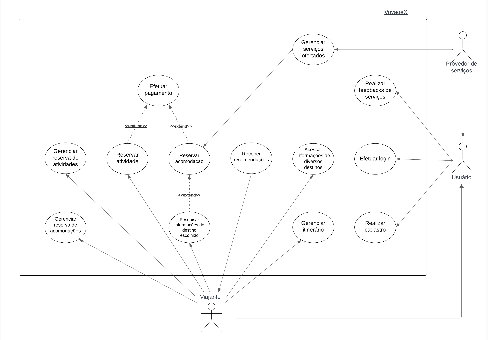

# Estudo de Caso - VoyageX

## Introdução

VoyageX foi contruído pelo professor George Marsicano (2023) como um Estudo de Caso almejando uma contribuição na matéria envolvendo o assunto "Casos de Uso". Neste artefato, é apresentado o que foi realizado pela facção Insurgentes Estelares, sintetizando os Atores, Casos de Uso identificado além das suas especificações com base no documento proposto.

## Casos de Uso

### Atores

Foram identificados 2 atores dos fluxos de eventos do nosso sistema, são eles:

- Viajante: Destinado a quem utiliza os serviços do aplicativo VoyageX
- Provedor de Serviços: Destinado a quem organiza os serviços que serão ofertados
- Usuário: Refere-se a ações compartilhadas em que os outros dois atores participam

## Casos de Uso Identificados

É apresentado na Tabela 1 os Casos de Uso que foram encontrados:

<table>
    <tr>
      <th>ID</th>
      <th>NOME DO CASO DE USO</th>
      <th>ATOR</th>
      <th>RESULTADO</th>
    </tr>
    <tr>
      <td>CdU-01</td>
      <td>Realizar cadastro</td>
      <td>Usuário</td>
      <td>Cadastro realizado no aplicativo</td>
    </tr>
    <tr>
      <td>CdU-02</td>
      <td>Efetuar login</td>
      <td>Usuário</td>
      <td>Acesso autorizado ao "VoyageX"</td>
    </tr>
    <tr>
      <td>CdU-03</td>
      <td>Realizar feedbacks de serviços</td>
      <td>Viajante</td>
      <td>Os viajantes podem avaliar os serviços utilizados e os provedores de hospedagem podem avaliar o comportamento do contratante</td>
    </tr>
    <tr>
      <td>CdU-04</td>
      <td>Acessar informações de diversos destinos</td>
      <td>Viajante</td>
      <td>Visualizar conteúdos de destinos disponíveis</td>
    </tr>
    <tr>
      <td>CdU-05</td>
      <td>Gerenciar itinerário</td>
      <td>Usuário</td>
      <td>Manter viagem com calendário e o cronograma atualizado</td>
    </tr>
    <tr>
      <td>CdU-06</td>
      <td>Receber recomendações</td>
      <td>Viajante</td>
      <td>Obter sugestões de acomodações e atividades de acordo com preferências</td>
    </tr>
    <tr>
      <td>CdU-07</td>
      <td>Pesquisar informações do destino escolhido</td>
      <td>Viajante</td>
      <td>Pesquisar conteúdo do destino escolhido</td>
    </tr>
    <tr>
      <td>CdU-08</td>
      <td>Reservar acomodação</td>
      <td>Viajante</td>
      <td>Acomodação reservada</td>
    </tr>
    <tr>
      <td>CdU-09</td>
      <td>Reservar atividade</td>
      <td>Viajante</td>
      <td>Atividade reservada</td>
    </tr>
    <tr>
      <td>CdU-10</td>
      <td>Efetuar pagamento</td>
      <td>Viajante</td>
      <td>Acessar informações da atividade escolhida</td>
    </tr>
    <tr>
      <td>CdU-11</td>
      <td>Gerenciar reserva de atividades</td>
      <td>Viajante</td>
      <td>Reservar, atualizar e cancelar reserva de acomodação</td>
    </tr>
    <tr>
      <td>CdU-12</td>
      <td>Gerenciar reserva de acomodações</td>
      <td>Provedor de Serviços</td>
      <td>Cadastrar e remover serviços de hospedagem e atividades</td>
    </tr>
  </table>

Com os atores e casos de usos identificados, foi criado o diagrama de casos de uso para visualizar como e por quem as ações são realizadas dentro do sistema, assim como a ligação entre casos quando existiam. O diagrama está disponível na Figura 1.

## Especificação dos Casos de Uso

### CdU-07 - Pesquisar informações do destino escolhido

<table>
    <tr>
        <th>Nome do caso de uso</th>
        <td>Pesquisar informações do destino escolhido</td>
    </tr>
    <tr>
        <th>Autor</th>
        <td>Gustavo França, Larissa Gomes e Oscar de Brito</td>
    </tr>
    <tr>
        <th>1. Atores</th>
        <td>Viajante</td>
    </tr>
    <tr>
        <th>2. Breve Descrição</th>
        <td>O usuário pode pesquisar informações detalhadas sobre o local, incluindo os melhores períodos para visitar, atrações culturais, culinária local, e dicas de viagem. Também podem filtrar acomodações por preço, localização, tipo (hotel, aluguel de temporada, pousada), e avaliações de outros viajantes.</td>
    </tr>
    <tr>
        <th>3. Fluxo básico de eventos</th>
        <td>
            
3.1. O viajante digita o destino que deseja pesquisar (FE01)

            
3.2. O sistema apresenta as seguintes opções: - Pesquisar informações de destino - Filtrar acomodações (FA01)

            
3.3. O viajante seleciona "Pesquisar informações de destino" (FE01)

            
3.4. O sistema retorna as informações requisitadas. (RN01) (RN02) (RN03) (FA02)

        </td>
    </tr>
    <tr>
        <th>4. Fluxo Alternativos</th>
        <td>
            
4.1. FA01 - Filtrar acomodações 
            
4.1.1. O viajante seleciona a opção "Filtrar acomodações"
 
            
4.1.2. O sistema apresenta as seguintes opções de filtro: - Preço - Localização - Tipo (hotel, aluguel de temporada, pousada) - Avaliações de outros viajantes

            
4.1.3. O viajante informa os filtros que deseja aplicar
 
            
4.1.4. O sistema valida as informações (FE01)
 
            
O caso de uso retorna ao 3.4 do FB

            
 4.2. FA02 - Visualizar acomodação

            
4.2.1. O viajante seleciona uma acomodação.
 
            
O caso de uso retorna ao 3.4 do FB

        </td>
    </tr>
    <tr>
        <th>5. Fluxos de exceção</th>
        <td>
            
5.1. FE01 - Destino inválido

            
No passo 3.3, caso o destino digitado não corresponda a nenhum local válido, o sistema deve emitir a mensagem: “Destino inválido, digite novamente”. E, o caso de uso retorna ao 3.1 do FB.
 
            
5.1. FE01 - Localização inválida

            
No passo 4.1.4 do FA, caso a localização digitada não corresponda a nenhum local válido, o sistema deve emitir a mensagem: “Localização inválida, digite novamente”. E, o caso de uso retorna ao 4.1.3 do FA.

        </td>
    </tr>
    <tr>
        <th>6. Pré-condições</th>
        <td>
            
6.1. O viajante deve possuir uma conta na plataforma

            
6.2. O viajante deve estar logado na sua conta

        </td>
    </tr>
    <tr>
        <th>7. Pós-condições</th>
        <td>
            
7.1. Informações do destino desejado

            
7.2. Acomodações filtradas como desejado

        </td>
    </tr>
    <tr>
        <th>8. Pontos de extensão</th>
        <td>Não há.</td>
    </tr>
    <tr>
        <th>9. Requisitos especiais</th>
        <td>Não há</td>
    </tr>
    <tr>
        <th>10. Regras de negócio</th>
        <td>
            
RN01 - Se a informação requisitada for de informações de destino, então ela deve apresentar no máximo os 2 melhores períodos para ser visitado. As atrações culturais com os seus períodos de funcionamento. A culinária local com as suas restrições alimentares. Nas dicas de viagem, devem ser listados as 5 melhores dicas baseado nas avaliações dos usuários

            
RN02 - Se a informação requisitada for de filtrar acomodações, então ela deve apresentar uma faixa entre o valor mínimo e o máximo, além de listar por uma ordenação por preço. Na localização, poderá ser definida por destinos mais próximos da localização atual do usuário. O tipo do destino deve apresentar 3 categorias diferentes. E nas avaliações de outros viajantes, deve apresentar de 1 a 5 estrelas.

            
RN03 - Se a informação requisitada for de visualizar acomodações, então ela deve apresentar até 15 fotos da acomodação. Nas descrições detalhadas, até 2500 caracteres e na disponibilidade, deve ser apresentado os períodos de reserva da acomodação

        </td>
    </tr>
    <tr>
        <th>11. Informações adicionais</th>
        <td>Não há</td>
    </tr>
</table>

### CdU-08 - Reservar acomodação

<table>
    <tr>
        <th>Nome do caso de uso</th>
        <td>Reservar acomodação</td>
    </tr>
    <tr>
        <th>Autor</th>
        <td>Gustavo França, Larissa Gomes e Oscar de Brito</td>
    </tr>
    <tr>
        <th>1. Atores</th>
        <td>Viajante e o Provedor de serviços</td>
    </tr>
    <tr>
        <th>2. Breve Descrição</th>
        <td>O viajante pode escolher a acomodação, visualizar fotos, ler descrições detalhadas, verificar a disponibilidade e realizar a reserva diretamente pelo aplicativo.</td>
    </tr>
    <tr>
        <th>3. Fluxo básico de eventos</th>
        <td>
            
3.1. O viajante seleciona o período de reserva (FE01)

            
3.2. O viajante informa a quantidade de hóspedes

            
3.3. O viajante informa os dados dos hóspedes

            
3.4. O viajante seleciona a opção "Reservar acomodação"

            
3.5. O sistema valida as informações (RN01)

            
3.6. O sistema informa o valor final e solicita o pagamento (PE02)

            
3.7. O sistema envia a solicitação de reserva para o provedor de serviços

            
3.8. O provedor de serviços analisa a reserva (FE02)

            
3.9. O sistema envia um email do status da reserva para o viajante (RN02)

        </td>
    </tr>
    <tr>
        <th>4. Fluxo Alternativos</th>
        <td>Não há.</td>
    </tr>
    <tr>
        <th>5. Fluxos de exceção</th>
        <td>
            
5.1. FE01 - Período inválido No passo 3.1 do FB, caso o período de reserva selecionado não esteja disponível, o sistema deve emitir a mensagem: “Esta data não está disponível”. E, o caso de uso retorna ao 3.1 do FB.

            
5.2. FE02 - Reserva rejeitada No passo 3.8 do FB, caso o provedor de serviços rejeite a solicitação de reserva, o sistema deve enviar um aviso ao viajante: “Sua solicitação de reserva foi recusada”. E, o caso de uso retorna ao 3.9 do FB.

        </td>
    </tr>
    <tr>
        <th>6. Pré-condições</th>
        <td>
            
6.1. O viajante deve possuir uma conta na plataforma

            
6.2. O viajante deve estar logado na sua conta

            
6.3. O viajante selecionou uma acomodação

        </td>
    </tr>
    <tr>
        <th>7. Pós-condições</th>
        <td>7.1. Reserva de acomodação concluída</td>
    </tr>
    <tr>
        <th>8. Pontos de extensão</th>
        <td>
            
8.1. PE01 - Efetuar pagamento é um ponto de extensão do caso de uso Reservar acomodação

            
8.2. Reservar acomodação é um ponto de extensão do caso de uso Pesquisar informações do destino escolhido

        </td>
    </tr>
    <tr>
        <th>9. Requisitos especiais</th>
        <td>Não há</td>
    </tr>
    <tr>
        <th>10. Regras de negócio</th>
        <td>
            (RN01) - Validação de informações
            <table>
                <tr>
                    <th>Atributo</th>
                    <th>Tipo</th>
                    <th>Obrigatoriedade</th>
                    <th>Observação</th>
                </tr>
                <tr>
                    <td>Nome</td>
                    <td>String</td>
                    <td>True</td>
                </tr>
                <tr>
                    <td>CPF</td>
                    <td>String</td>
                    <td>True</td>
                    <td>O sistrema deve validar se os CPFs
existem</td>
                </tr>
                <tr>
                    <td>Quantidade de Hóspedes</td>
                    <td>Int</td>
                    <td>True</td>
                    <td>Precisa ter no mínimo 1 hóspede</td>
                </tr>
                <tr>
                    <td>Email</td>
                    <td>String</td>
                    <td>True</td>
                    <td>O sistema deve conrifmar o email </td>
                </tr>
            </table>
    </tr>
    <tr>
        <th>11. Informações adicionais</th>
        <td>Não há</td>
    </tr>
</table>

### CdU-10 - Efetuar pagamento

<table>
    <tr>
        <th>Nome do caso de uso</th>
        <td>Efetuar pagamento</td>
    </tr>
    <tr>
        <th>Autor</th>
        <td>Gustavo França, Larissa Gomes e Oscar de Brito</td>
    </tr>
    <tr>
        <th>1. Atores</th>
        <td>Viajante</td>
    </tr>
    <tr>
        <th>2. Breve Descrição</th>
        <td>O viajante deve pagar os débitos pendentes</td>
    </tr>
    <tr>
        <th>3. Fluxo básico de eventos</th>
        <td>
            
3.1. O sistema apresenta as seguintes opções:

            
- Efetuar pagamento

            
- Adicionar novo cartão (FA01)

            
3.2. O viajante seleciona a opção "Efetuar pagamento"

            
3.3. O sistema apresenta as seguintes opções:

            <ul>
        <li>Cartão de crédito</li>
        <li>Cartão de débito</li>
        <li>PIX</li>
        <li>Boleto</li>
    </ul>
            
3.4. O viajante seleciona uma forma de pagamento (RN01)

            
3.5. O viajante confirma o pagamento (RN02) (RN03) (RN04)

            
3.6. O sistema verifica se o pagamento foi efetuado (FE01)

            
3.7. O sistema emite um comprovante de pagamento e confirma o pagamento da reserva

        </td>
    </tr>
    <tr>
        <th>4. Fluxo Alternativos</th>
        <td>
            
4.1. FA01 - Adicionar novo cartão

            
4.1.1. O viajante seleciona a opção "Adicionar novo cartão"

            
4.1.2. O viajante informa o número do cartão

            
4.1.3. O viajante informa a data de vencimento

            
4.1.4. O viajante informa o CVV do cartão

            
4.1.5. O viajante informa o País de emissão do cartão

            
4.1.6. O viajante pode informar um apelido para o cartão

            
4.1.7. O viajante seleciona a opção do cartão que deseja utilizar (crédito ou débito)

            
4.1.8. O sistema adiciona um novo cartão a carteira do viajante

            
O caso de uso retorna ao item 3.1 do FB

        </td>
    </tr>
    <tr>
        <th>5. Fluxos de exceção</th>
        <td>
            
5.1. FE01 - Pagamento não identificado No passo 3.6 do FB, caso o sistema não identifique nenhum pagamento efetuado, o sistema deve emitir a mensagem: “O pagamento não foi finalizado”. E, o caso de uso retorna ao 3.1 do FB.

        </td>
    </tr>
    <tr>
        <th>6. Pré-condições</th>
        <td>
            
6.1. O viajante deve possuir uma conta na plataforma

            
6.2. O viajante deve estar logado na sua conta

            
6.3. O viajante realizou uma reserva

            
6.4. O viajante possui o pagamento de uma reserva pendente

        </td>
    </tr>
    <tr>
        <th>7. Pós-condições</th>
        <td>7.1. Pagamento da reserva confirmado</td>
    </tr>
    <tr>
        <th>8. Pontos de extensão</th>
        <td>
            
8.1. PE01 - Efetuar pagamento é um ponto de extensão do caso de uso Reservar acomodação

        </td>
    </tr>
    <tr>
        <th>9. Requisitos especiais</th>
        <td>Não há</td>
    </tr>
    <tr>
        <th>10. Regras de negócio</th>
        <td>
            
RN01 - Se a forma de pagamento escolhida for cartão de crédito ou débito, então o viajante deverá selecionar um dos cartões da carteira.

            
RN02 - Quando a forma de pagamento escolhida for Boleto e PIX, então o pagamento deve ser realizado dentro de 30 minutos.

            
RN03 - Quando a forma de pagamento escolhida for cartão de crédito, então o cartão selecionado deve possuir limite para ser debitado.

            
RN04 - Quando a forma de pagamento escolhida for cartão de crédito, então o cartão selecionado deve possuir saldo para ser debitado.

        </td>
    </tr>
    <tr>
        <th>11. Informações adicionais</th>
        <td>Não há.</td>
    </tr>
</table>

## Histórico de versões

| Data  | Versão | Descrição                            | Autor                          |
| :---: | :----: | ------------------------------------ | ------------------------------ |
| 09/12 |  1.0   | Criação do artefato | Gustavo França e Oscar de Brito |
| 12/12 |  1.   | Correção das especificações do artefato | Gustavo França, Larissa Gomes e Oscar de Brito |