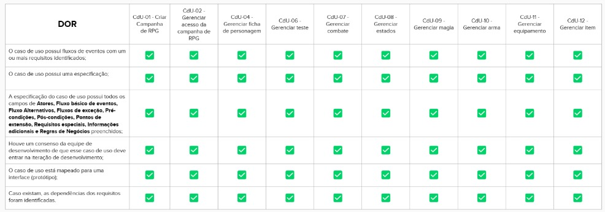

## Iteração 1: Definição do produto e do projeto

  <iframe loading="lazy" style="position: absolute; width: 100%; height: 100%; top: 0; left: 0; border: none; padding: 0;margin: 0;"
    src="https:&#x2F;&#x2F;www.canva.com&#x2F;design&#x2F;DAF2QHUS1PA&#x2F;view?embed" allowfullscreen="allowfullscreen" allow="fullscreen">
  </iframe>

## Iteração 2: Planejamento do Projeto

  <iframe loading="lazy" style="position: absolute; width: 100%; height: 100%; top: 0; left: 0; border: none; padding: 0;margin: 0;"
    src="https:&#x2F;&#x2F;www.canva.com&#x2F;design&#x2F;DAF2QFFkYoY&#x2F;view?embed" allowfullscreen="allowfullscreen" allow="fullscreen">
  </iframe>

## Iteração 3: Estudo de tecnologias e começo da especificação de caso de uso

  <iframe loading="lazy" style="position: absolute; width: 100%; height: 100%; top: 0; left: 0; border: none; padding: 0;margin: 0;"
    src="https:&#x2F;&#x2F;www.canva.com&#x2F;design&#x2F;DAF2QCUy7C8&#x2F;view?embed" allowfullscreen="allowfullscreen" allow="fullscreen">
  </iframe>

## Iteração 4: Definição de MVPs, definição de preparado, definição de pronto, diagramas e especificação de casos de uso

  <iframe loading="lazy" style="position: absolute; width: 100%; height: 100%; top: 0; left: 0; border: none; padding: 0;margin: 0;"
    src="https:&#x2F;&#x2F;www.canva.com&#x2F;design&#x2F;DAF2QdGnvsg&#x2F;view?embed" allowfullscreen="allowfullscreen" allow="fullscreen">
  </iframe>

## Iteração 5: Prototipagem 1, Desenvolvimento 1, Testes 1

  <iframe loading="lazy" style="position: absolute; width: 100%; height: 100%; top: 0; left: 0; border: none; padding: 0;margin: 0;"
    src="https:&#x2F;&#x2F;www.canva.com&#x2F;design&#x2F;DAF2QXYgjvI&#x2F;view?embed" allowfullscreen="allowfullscreen" allow="fullscreen">
  </iframe>

## Iteração 6: Desenvolvimento 2, Testes 2

  <iframe loading="lazy" style="position: absolute; width: 100%; height: 100%; top: 0; left: 0; border: none; padding: 0;margin: 0;"
    src="https:&#x2F;&#x2F;www.canva.com&#x2F;design&#x2F;DAF2QUYSHBw&#x2F;view?embed" allowfullscreen="allowfullscreen" allow="fullscreen">
  </iframe>

  

