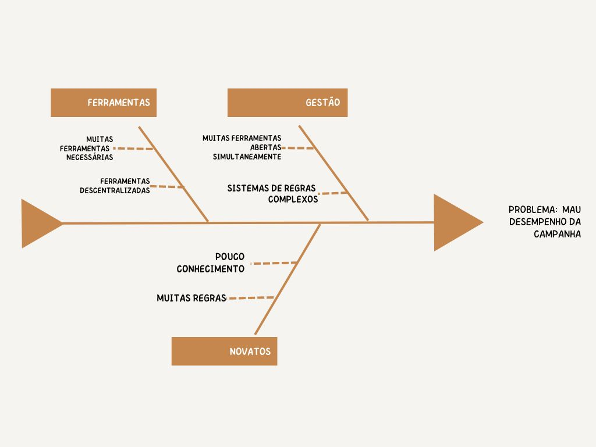
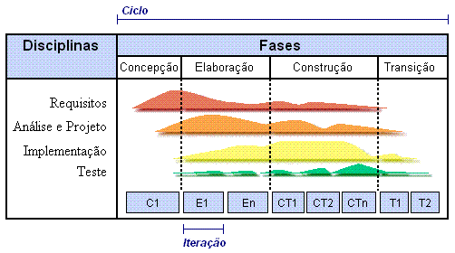

# Missão 1 - Chaos Manager

## Visão Geral do Produto

O produto Chaos Manager busca unificar o máximo de ferramentas para jogadores de rpg, tanto mestres quanto jogadores, utilizando um único sistema brasileiro e gratuito chamado Order & Chaos.

Segue na Figura 1 o diagrama Ishikawa no qual reflete o panorama do produto: 

 
Figura 1 - Diagrama Ishikawa

### Objetivo

O Chaos Manager apresenta um único sistema de regra brasileiro com ferramentas acessíveis e que pode ser usado para qualquer tipo de história, campanha e mundos, com todas as ferramentas necessárias para gerenciar uma campanha de rpg de mesa, tanto para mestres quanto para jogadores.

**Objetivo principal:** Unificar ferramentas de um rpg de mesa citados na declaração do produto, por meio de um único sistema de regras.

**Objetivo secundário 1:** Permitir que jogadores se reunam em um único ambiente.

**Objetivo secundário 2:** Os usuários devem conseguir ter acesso a todas as suas informações por meio da ficha de personagem

**Objetivo secundário 3:** Os usuários devem poder usufruir das dinâmicas disponíveis (Testes e combate).

## Visão Geral do Projeto

Para isso, o grupo responsável por esse projeto se organizou em diferentes papeis nos quais podem ser visualizados [aqui](../docs/visao_projeto.md), além de definirmos o seu planejamento com as suas respectivas iterações:

 
Tabela 1 - Iterações do projeto

| **Iterações** | **Etapas**                                                                                                | **Produto (Entrega)**                                                      | **Data Início** | **Data Fim** |
| :-----------: | :-------------------------------------------------------------------------------------------------------- | :------------------------------------------------------------------------- | :-------------: | :----------: |
|  Iteração 1   | Definição do produto e do projeto                                                                         | Escopo do projeto e produto                                                |   04/09/2023    |  29/09/2023  |
|  Iteração 2   | Planejamento do Projeto                                                                                   | Backlog, requisitos elicitados, definição do MVP                           |   02/10/2023    |  13/10/2023  |
|  Iteração 3   | Estudo de tecnologias e começo da especificação de caso de uso                                            | Equipe capacitada                                                          |   16/10/2023    |  27/10/2023  |
|  Iteração 4   | Definição de MVPs, definição de preparado, definição de pronto, diagramas e especificação de casos de uso | Arquitetura do sistema, DoR, DoD, diagrama e especificação de casos de uso |   30/10/2023    |  10/11/2023  |
|  Iteração 5   | Desenvolvimento 1, Testes Manuais 1                                                        | Projeto de arquitetura do projeto, aplicação e testes manuais         |   13/11/2023    |  24/11/2023  |
|  Iteração 6   | Desenvolvimento 2, Testes Manuais 2                                                               | Projeto de arquitetura do projeto, aplicação e testes manuais          |   27/11/2023    |  04/12/2023  |
|  Iteração 7   | Testes Manuais, Release                                                                                           | Testes finais, Publicação da aplicação nos serviços digitais               |   05/12/2023    |  12/12/2023  |

## Processo de desenvolvimento

Para atingir uma máxima no desenvolvimento, foi utilizado os critérios Sommerville para definir o escopo do produto, categorizando-se como um sistema grande e complexo. Além disso, para escolher uma abordagem que esteja em harmonia com o software, foi definido que a faceta ideal ao nosso produto seria o **Contratual** baseado nos seguintes critérios:

- Customer-specific: o produto foi encomendado por um cliente específico, onde o cliente é a principal fonte de requisitos.
- Linear para Iterativo: devido ser um produto grande e complexo, dividí-lo em pequenas iterações se torna uma forma de gerenciar e minimizar os riscos.
- Prescritivo: a equipe possui conhecimento de diversas funcionalidades, e há um cliente e outros produtos similares para ajudar a elicitar e priorizar os requisitos.

Devido a complexidade do Chaos Manager, decidimos utilizar uma abordagem Dirigido a Plano, onde o Processo Unificado se mostrou um eficiente processo de software para realizar a construção do produto.

 
Figura 2 - Processo Unificado

## Timeline

  <iframe loading="lazy" style="position: absolute; width: 100%; height: 100%; top: 0; left: 0; border: none; padding: 0;margin: 0;"
    src="https:&#x2F;&#x2F;www.canva.com&#x2F;design&#x2F;DAF2n38ziLY&#x2F;view?embed" allowfullscreen="allowfullscreen" allow="fullscreen">
  </iframe>

### Iniciação

&emsp; Estabelece-se a viabilidade de implantação
do sistema.

- Definição do escopo do sistema
- Estimativas de custos e cronograma
- Identificação dos potenciais riscos que devem ser gerenciados ao longo do projeto
- Esboço da arquitetura do sistema, que
servirá como alicerce para a sua construção.

#### Artefatos

- [Visão Geral do Projeto](../docs/visao_projeto.md)

- [Visão Geral do Produto](../docs/visao_produto.md)

- Capacitação da Equipe

- [Elicitação de Requisitos](../docs/backlog.md)

- [Definição e Priorização do MVP](../docs/priorizacaoMVPSafe.md)

### Elaboração
&emsp; Visão refinada do sistema.

#### Artefatos

- [Diagrama de Classes](https://github.com/mdsreq-fga-unb/2023.2-ChaosManager/blob/main/docs/assets/diagClasses.jpeg)

- Casos de Uso - [Diagrama](../docs/casodeUso.md)

- Casos de Uso - [Especificações](../docs/casodeUso.md)

### Construção

&emsp; É iniciado a fase de desenvolvimento do sistema.

#### Artefatos

- Correção das [Especificações](../docs/casodeUso.md) dos Casos de Uso

- Projeto de Arquitetura

- 13/11 - Criação do ambiente de desenvolvimento
    - O conteúdo da criação do ambiente pode ser acessado [aqui](https://github.com/mdsreq-fga-unb/2023.2-ChaosManager/commit/b8bbf826a49bd1f9e7cb7a5ba1c0e3e77c831fb1)

- [Definição do Pronto (DoR)](../docs/casodeUso.md) 

- [Desenvolvimento](https://github.com/mdsreq-fga-unb/2023.2-ChaosManager/tree/main/cmweb/models)

### Transição

&emsp; O sistema é entregue ao cliente para
uso em produção.
Testes são realizados e um ou mais
incrementos do sistema são
implantados.

#### Artefatos

- Correção das [Especificações](../docs/casodeUso.md) dos Casos de Uso

- [Testes Manuais](https://github.com/mdsreq-fga-unb/2023.2-ChaosManager/blob/main/cmweb/models/logtests.ts)

- [Implementação](https://github.com/mdsreq-fga-unb/2023.2-ChaosManager/commit/d35aae1324a7b4ffa2a04637eb3b73d79bf58393)

- [Definição do Pronto (DoD)]()

- [Desenvolvimento](https://github.com/mdsreq-fga-unb/2023.2-ChaosManager/tree/main/cmweb/models)
