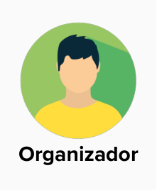

# User Story Mapping - ComunEventos

## Introdução

&emsp;&emsp; É proposto pelo professor George Marsicano a criação do User Story Mapping (USM) relacionado ao estudo de caso "ComunEventos" pela facção Insurgentes Estelares. 

## USM

&emsp;&emsp; É realizado na Figura 1 o USM para a tarefa proposta: 

Figura 1: Mural do USM 

Fonte: Emerson Luis, Gustavo França, Larissa Gomes, Luciano Ricardo, Oscar de Brito e Pedro Eduardo (2023)

## Personas

Foram definidas as seguintes personas, considerando o *Organizador* como a mais importante para o processo de negócios da ComunEventos

## Objetivos

*Personas*: __Organizador__ e __Voluntário__

### Gerenciar Evento

#### Atividades

- Criar Ingresso
	- Definir tipo do evento 
	- Definir data e hora 
    - Definir local 
    - Especificar o preço 

- Promover Evento
	- Criar postagem de propaganda do evento nas redes sociais

- Organizar Relatórios de Feedback Pós-Evento
    - Criar formulário de feedback
    - Preencher formulário com as respostas das sessões de feedback 
    - Enviar email de propaganda para lista de contatos
    - Enviar email de propaganda para parceiros locais

- Ver Feedbacks dos Participantes
    - Abrir feedbacks em formato de gráficos
    - Gerar PDF dos feedbacks em gráficos
    - Gerar feedbacks em gráficos
    - Gerar PDF dos feedbacks em gráficos

### Gerenciar Inscritos

#### Atividades

- Registrar presença de participante no evento
    - Realizar Check-in do inscrito
    - Coletar pagamento

- Listar inscritos
    - Filtrar inscritos por presença confirmada
    - Filtrar inscritos por pagamento confirmado

### Gerenciar Comunicações

#### Atividades

- Enviar Mensagens
    - Enviar mensagem de confirmação de inscrição
    - Enviar relatórios 
    - Filtrar inscritos por pagamento confirmado

- Reunir com Colaboradores
    - Agendar reunião

*Personas*: __Organizador__

### Gerenciar Orçamento

#### Atividades

- Registrar Fluxo de Caixa
    - Adicionar lucros do evento
    - Adicionar despesas do evento
    - Abrir reunião em formato de vídeo chamada

- Registrar Contratos
    - Inserir as cotações bem-sucedidas 
    - Inserir os patrocínios bem-sucedidos

### Gerenciar Colaboradores

#### Atividades

- Enviar proposta de patrocínio
    - Criar e enviar proposta em formato texto
    - Criar e enviar proposta em formato PDF
    - Adicionar anexos

- Gerar relatório
    - Gerar relatório de cumprimento das promessas ao patrocinador em PDF
    - Anexar imagens comprobatórias ao relatório

- Solicitar cotações
    - Escrever especificações da cotação
    - Enviar cotações para os fornecedores

- Receber propostas dos fornecedores
    - Visualizar propostas dos fornecedores
    - Aceitar proposta do fornecedor

### Gerenciar Voluntários

#### Atividades

- Encontrar voluntários
    - Mandar solicitação de voluntariado
    - Avaliar documentação do voluntário

- Organizar sessão de treinamento para os voluntários
    - Criar vídeo contendo instruções para o evento
    - Criar arquivo em PDF contendo instruções para o evento
    - Dividir categorias de funções para um evento
    - Criar teste de conhecimento para validar o voluntário
    - Criar videos de treinamento

- Agradecer aos voluntários
    - Criar certificado para os voluntariados
    - Enviar postagem de agradecimento aos voluntários nas redes sociais

*Personas*: __Participante__

### Participar de um evento

#### Atividades

- Procurar um evento
    - Pesquisar eventos por nome
    - Pesquisar eventos por tema ou causa
    - Acessar detalhes do evento
    - Ver eventos próximos
    - Ver eventos populares
    - Compartilhar evento

- Fazer inscrição em um evento
    - Adquirir ingresso do evento
    - Fazer download do ingresso do evento
    - Escolher forma de inscrição
    - Confirmar presença em evento

- Ver guia do evento
    - Ver programação do evento
    - Ver mapa do local do evento
    - Ver as instruções dos organizadores do evento

- Enviar feedback de um evento
    - Avaliar evento
    - Enviar mensagem de feedback para organizadores

*Personas*: __Voluntário__

### Contribuir em um Evento

#### Atividades

- Cadastrar como voluntário
    - Preencher perfil de voluntário

- Aceitar convocação de voluntariado
    - Assinar termo de voluntariado 
    - Enviar documentação 

- Realizar treinamento
    - Confirmar presença no treinamento
    - Acessar detalhes do treinamento
    - Acessar vídeo contendo instruções para o evento
    - Acessar arquivo em PDF contendo instruções para o evento
    - Acessar teste de conhecimento para validar o voluntário

*Personas*: __Patrocinador__

### Gerenciar Informativos

#### Atividades

- Analisar proposta
    - Apoiar proposta
    - Visualizar proposta em formato texto
    - Visualizar proposta em formato PDF
    - Abrir anexos

- Ver relatório
    - Visualizar relatório de cumprimento das promessas ao patrocinador em PDF

*Personas*: __Fornecedor__

### Gerenciar Cotações

#### Atividades

- Atender cotações
    - Visualizar cotações
    - Enviar uma proposta de cotação
    - Visualizar status das propostas 
    - Filtrar por cotações em aberto
    - Filtrar por propostas aceitass

- Visualizar status do pagamento
    - Visualizar data prevista do pagamento
    - Visualizar valores a serem recebidos

*Personas*: __Patrocinador__ e __Fornecedor__

### Acessar Feedbacks

#### Atividades

- Visualizar Feedback
    - Visualizar relatório de feedback em gráficos
    - Visualizar relatório de feedback em PDF

- Solicitar revisão
    - Criar um pedido de revisão em formato de texto
    - Enviar um pedido de revisão em PDF

*Personas*: __Organizador__, __Participante__, __Voluntário__, __Patrocinador__ e __Fornecedor__

### Gerenciar Mensagens

#### Atividades

- Enviar mensagens
    - Enviar mensagens em formato de texto 
    - Anexar arquivos 

- Ler mensagens
    - Abrir mensagens recebidas em formato de texto 
    - Abrir anexos 

# Mural

Segue abaixo o Mural que possui tudo o que foi apresentado:
<iframe src='https://app.mural.co/embed/ce864c15-402f-4476-96aa-04071c9256e3'
  width='100%'
  height='480px'
  style='min-width: 640px; min-height: 480px; background-color: #f4f4f4; border: 1px solid #efefef'
  sandbox='allow-same-origin allow-scripts allow-modals allow-popups allow-popups-to-escape-sandbox'></iframe>

## Histórico de versão

| Data  | Versão | Descrição                            | Autor                          |
| :---: | :----: | ------------------------------------ | ------------------------------ |
| 19/11 |  1.0   | Criação do artefato USM| Gustavo França |

