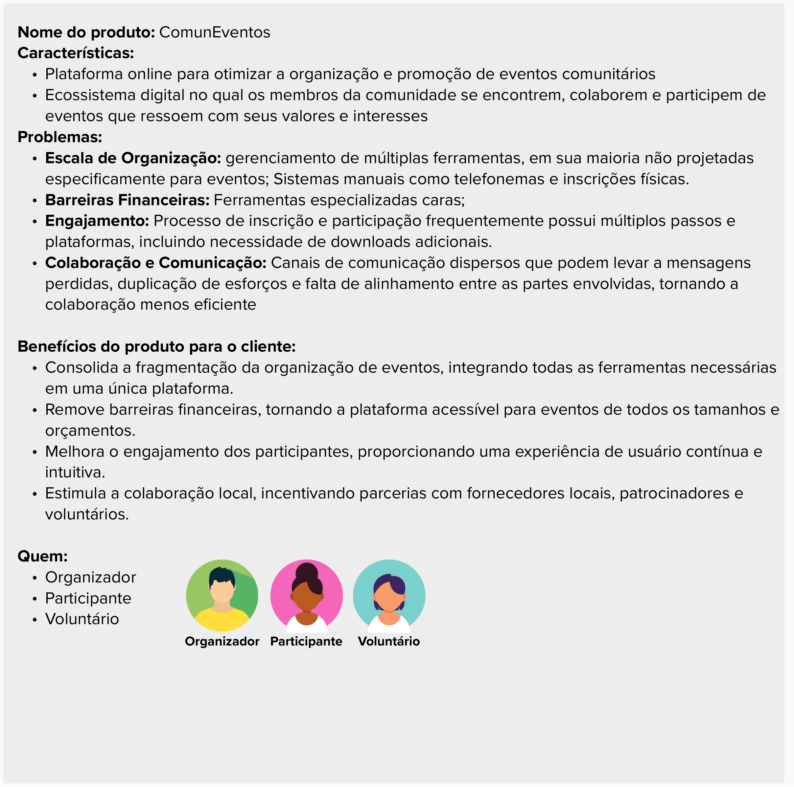

---
hide:
  - toc
---

# User Story Mapping

## Introdução

&emsp;&emsp; É proposto pelo professor George Marsicano a criação do User Story Mapping (USM) relacionado ao estudo de caso "ComunEventos" pela facção Insurgentes Estelares. 

## ComunEventos
__Características:__
Plataforma online para otimizar a organização e promoção de eventos comunitáriosEcossistema digital no qual os membros da comunidade se encontrem, colaborem e participem de eventos que ressoem com seus valores e interesses
Problemas: 

__Escala de Organização:__ gerenciamento de múltiplas ferramentas, em sua maioria não projetadas especificamente para eventos; Sistemas manuais como telefonemas e inscrições físicas.

__Barreiras Financeiras:__ Ferramentas especializadas caras;

Engajamento: Processo de inscrição e participação frequentemente possui múltiplos passos e plataformas, incluindo necessidade de downloads adicionais.

__Colaboração e Comunicação:__ Canais de comunicação dispersos que podem levar a mensagens perdidas, duplicação de esforços e falta de alinhamento entre as partes envolvidas, tornando a colaboração menos eficiente

__Benefícios do produto para o cliente:__
Consolida a fragmentação da organização de eventos, integrando todas as ferramentas necessárias em uma única plataforma. Remove barreiras financeiras, tornando a plataforma acessível para eventos de todos os tamanhos e orçamentos.
Melhora o engajamento dos participantes, proporcionando uma experiência de usuário contínua e intuitiva.
Estimula a colaboração local, incentivando parcerias com fornecedores locais, patrocinadores e voluntários.

## Personas

Foram definidas as seguintes personas, considerando o *Organizador* como a mais importante para o processo de negócios da ComunEventos

## Objetivos

# Priorização

&emsp;&emsp; Para organizar e atualizar o Backlog, realizamos a priorização das histórias de usuário do User Story Mapping utilizando a técnica MoSCoW para determinar a sua prioridade, os critérios utilizados para definir o que seria Must, Should, Could ou Would foram o <b>valor de negócio</b>, a <b>complexidade</b>e e a <b>viabilidade</b>, tendo um maior peso os que possuiam valor de negócio que ajudava a cumprir os objetivos e necessidades mais urgentes do cliente. A execução da técnica pode ser vista na Figura 1

# Mural

Segue abaixo o Mural que possui tudo o que foi apresentado:
<iframe src='https://app.mural.co/embed/c653020b-a547-4921-bb0e-192b39e67f41'
  width='100%'
  height='480px'
  style='min-width: 640px; min-height: 480px; background-color: #f4f4f4; border: 1px solid #efefef'
  sandbox='allow-same-origin allow-scripts allow-modals allow-popups allow-popups-to-escape-sandbox'></iframe>

## Histórico de versão

| Data  | Versão | Descrição                            | Autor                          |
| :---: | :----: | ------------------------------------ | ------------------------------ |
| 19/11 |  1.0   | Criação do artefato USM| Gustavo França |
| 22/11 |  1.1   | Atualização do artefato USM| Gustavo França |

