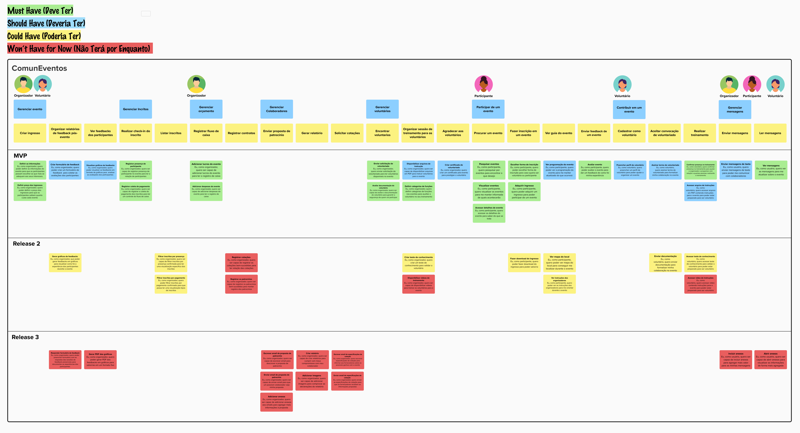

---
hide:
  - toc
---

# User Story Mapping

## Introdução

&emsp;&emsp; É proposto pelo professor George Marsicano a criação do User Story Mapping (USM) relacionado ao estudo de caso "ComunEventos" pela facção Insurgentes Estelares. 

## Resumo

<b>Figura 1:</b> Breve resumo do produto. 

## Tabela de Histórias

&emsp;&emsp; Para facilitar a leitura do mapa, devido em imagem ser difícil visualizar, transformamos o User Story Mapping em na Tabela 1. 

<table><tr><th><b>Usuário</b></th><th><b>Atividade</b></th><th><b>Jornada do Usuário</b></th><th><b>Título da Tarefa do Usuário</b></th><th><b>História do Usuário</b></th></tr>
<tr><td rowspan="11"><b>Organizador e voluntário</b></td><td rowspan="7"><b>Gerenciar evento</b></td><td rowspan="2"><b>Criar ingresso</b></td><td><b>Definir as informações</b></td><td>Eu, como organizador, quero poder definir as informações do evento para que os participantes possam escolher as que mais se adequam aos seus interesses.</td></tr>
<tr><td><b>Definir preço dos ingressos</b></td><td>Eu, como organizador, quero poder definir o preço dos ingressos para que os participantes saibam quanto custa cada evento</td></tr>
<tr><td rowspan="3"><b>Organizar relatórios de feedback pós-evento</b></td><td><b>Criar formulário de feedback</b></td><td>Eu, como organizador, quero poder criar um formulário de feedback  para coletar as avaliações dos participantes</td></tr>
<tr><td><b>Gerar gráficos de feedbacks</b></td><td>Eu, como organizador, que poder gerar feedbacks em gráficos para visualizar como foi a experiência dos participantes durante o evento</td></tr>
<tr><td><b>Responder formulário de feedback</b></td><td>Eu, como organizador, quero poder preencher formulário com as respostas das sessões de feedback presenciais para documentar as experiências dos participantes</td></tr>
<tr><td rowspan="2"><b>Ver feedbacks dos participantes</b></td><td><b>Visualizar gráficos de feedbacks</b></td><td>Eu, como organizador, quero poder visualizar os feedbacks em formato de gráficos para  analisar as avaliações dos participantes</td></tr>
<tr><td><b>Gerar PDF dos gráficos</b></td><td>Eu, como organizador, quero poder gerar PDF dos feedbacks em gráficos para salvá-las em um formato fixo</td></tr>
<tr><td rowspan="4"><b>Gerenciar Inscritos</b></td><td rowspan="2"><b>Realizar check-in do inscrito</b></td><td><b>Registrar presença de participante</b></td><td>Eu, como organizador, quero ser capaz de registrar presença de participante no evento para ter a relação de participantes</td></tr>
<tr><td><b>Registrar coleta de pagamento</b></td><td>Eu, como organizador, quero ser capaz de registrar a coleta do pagamento dos inscritos para ter um controle do fluxo de caixa</td></tr>
<tr><td rowspan="2"><b>Listar inscritos</b></td><td><b>Filtrar inscritos por presença</b></td><td>Eu, como organizador, quero ser capaz de filtrar inscritos por presença confirmada para ter uma visualização especifica dos inscritos</td></tr>
<tr><td><b>Filtrar inscritos por pagamento</b></td><td>Eu, como organizador, quero poder filtrar inscritos por pagamento confirmado para que possa ter uma visualização tipos de inscritos</td></tr>
<tr><td rowspan="18"><b>Organizador</b></td><td rowspan="4"><b>Gerenciar orçamento</b></td><td rowspan="2"><b>Registrar fluxo de caixa</b></td><td><b>Adicionar lucros do evento</b></td><td>Eu, como organizador, quero ser capaz de adicionar lucros do evento para ter o registro de caixa</td></tr>
<tr><td><b>Adicionar despesas do evento</b></td><td>Eu, como organizador, quero ser capaz de adicionar despesas do evento para ter o registro de caixa</td></tr>
<tr><td rowspan="2"><b>Registrar contratos</b></td><td><b>Registrar cotações</b></td><td>Eu, como organizador, quero ser capaz de registrar as cotações bem-sucedidas para ter relação das cotações</td></tr>
<tr><td><b>Registrar os patrocínios</b></td><td>Eu, como organizador, quero ser capaz de registrar os patrocínios bem-sucedidos para manter registro dos patrocínios</td></tr>
<tr><td rowspan="7"><b>Gerenciar Colaboradores</b></td><td rowspan="3"><b>Enviar proposta de patrocínio</b></td><td><b>Escrever email de proposta de patrocínio</b></td><td>Eu, como organizador, quero ser capaz de escrever email para descrever a proposta de patrocínio</td></tr>
<tr><td><b>Enviar email de proposta de patrocínio</b></td><td>Eu, como organizador, quero ser capaz de enviar email para que um possível colaborador veja minha proposta</td></tr>
<tr><td><b>Adicionar anexos</b></td><td>Eu, como organizador, quero ser capaz de adicionar anexos aos emails para agregar mais informações à proposta</td></tr>
<tr><td rowspan="2"><b>Gerar relatório</b></td><td><b>Criar relatório</b></td><td>Eu. como organizador, quero ser capaz de criar relatórios para cumprir com meus compromissos com meu colaborador</td></tr>
<tr><td><b>Adicionar imagens</b></td><td>Eu, como organizador, quero ser capaz de adicionar imagens para comprovar as declarações do relatório</td></tr>
<tr><td rowspan="2"><b>Solicitar cotações</b></td><td><b>Enviar email de especificações de cotação</b></td><td>Eu, como organizador, quero enviar as especificações de cotação para que os fornecedores recebam as informações propostas</td></tr>
<tr><td><b>Escrever email de especificações de cotação</b></td><td>Eu, como organizador, quero escrever especificações de cotação para informar aos fornecedores sobre os possíveis ganhos com o evento</td></tr>
<tr><td rowspan="7"><b>Gerenciar voluntários</b></td><td rowspan="2"><b>Encontrar voluntários</b></td><td><b>Enviar solicitação de voluntariado</b></td><td>Eu, como organizador, quero enviar solicitação de voluntariado para ter voluntários disponíveis no evento</td></tr>
<tr><td><b>Avaliar documentação do voluntário</b></td><td>Eu, como organizador, quero ser capaz de avaliar a documentação do voluntário para garantir a segurança de quem vai participar</td></tr>
<tr><td rowspan="4"><b>Organizar sessão de treinamento para os voluntários</b></td><td><b>Disponibilizar arquivos de instrução</b></td><td>Eu, como organizador, quero ser capaz de disponibilizar arquivos em PDF para instruir voluntários para o evento</td></tr>
<tr><td><b>Definir categorias de funções</b></td><td>Eu, como organizador, quero definir categorias de funções nos eventos para auxiliar o voluntário no seu treinamento</td></tr>
<tr><td><b>Criar teste de conhecimento</b></td><td>Eu, como organizador, quero criar um teste de conhecimento para validar o voluntário</td></tr>
<tr><td><b>Disponibilizar vídeos de treinamento</b></td><td>Eu, como organizador, quero ser capaz de disponibilizar vídeos para treinar os voluntários para o evento</td></tr>
<tr><td><b>Agradecer aos voluntários</b></td><td>
<b>Criar certificado de voluntariado</b>

</td><td>Eu, como organizador, quero criar um certificado pós-evento para prestigiar o voluntário</td></tr>
<tr><td rowspan="10"><b>Participante</b></td><td rowspan="10"><b>Participar de um evento</b></td><td rowspan="3"><b>Procurar um evento</b></td><td><b>Pesquisar eventos</b></td><td>Eu, como participante, quero pesquisar por eventos para encontrar o que desejo</td></tr>
<tr><td><b>Visualizar eventos</b></td><td>Eu, como participante, quero visualizar os eventos para me manter informada de quais acontecerão</td></tr>
<tr><td><b>Acessar detalhes de evento</b></td><td>Eu, como participante, quero acessar os detalhes do evento para saber do que se trata</td></tr>
<tr><td rowspan="3"><b>Fazer inscrição em um evento</b></td><td><b>Escolher forma de inscrição</b></td><td>Eu, como participante, quero poder escolher forma de inscrição para caso queira ser voluntária ou participante</td></tr>
<tr><td><b>Adquirir ingresso</b></td><td>Eu, como participante, quero poder adquirir um ingresso para poder participar de um evento</td></tr>
<tr><td><b>Fazer download do ingresso</b></td><td>Eu, como participante, quero poder fazer download do ingresso para poder salvá-lo</td></tr>
<tr><td rowspan="3"><b>Ver guia do evento</b></td><td><b>Ver mapa do local</b></td><td>Eu, como participante, quero poder ver mapa do local para conseguir me localizar durante o evento</td></tr>
<tr><td><b>Ver instruções dos organizadores</b></td><td>Eu, como participante, quero poder ver as instruções dos organizadores para me orientar durante o evento</td></tr>
<tr><td><b>Ver programação do evento</b></td><td>Eu, como participante, quero poder ver a programação do evento para me manter atualizado do que ocorrerá</td></tr>
<tr><td><b>Enviar feedback de um evento</b></td><td><b>Avaliar evento</b></td><td>Eu, como participante, quero poder avaliar o evento para dar um feedback de como foi minha experiência</td></tr>
<tr><td rowspan="7"><b>Voluntário</b></td><td rowspan="7"><b>Contribuir em um evento</b></td><td><b>Cadastrar como voluntário</b></td><td><b>Preencher perfil de voluntário</b></td><td>Eu, como voluntário, quero preencher um perfil de voluntário para poder ajudar a organizar um evento</td></tr>
<tr><td rowspan="2"><b>Aceitar convocação de voluntariado</b></td><td><b>Assinar termo de voluntariado</b></td><td>Eu, como voluntário, quero assinar termo de voluntariado para formalizar minha colaboração no evento</td></tr>
<tr><td>
<b>Enviar documentação</b>

</td><td>Eu, como voluntário, quero enviar documentação para formalizar minha colaboração no evento</td></tr>
<tr><td rowspan="4"><b>Realizar treinamento</b></td><td><b>Confirmar presença no treinamento</b></td><td>Eu, como voluntário, quero confirmar presença no treinamento para ajudar o organizador a programar com relação a quantas pessoas realizarão o treinamento</td></tr>
<tr><td><b>Acessar arquivo de instruções</b></td><td>Eu, como voluntário, quero acessar arquivo em PDF contendo instruções para o evento para poder estar preparado para ser voluntário</td></tr>
<tr><td><b>Acessar teste de conhecimento</b></td><td>Eu, como voluntário, quero acessar teste de conhecimento para validar o voluntário para poder estar preparado para ser voluntário</td></tr>
<tr><td><b>Acessar vídeo de instruções</b></td><td>Eu, como voluntário, quero acessar vídeo contendo instruções para o evento para poder estar preparado para ser voluntário</td></tr>
<tr><td rowspan="4"><b>Organizador, voluntário e participante</b></td><td rowspan="4"><b>Gerenciar mensagens</b></td><td rowspan="2"><b>Enviar mensagens</b></td><td><b>Enviar mensagens de texto</b></td><td>Eu, como usuário, quero enviar mensagens de texto para poder me comunicar com colaboradores</td></tr>
<tr><td><b>Incluir anexos</b></td><td>Eu, como usuário, quero ser capaz de incluir anexos para agregar mais valor para as minhas mensagens</td></tr>
<tr><td rowspan="2"><b>Ler mensagens</b></td><td><b>Abrir anexos</b></td><td>Eu, como usuário, quero ser capaz de abrir anexos para visualizar as informações de forma mais agregada</td></tr>
<tr><td><b>Ver mensagens</b></td><td>Eu, como usuário, quero ver as mensagens para me atualizar sobre o evento</td></tr>
</table>

<b>Tabela 1:</b> Tabela do mapa de histórias. 

## Priorização 

&emsp;&emsp; Para organizar e atualizar o Backlog, realizamos a priorização das histórias de usuário do User Story Mapping utilizando a técnica MoSCoW para determinar a sua prioridade, os critérios utilizados para definir o que seria Must, Should, Could ou Would foram o <b>valor de negócio</b>, a <b>complexidade</b>e e a <b>viabilidade</b>, tendo um maior peso os que possuiam valor de negócio que ajudava a cumprir os objetivos e necessidades mais urgentes do cliente. A execução da técnica pode ser vista na Figura 2.

<b>Figura 2:</b> USM completo. 

# Mural

Segue abaixo o Mural que possui tudo o que foi apresentado:

<iframe src='https://app.mural.co/embed/c653020b-a547-4921-bb0e-192b39e67f41'
  width='100%'
  height='480px'
  style='min-width: 640px; min-height: 480px; background-color: #f4f4f4; border: 1px solid #efefef'
  sandbox='allow-same-origin allow-scripts allow-modals allow-popups allow-popups-to-escape-sandbox'></iframe>

## Histórico de versão

| Data  | Versão | Descrição                            | Autor                          |
| :---: | :----: | ------------------------------------ | ------------------------------ |
| 19/11 |  1.0   | Criação do artefato USM | Gustavo França |
| 22/11 |  1.1   | Atualização do artefato USM | Gustavo França |
| 05/11 |  2.0   | Adição da tabela e correção do USM | Larissa Gomes |

