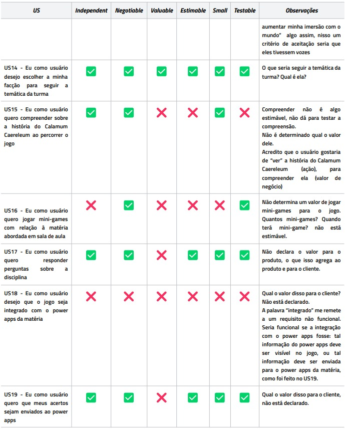
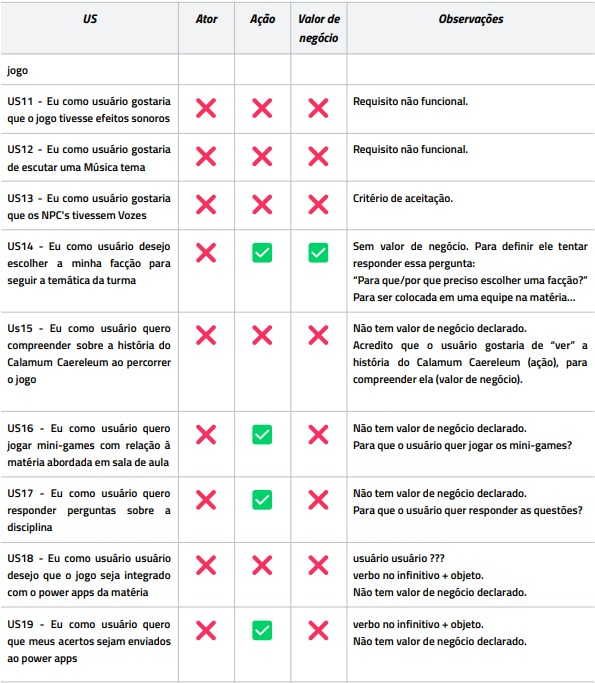
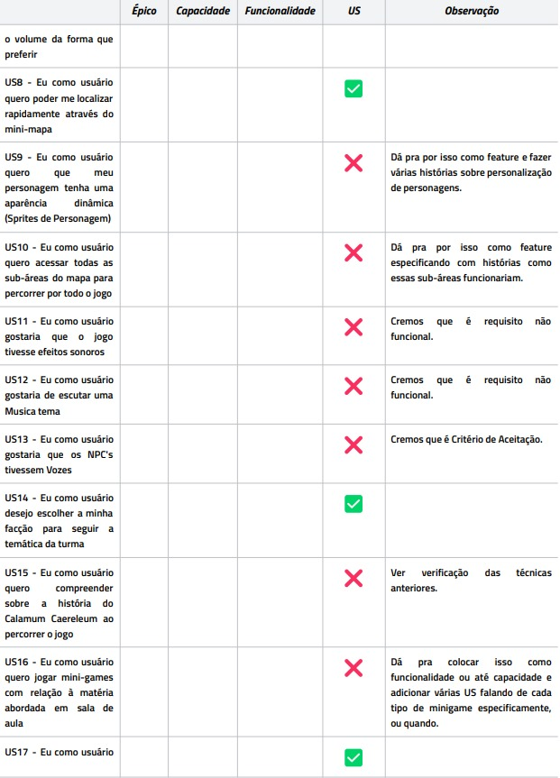
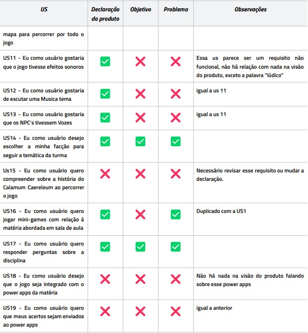

---
hide:
  - toc
---

# Verificação e Validação - Crystaleum

## Dinâmica

Para atingir uma máxima no compreendimento na matéria com a união de diferentes equipes, o professor George Marsicano apresenta um exercício entre duas facções no qual o objetivo é verificar e validar os requisitos apresentados pela outra equipe (Moonwalkers), enquanto o mesmo acontece no outro lado. Para alcançar esse objetivo, os Insurgentes Estelares utilizarão as seguintes técnicas:

## Técnicas Utilizadas

- INVEST com checklist para **verificar** se foram escritas boas US
- Checklist para **verificar** a estrutura da US (Ator, Ação, Valor de negócio)
- Checklist para **verificar** a qualidade do backlog (Épicos, Capacidades, Funcionalidades e Histórias de Usuário)
- Checklist para **validar** as US (Declaração do produto, Objetivo, Problema) 

## Verificação - Invest

## Verificação - Checklist

## Verificação - SAFe

## Validação - Checklist

## Feedback Geral

A equipe não seguiu a metodologia SAFe (Épicos, Capacidades, Funcionalidade, História de Usuário) para montar o backlog. Não declararam nenhuma capacidade.

A equipe não tem as personas (atores) declaradas. Nas US tem apenas usuário, que não é especificado qual e pelo produto dá pra entender que tem mais de um.

As User Stories não seguem um padrão, muitas estão fora da estrutura de Ator, Ação e Valor de Negócio, além de na própria declaração não estarem padronizadas entre si. Tem casos de “Eu como usuário quero/gostaria/desejo”, são todos sinônimos que poderiam ser padronizados.

Muitas US foram classificadas sem valor pelo método INVEST por não ter os valores escritos explicitamente na US por estarmos avaliando a qualidade da história, como o valor não tava declarado de forma explícita foi definido como sem valor.

Na Técnica SAFe tentem reagrupar as US com a mesma temática. Isso vai facilitar a identificação das Features e Capacidades e Épicos.

A falta de valor de negócio nas US dificultou a verificação e validação, em principal a validação que precisava saber o valor para ver se está alinhado com a Declaração do Produto, Problema e Objetivo.

Falta contexto, muitas US incompletas, elaboradas incorretamente, não haverá cadastro dos jogadores? Não haverá turmas? Não haverá interface de controle do professor? Feedback? Notas? Avaliações? Em que US as perguntas serão inseridas? O conteúdo da disciplina será estático?

## Bibliografia 

> Insurgentes Estelares. Verificação e Validação - Crystaleum. Google Docs. Disponível em: https://docs.google.com/document/d/1LQgYhpjF86tWoar6K5Ryrx_JWKtUVAh7q3pIY0Bezts/edit#heading=h.esgg0ahqatg9. Acesso em: 25 de outubro de 2023.

## Histórico de versão

| Data  | Versão | Descrição                                                            | Autor          |
| :---: | :----: | -------------------------------------------------------------------- | -------------- |
| 25/10 |  1.0   | Adição do documento de verificação e validação da equipe Moonwalkers | Gustavo França |

