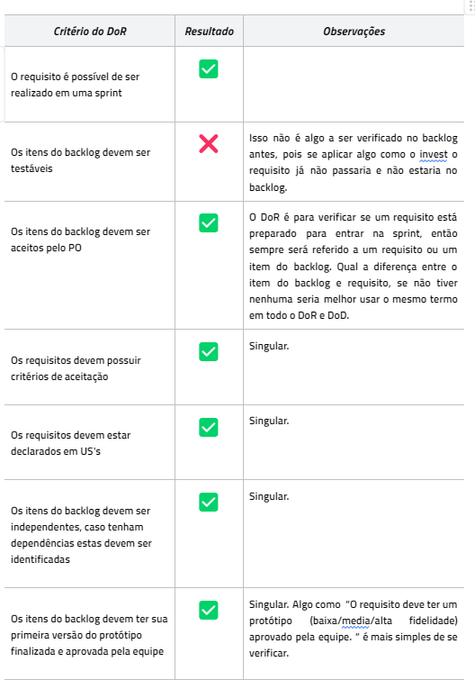
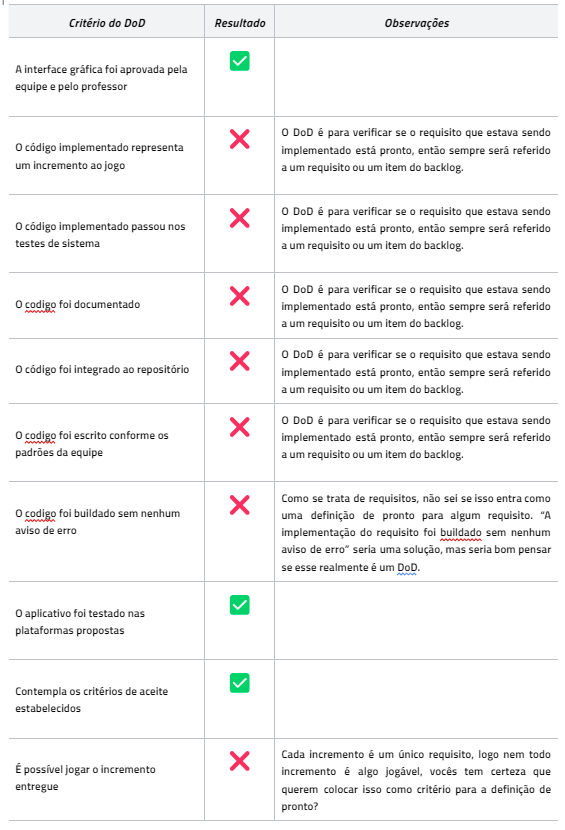
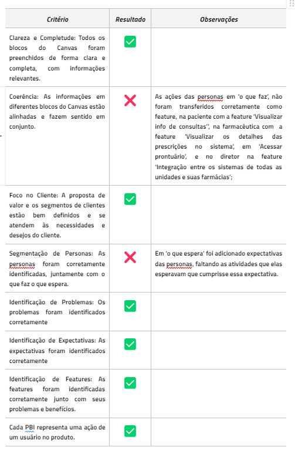

---
hide:
  - toc
---

# Verificação e Validação - MoonWalkers

## Dinâmica

Para atingir uma máxima no compreendimento na matéria com a união de diferentes equipes, o professor George Marsicano apresenta um exercício entre duas facções no qual o objetivo é verificar e validar o PBB e os criteiros de DoD e DoR apresentados pela outra equipe (Moonwalkers), enquanto o mesmo acontece no outro lado. Para alcançar esse objetivo, os Insurgentes Estelares utilizaram a tecnica de checklist para cada um dos artefatos.

## Verificação - Checklist DoR

Figura 1: Checklist DoR 

Fonte: Luciano Ricardo (2023)

## Verificação - Checklist DoD

Figura 2: Checklist DoD 

Fonte: Luciano Ricardo (2023)

## Verificação - Checklist PBB

Figura 3: Checklist PBB 

Fonte: Luciano Ricardo (2023)

## Histórico de versão

| Data  | Versão | Descrição               | Autor           |
| :---: | :----: | ----------------------- | --------------- |
| 20/11 |  1.0   | Criação do artefato pbb | Luciano Ricardo |

