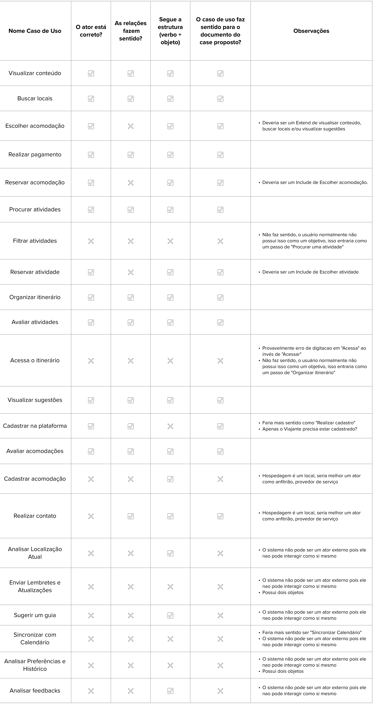
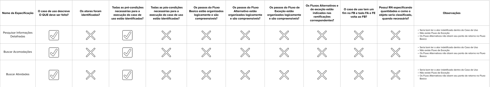

# Verificação e Validação - Tanás

## Dinâmica

Para atingir uma máxima no compreendimento na matéria com a união de diferentes equipes, o professor George Marsicano (2023) apresenta um exercício entre duas facções no qual o objetivo é verificar e validar os Casos de Uso e suas especificações apresentados pela outra equipe (Tanás), enquanto o mesmo acontece no outro lado. Para alcançar esse objetivo, os Insurgentes Estelares utilizaram a tecnica de checklist para realizar a tarefa.

## Casos de Uso

### Atores

Foram identificados 2 atores dos fluxos de eventos do nosso sistema, são eles:

- **Viajante**
- **Hospedagem**
- **Sistema**

### Casos de Uso Identificados

Com base no que foi ofertado pela facção Tanás, foram identificados 22 casos de uso, como apresentado na Tabela 1.

| ID  | Nome                           |
|-----|--------------------------------|
| CdU-01  | Visualizar conteúdo           |
| CdU-02  | Buscar locais                 |
| CdU-03  | Escolher acomodação           |
| CdU-04  | Realizar pagamento            |
| CdU-05  | Reservar acomodação           |
| CdU-06  | Procurar atividades           |
| CdU-07  | Filtrar atividades            |
| CdU-08  | Reservar atividade            |
| CdU-09  | Organizar itinerário          |
| CdU-10  | Avaliar atividades            |
| CdU-11  | Acessar o itinerário          |
| CdU-12  | Visualizar sugestões          |
| CdU-13  | Cadastrar na plataforma       |
| CdU-14  | Avaliar acomodações           |
| CdU-15  | Cadastrar acomodação          |
| CdU-16  | Realizar contato              |
| CdU-17  | Analisar Localização Atual    |
| CdU-18  | Enviar Lembretes e Atualizações|
| CdU-19  | Sugerir um guia               |
| CdU-20  | Sincronizar com Calendário    |
| CdU-21  | Analisar Preferências e Histórico|
| CdU-22  | Analisar feedbacks             |

Com os atores e casos de usos identificados, foi criado pela facção Tanás o seu diagrama de casos de uso para visualizar como e por quem as ações são realizadas, assim como a ligação entre casos quando existiam. É apresentado o seguinte diagrama:

<iframe allowfullscreen frameborder="0" style="width:640px; height:480px" src="https://lucid.app/documents/embedded/3a9629d7-2857-4d72-8b22-125c3c309cd1" id="3iRUlzCNfnbY"></iframe>

### Checklist

Com os Casos de Uso determinados, foi possível realizarmos uma verificação e validação por uma checklist com os seguintes critérios:

- **O ator está correto**
- **As relações fazem sentido**
- **Segue a estrutura (Verbo + Objeto)**
- **O caso de uso faz sentido para o documento do caso proposto?**

Após definirmos os critérios, é realizado uma observação com o Caso de Uso verificado caso não tenha passado em algum dos critérios. É apresentado na Figura 1 o checklist concluído.

## Especificações dos Casos de Uso

Seguem abaixo as especificações que a facção Tanás

### 1. Pesquisar Informações Detalhadas

**Descrição:**

Este caso de uso permite ao usuário pesquisar informações detalhadas sobre acomodações e atividades, incluindo detalhes específicos, disponibilidade e opções de reserva.

**Fluxo Básico:**

1. O usuário acessa a função de pesquisa de informações detalhadas.

2. O usuário seleciona entre "Buscar Acomodações" e "Buscar Atividades".

3. O usuário define critérios de busca, como preço, localização e tipo.

4. O aplicativo apresenta uma lista de resultados que correspondem aos critérios definidos.

5. O usuário pode visualizar detalhes, como descrição, fotos e avaliações.

6. O usuário pode selecionar "Ver Detalhes e Disponibilidade de Reserva."

**Fluxos Alternativos:**

- Se não houver resultados que correspondam aos critérios de busca, o aplicativo notifica o usuário e sugere ajustes nos parâmetros de pesquisa.

- Se o usuário decidir não visualizar detalhes e disponibilidade de reserva, o caso de uso é encerrado.

**Requisitos Especiais:**

- O sistema deve ter uma funcionalidade de busca eficiente que retorne resultados precisos.

- As avaliações de outras atividades do usuário podem influenciar a ordem ou destaque dos resultados.

**Pré-condições:**

- O usuário está autenticado no aplicativo.

**Pontos de Extensão:**

- Após encontrar uma acomodação ou atividade desejada, o usuário pode iniciar os casos de uso "Buscar Acomodações" ou "Buscar Atividades."

### 2. Buscar Acomodações

**Descrição:**

Este caso de uso estende o caso de uso "Pesquisar Informações Detalhadas" e permite ao usuário buscar especificamente por acomodações com base em critérios como preço, localização, tipo e avaliações.

**Fluxo Básico:**

1.	O usuário seleciona a opção "Buscar Acomodações" durante o caso de uso "Pesquisar Informações Detalhadas."

2.	O usuário define critérios de busca para acomodações.

3.	O aplicativo apresenta uma lista de acomodações que correspondem aos critérios definidos. 

**Fluxos Alternativos:**

- Se não houver resultados que correspondam aos critérios de busca, o aplicativo notifica o usuário e sugere ajustes nos parâmetros de pesquisa.

**Requisitos Especiais:**

- O sistema deve integrar avaliações de outras atividades do usuário para influenciar a ordem ou destaque das acomodações na lista de resultados.

**Pré-condições:**

- O usuário está autenticado no aplicativo.

**Pontos de Extensão:**

-  Após encontrar uma acomodação desejada, o usuário pode iniciar o caso de uso "Ver Detalhes e Disponibilidade de Reserva."

### 3. Buscar Atividades

**Descrição:**

Este caso de uso estende o caso de uso "Pesquisar Informações Detalhadas" e permite ao usuário buscar especificamente por atividades com base em critérios como tipo, preço e avaliações.

**Fluxo Básico:**

1. O usuário seleciona a opção "Buscar Atividades" durante o caso de uso "Pesquisar Informações Detalhadas."

2. O usuário define critérios de busca para atividades.

3. O aplicativo apresenta uma lista de atividades que correspondem aos critérios definidos.

**Fluxos Alternativos:**

- Se não houver resultados que correspondam aos critérios de busca, o aplicativo notifica o usuário e sugere ajustes nos parâmetros de pesquisa.

**Requisitos Especiais:**

- O sistema deve integrar avaliações de outras atividades do usuário para influenciar a ordem ou destaque das atividades na lista de resultados.

**Pré-condições:**

- O usuário está autenticado no aplicativo.

**Pontos de Extensão:**

- Após encontrar uma atividade desejada, o usuário pode iniciar o caso de uso "Ver Detalhes e Disponibilidade de Reserva."

### Checklist

Com as especificações determinadas, foi possível realizarmos uma verificação e validação por uma checklist com os seguintes critérios:

- **O caso de uso descreve O QUE deve ser feito**
- **Os atores foram identificados?**
- **Todas as pré-condições necessárias para a execução do caso de uso estão identificadas?**
- **Todas as pós-condições necessárias para a execução do caso de uso estão identificadas?**
- **Os passos do Fluxo Basico estão organizados logicamente e são compreensíveis?**
- **Os passos do Fluxo Alternativo estão organizados logicamente e são compreensíveis?**
- **Os passos do Fluxo de Exceção estão organizados logicamente e são compreensíveis?**
- **Os Fluxos Alternativos e de exceção estão indicados nas ramificações correspondentes?**
- **O caso de uso tem um fim no FB e todo FA e FE volta ao FB?**
- **Possui RN especificando quantidades e como o objeto seria classificado, quando necessário?**

Após definirmos os critérios, é realizado uma observação com a especificação verificada caso não tenha passado em algum dos critérios. É apresentado na Figura 2 o checklist concluído.

## Histórico de versão

| Data  | Versão | Descrição               | Autor          |
| :---: | :----: | ----------------------- | -------------- |
| 07/12 |  1.0   | Criação do artefato | Gustavo França e Oscar de Brito |
| 09/12 |  1.1   | fizalização do documento | Gustavo França e Oscar de Brito |
