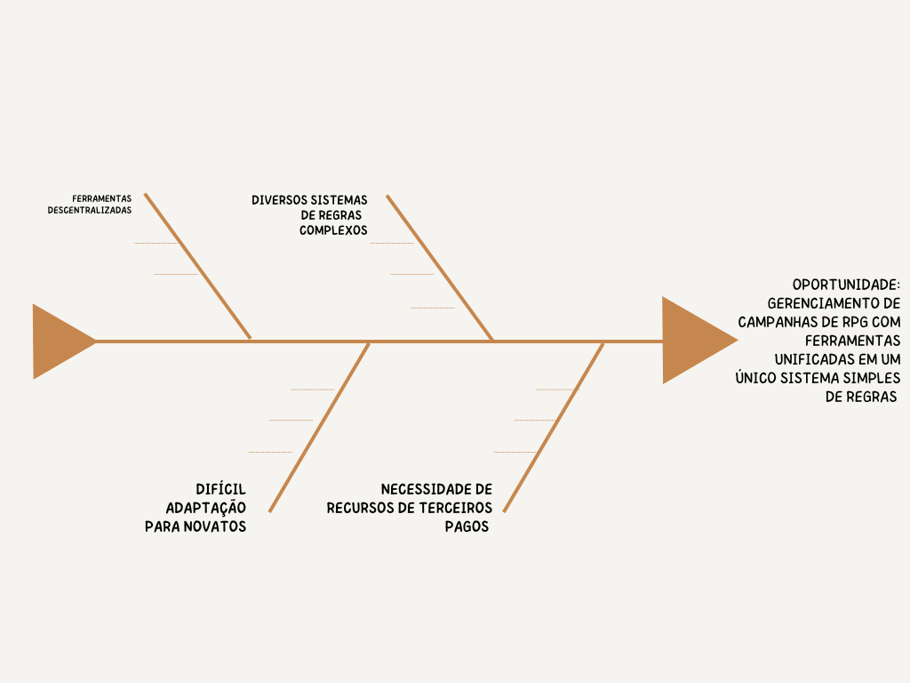

## 1 Visão de produto

### 1.1 Problema
RPG de mesa é uma forma de entretenimento e diversão que envolve duas ou mais pessoas em que a principal função é a interpretação de personagens, onde há sempre um mestre e um ou mais jogadores, sendo utilizado diversos sistemas diferentes. Com a popularização da internet, tornou-se possível jogar por meio de ferramentas online que permitem interagir, criar personagens e gerenciar campanhas. O problema é que essas ferramentas não são unificadas, dificultando o gerenciamento e uso dessas ferramentas. Com isso o produto Chaos Manager busca unificar o máximo de ferramentas para jogadores de rpg, tanto mestres quanto jogadores, utilizando um único sistema brasileiro e gratuito chamado Order & Chaos.

### 1.2 Declaração de posição de produto

|     Para      |                                                                     Jogadores de rpg brasileiros                                                                      |
| :-----------: | :-------------------------------------------------------------------------------------------------------------------------------------------------------------------: |
|     Quem      |                                         Novatos ou experientes que se perdem em meio aos muitos sistemas e ferramentas online                                         |
| Chaos Manager |                                                                              Sistema WEB                                                                              |
|      Que      |                                                    Gerencia os principais aspectos de uma campanha de rpg de mesa                                                     |
| Ao contrário  |                                                                       Roll20, taulukko e Kanka                                                                        |
| Nosso produto | Unifica as principais ferramentas do rpg de mesa online, de maneira acessível com um sistema de regras brasileiro e que pode ser usado para qualquer tipo de história |

### 1.3 Objetivos do produto
Apresenta um único sistema de regra brasileiro com ferramentas acessíveis e que pode ser usado para qualquer tipo de história, campanha e mundos, com todas as ferramentas necessárias para gerenciar uma campanha de rpg de mesa, tanto para mestres quanto para jogadores.

### 1.4 Tecnologias a serem utilizadas

### 1.5 Referências

### 1.6 Histórico de versão

| Data  | Versão | Descrição | Autor |
| :---: | :----: | :-------: | :---: |
|       |  1.0   |           |       |
